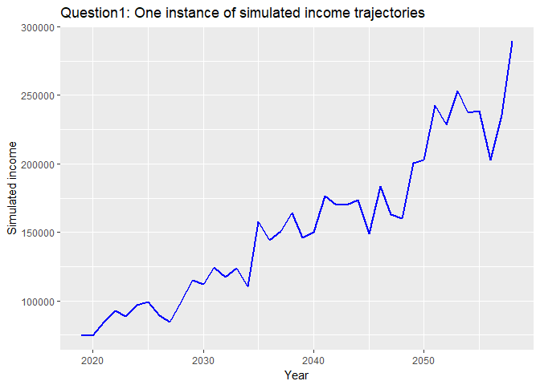
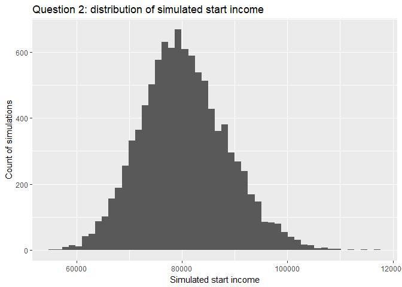
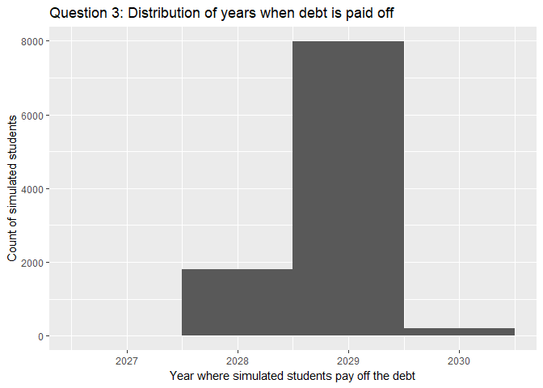

Simulating Your Income
----------------------

### Model set up

We will firstly set up our model to simulate the income.

    # ===================
    # inc_sim is a function to simulate the income trajectory of all simulations
    # ===================

    inc_sim = function(inc0, rho, g, sigma, start_time, end_time, ntrials, seed){
      set.seed(seed)
      # set up the matrix, row represents simulations and column represents time
      duration = end_time - start_time + 1
      inc_mat = as.data.frame(matrix(rep(NA, ntrials * duration), nrow = ntrials))
      rownames(inc_mat) = paste0("sim", seq(1 : ntrials))
      colnames(inc_mat) = seq(start_time, end_time)
      
      # simulate the shocks matrix
      eps_mat = as.data.frame(matrix(rnorm(ntrials * duration, 0, sigma), 
                                     nrow = ntrials, byrow = F))
      rownames(eps_mat) = paste0("sim", seq(1 : ntrials))
      colnames(eps_mat) = seq(start_time, end_time)
      
      #initialize the start year's income
      inc_mat[as.character(start_time)] = log(inc0) + 
        eps_mat[as.character(start_time)]
      
      for (year in (start_time + 1):end_time){
        inc_mat[as.character(year)] = 
          (1 - rho) * (log(inc0) + g * (year - start_time)) +
          rho * inc_mat[as.character(year - 1)] +
          eps_mat[as.character(year)]
      }
      
      return(exp(inc_mat))
      }

### Question 1

    #initialize parameters
    inc0 = 80000
    rho = 0.2
    g = 0.03
    sigma = 0.1
    start_time = 2019
    end_time = 2058
    ntrials = 10000
    seed = 1
    # simulate income trajectories for question 1
    inc_mat1 = inc_sim(inc0, rho, g, sigma, start_time, end_time, ntrials, seed)

    # pick out a simulated trajectory and plot it
    inc_sim1 = as.data.frame(t(inc_mat1[1,]))
    inc_sim1$year = as.numeric(rownames(inc_sim1))
    plot1 = ggplot(inc_sim1, aes(year, sim1)) +
      geom_line(color = "blue", size = .8) +
      ylab("Simulated income") +
      xlab("Year") +
      ggtitle("Question1: One instance of simulated income trajectories")
    print(plot1)

### Question 2

As we can see in the chart below, the distribution of simulated start
income is symmetric and bell-shaped. As we calculated below, 1.27% of
the class will earn more than 100000 in the first year while 9.47% of
the class will earn less than 70000 in the first year according to our
simulation.

    inc_start = inc_mat1[as.character(start_time)]
    plot2 = ggplot(inc_mat1, aes(x = inc_mat1[as.character(start_time)])) +
      geom_histogram(bins = 50) + 
      ylab("Count of simulations") +
      xlab("Simulated start income") +
      ggtitle("Question 2: distribution of simulated start income")

    print(plot2)

    ## Don't know how to automatically pick scale for object of type data.frame. Defaulting to continuous.

    # calculate the upper and lower tail of the start income distribution
    uppertail =  100 * length(inc_start[inc_start > 100000])/ntrials
    lowertail =  100 * length(inc_start[inc_start < 70000])/ntrials
    print(paste0("Percentage of class earning more than 100000: ", uppertail))

    ## [1] "Percentage of class earning more than 100000: 1.27"

    print(paste0("Percentage of class earning less than 70000: ", lowertail))

    ## [1] "Percentage of class earning less than 70000: 9.47"

### Question 3

We will define a function to calculate the year when each simulated
student payoff his/her debt.

    payoff_year = function(inc_mat, debt, end_time){
      payment_mat = t(apply(inc_mat * 0.1, 1, cumsum))    # calculate cumulative payments
      payment_mat[payment_mat < debt] = 0    # index year where debt is not paid off
      payment_mat[payment_mat >= debt] = 1    # index year where debt is paid off
      payoff_ind = end_time - as.data.frame(rowSums(payment_mat)) + 1    # calculate pay-off year
      colnames(payoff_ind) = "payoff_year"
      return(as.data.frame(payoff_ind))
    }

We then plot the distribution of simulated students' payoff year. Only
17.98% of the simulated student can payoff their debts on or before
2028.

    payoff_year1 = payoff_year(inc_mat1, 95000, 2058)

    plot3 = ggplot(payoff_year1, aes(x = payoff_year1$payoff_year )) +
      geom_histogram(bins = length(unique(payoff_year1$payoff_year))) + 
      ylab("Count of simulated students") +
      xlab("Year where simulated students pay off the debt")+
      ggtitle("Question 3: Distribution of years when debt is paid off")

    print(plot3)

    percentage_payoff_2028 = length(payoff_year1[payoff_year1 <= 2028])/ntrials * 100
    print(paste0("Percentage of students pay off debt on /before 2028: ",
                 percentage_payoff_2028))

    ## [1] "Percentage of students pay off debt on /before 2028: 17.98"

### Question 4

Please see the chart below, and the percentage of simulated students who
can pay off student debt is 69.94%.

    inc0 = 85000
    sigma = 0.15
    inc_mat2 = inc_sim(inc0, rho, g, sigma, start_time, end_time, ntrials, seed)
    payoff_year2 = payoff_year(inc_mat2, 95000, 2058)
    plot4 = ggplot(payoff_year2, aes(x = payoff_year2$payoff_year )) +
      geom_histogram(bins = length(unique(payoff_year2$payoff_year))) + 
      ylab("Count of simulated students") +
      xlab("Year where simulated students pay off the debt")+
      ggtitle("Question 4: Distribution of years when debt is paid off")

    print(plot4)

    percentage_payoff_2028 = length(payoff_year2[payoff_year2 <= 2028])/ntrials * 100
    print(paste0("Percentage of students pay off debt on /before 2028: ",
                 percentage_payoff_2028))

    ## [1] "Percentage of students pay off debt on /before 2028: 69.94"
