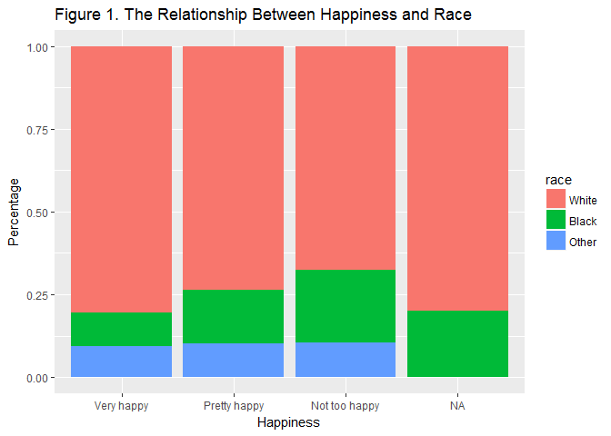
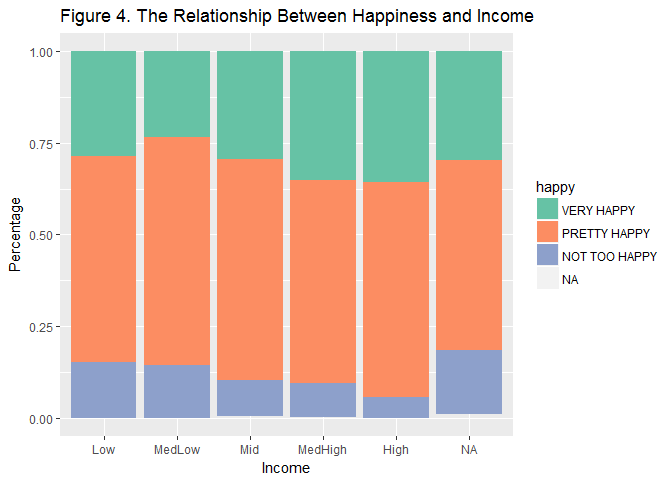
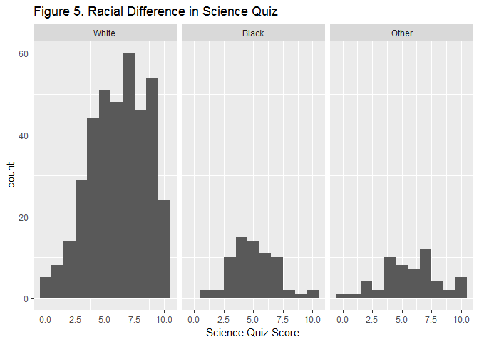
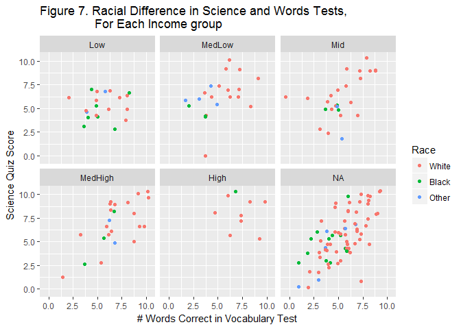

EDA For the GSS Data - Exploration Write-up
================
Xi Chen
November 26, 2017

The General Social Survey provides us with a large scale of data and enables us to examine numerous social issues. By conducting EDA with the GSS data, I would like to discuss the following two research questions:

-   What makes people happy? In other words, what kind of characteristics does the happier people have compared to others in the population?
-   Does racial difference or racial inequality exist in the fields of education, and social or political attitudes?

Happiness
---------

Many factors could make a big difference in one's sense of happiness. Firstly, I found noticeable difference in the level of happiness among different racial groups. As Figure 1 shows, more white people tend to choose "very happy", while more black people tend to choose "not too happy". This racial inequality may lead to serious social problems, so this finding should be attached great importance by policy makers. Secondly, in general, marriage brings people happiness. As Figure 2 shows, married people are more likely to be "very happy" than those who never got married. This tells us that marriage could be one of the important sources of happiness. Another interesting finding is showed in Figure 3: the "very happy" people are more likely to have a higher educational degree, such as "graduate degree" and "bachelor degree", which may indicate a positive relationship between happiness and educational background. However, further investigation should be carried out to rule out the moderate or confounding variables. It may be the case that, higher educational degree leads to higher income, resulting in higher level of happiness. Hence, it is questionable to directly conclude that higher education degrees bring more happiness. Therefore, as showed in Figure 4, I examined the relationship between happiness and income. However, from this figure, it doesn't show a significantly positive relationship between these two variables.

In addition, (the supportive figures of the following findings are not attached below but in the Lab Notebook), I also found that people who watch more TV have a lower level of happiness. This is somewhat surprising, and it may be because watching TV could not make oneself intrinsically happy. However, an opposite result is observed in terms of reading news: people who read news "everyday" are more likely to be happier than those who "never" read news or "less than once a week". Therefore, having a daily habit of reading news may increase one's sense of happiness. Furthermore, in terms of happiness between female and male, no big difference is observed. However, compared to male, slightly larger percentage of the female population choose the extreme choices: "Very happy" or "Not too happy", which may support the psychological hypothesis or finding that females are more sensitive and sympathetic.

``` r
data(gss, package = "poliscidata")
attach(gss)
options(warn=-1)
library(tidyverse)
```

    ## -- Attaching packages ----------------------------------- tidyverse 1.2.1 --

    ## v ggplot2 2.2.1     v purrr   0.2.4
    ## v tibble  1.3.4     v dplyr   0.7.4
    ## v tidyr   0.7.2     v stringr 1.2.0
    ## v readr   1.1.1     v forcats 0.2.0

    ## -- Conflicts -------------------------------------- tidyverse_conflicts() --
    ## x dplyr::filter() masks stats::filter()
    ## x dplyr::lag()    masks stats::lag()

``` r
gss <- as_tibble(gss)

ggplot(gss, aes(happy, fill=race)) + geom_bar(position="fill") +
  scale_x_discrete(labels=c("VERY HAPPY"="Very happy", 
                            "PRETTY HAPPY" = "Pretty happy", 
                            "NOT TOO HAPPY" = "Not too happy")) + 
  labs(title = "Figure 1. The Relationship Between Happiness and Race",
       x = "Happiness",
       y = "Percentage")
```



``` r
ggplot(gss, aes(happy, fill=marital)) + 
  geom_bar(position="fill") +
  scale_fill_brewer(palette = "Paired") + 
  scale_x_discrete(labels=c("VERY HAPPY"="Very happy", 
                            "PRETTY HAPPY" = "Pretty happy", 
                            "NOT TOO HAPPY" = "Not too happy")) +
  labs(title = "Figure 2. Respondent's Happiness In Various Marital Status",
       x = "Respondent's Happiness",
       y = "Percentage",
       color = "Marital Status" )
```


``` r
ggplot(gss, aes(happy, fill=degree)) + geom_bar(position="fill") +
  scale_x_discrete(labels=c("VERY HAPPY"="Very happy", 
                            "PRETTY HAPPY" = "Pretty happy", 
                            "NOT TOO HAPPY" = "Not too happy")) + 
  labs(title = "Figure 3. The Relationship Between Happiness and Degree",
       x = "Happiness",
       y = "Percentage")
```


``` r
ggplot(gss, aes(rincom06_5, fill=happy)) + 
  geom_bar(position="fill") + 
  scale_fill_brewer(palette = "Set2") + 
  labs(title = "Figure 4. The Relationship Between Happiness and Income",
       x = "Income",
       y = "Percentage")
```



Racial Difference
-----------------

Except for the finding that different racial groups have various levels of happiness, which mentioned above, racial difference or racial inequality also exists in the fields of education, and social attitudes. In terms of education, there is significant difference in science quiz score between white people and black people. As showed in Figure 5, the score distribution of white people is left skewness, while the black people's score distribution is right skewness. In other words, more white people have higher scores than black people. Similar result is found in the vocabulary test score, as showed in Figure 6. The average score of white people is higher than that of black people. Then, I would like to see if there is relationship between these educational outcomes and future income, so a combined comparison is carried out in Figure 7. It shows that in the low-income group, there are more black people with lower science quiz and vocabulary test scores; in the high-income group, there are more white people with higher science quiz and vocabulary test scores. From this figure, we can tell that the racial difference in education scores would possibly lead to income inequality in the future.

``` r
ggplot(gss, aes(science_quiz)) + 
  geom_histogram(binwidth = 1) + 
  facet_wrap(~race) + 
  labs(title = "Figure 5. Racial Difference in Science Quiz",
       x = "Science Quiz Score")
```



``` r
ggplot(gss, aes(wordsum)) + 
  geom_histogram(binwidth = 1) + 
  facet_wrap(~race) + 
  labs(title = "Figure 6. Racial Difference in Vocabulary Test",
       x = "Vocabulary Test Score")
```


``` r
gss %>% 
  ggplot(aes(wordsum, science_quiz, color=race))+
  geom_jitter(alpha=1) +
  facet_wrap(~rincom06_5)+
  labs(title = "Figure 7. Racial Difference in Science and Words Tests, 
                For Each Income group",
       y = "Science Quiz Score",
       x = "# Words Correct in Vocabulary Test",
       color = "Race")
```



In terms of social and political attitudes, I have a surprising finding. I mainly focused on examining the two variables: social trust and confidence in government. My hypotheses are black people have lower social trust and lower confidence in government than white people. As showed in Figure 8, more white people choose the higher levels: 2 or 3, as their perception or attitudes toward social trust, while most of the black people choose the lower levels: 0 or 1, indicating their lower perception of social trust. However, in Figure 9, most black people choose the high level: 3, to represent their confidence in government, while a large proportional of white people choose the lower level: 1, indicating a much lower level of confidence in government. The results suggest opposite trends in these two social and political attitudes: more white people have higher level of social trust than black people, while more black people have higher level of confidence in government than white people. This interesting contrast is worth of further investigation.

``` r
ggplot(gss, aes(social_trust, color = race_2)) + 
  geom_density() + 
  labs(title = "Figure 8. Racial Difference in Social Trust",
       x = "Social Trust",
       y = "Density",
       color = "Race")
```


``` r
ggplot(gss, aes(con_govt, color = race_2)) + 
  geom_density() + 
  labs(title = "Figure 9. Racial Difference in Confidence of Government",
       x = "Confidence in Government",
       y = "Density",
       color = "Race")
```


