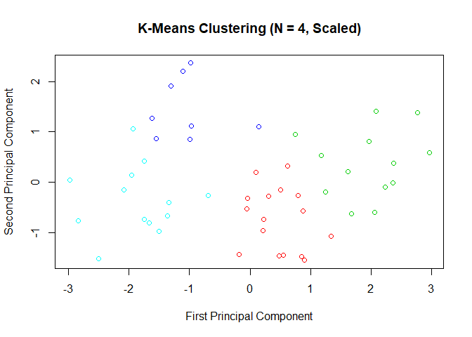
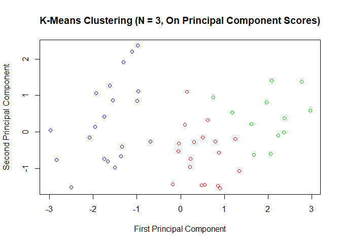
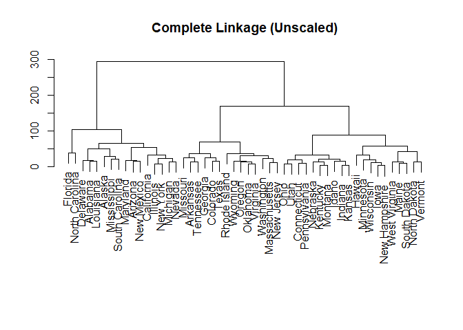
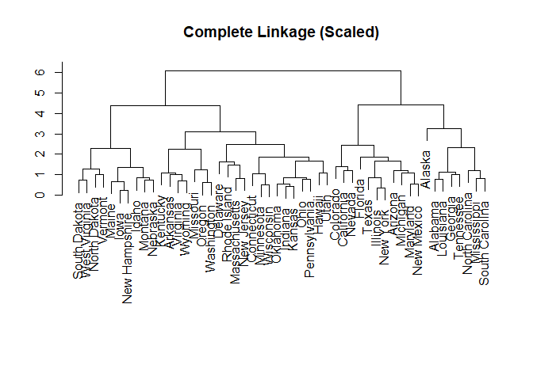

Unsupervised Learning Assignment
================
Ling Dai
12/04/2017

### Part 1: PCA on Colleges Data

``` r
college <- read.csv("College.csv")

pr.out = prcomp(college[,2:18], scale = TRUE)

biplot(pr.out, scale = 0,
       xlab = "first principal component", ylab = "second principal component")
```


``` r
#What variables are most significant in the first principal component
pr.out$rotation[,1]
#What variables are most significant in the second principal component
pr.out$rotation[,2]

#Calculate pve
pr.var = pr.out$sdev ^ 2
pve <- pr.var/sum(pr.var)

#Cumulative Plot
plot(cumsum(pve), xlab = "Principal Component", ylab = "Cumulative PVE",
     ylim = c(0,1), type = "b", main = "Cumulative Proportion of Variance Explained")
```


1.  Top10perc and Top25perc appear most strongly correlated on the first principal component (|coefficient| close to 0.35), followed by PhD, Expend, Terminal (|coefficient| &gt; 0.3).

2.  Apps, Accept, Enroll, F.Undergrad, P.Undergrad (|coefficient| &gt; 0.3) appear most strongly correlated on the second principal component.

3.  Approximately 60% of the variance in College is explained by the first two principal components.

### Part 2: Clustering on Arrests Data

#### PCA

``` r
arrests <- read.csv("USArrests.csv")

pr.arrests <- prcomp(arrests[2:5], scale = TRUE)

biplot(pr.arrests, scale = 0)
```


From the plot we can observe that Murder, Assalt and Rape are most strongly correlated on the first principal component, while UrbanPop is strongly correlated on the second principal component.

#### K-Means Clustering: N = 2

``` r
set.seed(16)

km.arrests2 <- kmeans(scale(arrests[2:5]), 2, nstart = 25)

km.arrests2

plot(pr.arrests$x[,2]~pr.arrests$x[,1], col = km.arrests2$cluster+1,
     xlab = "First Principal Component", ylab = "Second Principal Component",
     main = "K-Means Clustering (N = 2, Scaled)")
```


From the plot we can observe that, when N = 2, the clustering result seems to be mainly influenced by the first principal component: the observations with smaller values of the first principal component tend to be grouped into a cluster (cluster 1), while those with greater values of the first principal components are grouped into another cluster (cluster 2). The second principal component does not appear very significant in diciding the clustering outcome. The result suggests that the first principal component is able to explain most variance between the clusters.

#### K-Means Clustering: N = 4

``` r
set.seed(16)

km.arrests4 <- kmeans(scale(arrests[2:5]), 4, nstart = 25)

km.arrests4

plot(pr.arrests$x[,2]~pr.arrests$x[,1], col = km.arrests4$cluster+1,
     xlab = "First Principal Component", ylab = "Second Principal Component",
     main = "K-Means Clustering (N = 4, Scaled)")
```



For N = 4, while the first principal component still remains the most deciding factor in clustering, the second principal component seems to have a much larger role in determining cluster memberships compared to the N = 2 case. Overall, the two clusters identified in the previous (N = 2) case are each further splitted into two smaller groups, with some minor changes on the cluster boundaries. The clusters are clearly divided, with no obvious overlappings, which means the first principal are able to efficiently explain most variance between different clusters.

#### K-Means Clustering: N = 3

``` r
set.seed(16)

km.arrests3 <- kmeans(scale(arrests[2:5]), 3, nstart = 25)

km.arrests3

plot(pr.arrests$x[,2]~pr.arrests$x[,1], col = km.arrests3$cluster+1,
     xlab = "First Principal Component", ylab = "Second Principal Component",
     main = "K-Means Clustering (K = 3, Scaled)")
```


Like previous plots, the clusters have clear-cut boundaries. The clustering result is almost solely influenced by the first principal component value of each data point, except on the boundary between Cluster 2 (red) and Cluster 3 (green), where the second principal component seems to also play a role.

#### K-Means Clustering: N = 3 (Principal Components)

``` r
set.seed(16)

km.arrests_pc <- kmeans(pr.arrests$x[,1:2], 3, nstart = 25)

km.arrests_pc

plot(pr.arrests$x[,2]~pr.arrests$x[,1], col = km.arrests_pc$cluster+1,
     xlab = "First Principal Component", ylab = "Second Principal Component",
     main = "K-Means Clustering (N = 3, On Principal Component Scores)")
```



The plot looks exactly the same as the previous plot (clustering based on raw data), which means the results of clustering are the same. Based on the statistics, however, the (between\_SS / total\_SS) value is higher when we perform clustering based on the first two principal components, instead of raw data.

#### Hierarchical Clustering (Complete Linkage)

``` r
plot(hclust(dist(arrests[2:5]), method = "complete"), labels = arrests$State,
     main = "Complete Linkage (Unscaled)", xlab = "", ylab = "", sub = "")
```



#### Cut Dendrogram (3 Distinct Clusters)

``` r
hc.clusters <- cutree(hclust(dist(arrests[2:5])),3)

arrests$hc.cluster <- hc.clusters

subset(arrests, hc.cluster == 1)$State
subset(arrests, hc.cluster == 2)$State
subset(arrests, hc.cluster == 3)$State
```

Among all 50 states,

16 States are grouped into Cluster 1:
Alabama Alaska Arizona California Delaware Florida Illinois
Louisiana Maryland Michigan Mississippi Nevada New Mexico New York
North Carolina South Carolina

14 States are grouped into Cluster 2:
Arkansas Colorado Georgia Massachusetts Missouri New Jersey Oklahoma Oregon
Rhode Island Tennessee Texas Virginia Washington Wyoming

20 States are grouepd into Cluster 3:
Connecticut Hawaii Idaho Indiana Iowa Kansas Kentucky Maine
Minnesota Montana Nebraska New Hampshire North Dakota Ohio Pennsylvania South Dakota Utah Vermont West Virginia Wisconsin

#### Hierarchical Clustering (Scaled, Complete Linkage)

``` r
plot(hclust(dist(scale(arrests[2:5]))), labels = arrests$State,
     main = "Complete Linkage (Scaled)", xlab = "", ylab = "", sub = "")
```



``` r
sd.hc.clusters <- cutree(hclust(dist(scale(arrests[2:5]))),3)
table(hc.clusters, sd.hc.clusters)

arrests$sd.cluster <- sd.hc.clusters
subset(arrests, sd.cluster == 2 & hc.cluster == 1)$State
subset(arrests, sd.cluster == 3 & hc.cluster == 2)$State
subset(arrests, sd.cluster == 3 & hc.cluster == 1)$State
```

Compared to our previous model, the shape of the tree generated with standardized data looks more balanced, whereas the previous tree looks heavier on the right side. Noticeably, the clustering result generated with standardized data have more observations classified as cluster 3 members.

In fact, 10 of the 34 Cluster 3 members in the standardized model were idenfitied as Cluster 2 members in the previous model:
Arkansas Massachusetts Missouri New Jersey Oklahoma Oregon Rhode Island Virginia
Washington Wyoming

And one Cluster 3 member was previously identified as a Cluster 1 member in the unstandardized model:
Delaware

Moreoever, 9 observations that were previously identified as Cluster 1 members are now grouped into Cluster 2 by the standardized model:
Arizona California Florida Illinois Maryland Michigan Nevada New Mexico New York
