EDA Notebook
================
Yilun Dai
11/25/2017

``` r
#setwd("~/Documents/Fall2017/MACS30000")
#install.packages("poliscidata")
data(gss, package = "poliscidata")
library(tidyverse)
```

    ## Warning: package 'tidyverse' was built under R version 3.3.2

    ## Loading tidyverse: ggplot2
    ## Loading tidyverse: tibble
    ## Loading tidyverse: tidyr
    ## Loading tidyverse: readr
    ## Loading tidyverse: purrr
    ## Loading tidyverse: dplyr

    ## Warning: package 'tibble' was built under R version 3.3.2

    ## Warning: package 'tidyr' was built under R version 3.3.2

    ## Warning: package 'purrr' was built under R version 3.3.2

    ## Warning: package 'dplyr' was built under R version 3.3.2

    ## Conflicts with tidy packages ----------------------------------------------

    ## filter(): dplyr, stats
    ## lag():    dplyr, stats

``` r
library(ggthemes)
library(knitr)
library(broom)
library(stringr)
options(digits = 3)
set.seed(1234)
theme_set(theme_minimal())
gss1 <- read.csv('gss2012.csv', header = TRUE)
str(gss)
```

    ## 'data.frame':    1974 obs. of  221 variables:
    ##  $ year            : num  2012 2012 2012 2012 2012 ...
    ##  $ id              : num  1 2 3 4 5 6 7 8 9 10 ...
    ##  $ wrkstat         : Factor w/ 7 levels "WORKING FULL TIME",..: 2 2 1 NA 5 NA 7 7 7 1 ...
    ##  $ wrkslf          : Factor w/ 2 levels "SELF-EMPLOYED",..: 2 2 2 2 2 2 2 NA NA 2 ...
    ##  $ wrkgvt          : Factor w/ 2 levels "GOVERNMENT","PRIVATE": 2 2 2 2 1 2 2 NA NA 2 ...
    ##  $ marital         : Factor w/ 5 levels "Married","Widowed",..: 5 5 1 1 4 2 1 4 1 5 ...
    ##  $ sibs            : atomic  1 2 1 2 0 4 2 2 2 0 ...
    ##   ..- attr(*, "value.labels")= Named num 
    ##   .. ..- attr(*, "names")= chr 
    ##  $ childs          : atomic  0 0 2 2 3 2 2 3 2 0 ...
    ##   ..- attr(*, "value.labels")= Named num 8
    ##   .. ..- attr(*, "names")= chr "8+"
    ##  $ age             : atomic  22 21 42 49 70 50 35 24 28 28 ...
    ##   ..- attr(*, "value.labels")= Named num 89
    ##   .. ..- attr(*, "names")= chr "89+"
    ##  $ educ            : Factor w/ 22 levels "IAP","None","1st grade",..: 18 14 14 15 18 21 17 13 11 19 ...
    ##  $ degree          : Factor w/ 5 levels "<HS","HS","Junior Coll",..: 4 2 2 2 4 4 3 1 1 4 ...
    ##  $ sex             : Factor w/ 2 levels "Male","Female": 1 1 1 2 2 2 2 2 2 2 ...
    ##  $ race            : Factor w/ 3 levels "White","Black",..: 1 1 3 1 2 1 1 3 2 1 ...
    ##  $ polviews        : Factor w/ 7 levels "ExtrmLib","Liberal",..: 4 5 5 5 2 4 4 4 6 2 ...
    ##  $ partyid         : Factor w/ 7 levels "StrDem","WkDem",..: 3 5 3 6 1 1 4 4 4 1 ...
    ##  $ mobile16        : Factor w/ 3 levels "SAME CITY","SAME ST, DIF CITY",..: 2 1 3 2 1 2 1 1 NA 1 ...
    ##  $ born            : Factor w/ 2 levels "YES","NO": 1 1 1 1 1 1 1 2 1 1 ...
    ##  $ income06        : Factor w/ 25 levels "UNDER $1 000",..: 25 25 23 24 19 15 16 5 1 16 ...
    ##  $ rincom06        : Factor w/ 25 levels "UNDER $1 000",..: NA NA 23 NA NA NA NA NA NA 16 ...
    ##  $ region          : Factor w/ 9 levels "NEW ENGLAND",..: 1 1 1 1 2 2 2 2 2 2 ...
    ##  $ size            : atomic  14 14 14 14 24 24 24 24 24 24 ...
    ##   ..- attr(*, "value.labels")= Named num 
    ##   .. ..- attr(*, "names")= chr 
    ##  $ vote08_coded    : Factor w/ 2 levels "Voted","Did not vote": 2 NA 1 1 1 1 2 NA 1 1 ...
    ##  $ pres08          : Factor w/ 2 levels "Obama","McCain": NA NA 1 2 1 1 NA NA 1 1 ...
    ##  $ natspac         : Factor w/ 3 levels "Too little","About right",..: NA NA 2 NA NA 2 1 NA 2 2 ...
    ##  $ natenvir        : Factor w/ 3 levels "Too little","About right",..: NA NA 2 NA NA 1 1 NA 1 1 ...
    ##  $ natheal         : Factor w/ 3 levels "Too little","About right",..: NA NA 3 NA NA 1 1 NA 2 1 ...
    ##  $ natcity         : Factor w/ 3 levels "Too little","About right",..: NA NA 2 NA NA 1 1 NA 1 NA ...
    ##  $ natcrime        : Factor w/ 3 levels "Too little","About right",..: NA NA 2 NA NA 2 1 NA 2 2 ...
    ##  $ natdrug         : Factor w/ 3 levels "Too little","About right",..: NA NA NA NA NA 1 2 NA 2 1 ...
    ##  $ nateduc         : Factor w/ 3 levels "Too little","About right",..: NA NA 1 NA NA 2 1 NA 1 1 ...
    ##  $ natrace         : Factor w/ 3 levels "Too little","About right",..: NA NA 2 NA NA 3 2 NA 1 1 ...
    ##  $ natarms         : Factor w/ 3 levels "Too little","About right",..: NA NA 3 NA NA 3 1 NA 2 2 ...
    ##  $ nataid          : Factor w/ 3 levels "Too little","About right",..: NA NA 3 NA NA 3 2 NA 2 2 ...
    ##  $ natfare         : Factor w/ 3 levels "Too little","About right",..: NA NA 2 NA NA 3 3 NA 1 1 ...
    ##  $ natroad         : Factor w/ 3 levels "Too little","About right",..: 3 2 1 1 1 1 1 2 2 1 ...
    ##  $ natsoc          : Factor w/ 3 levels "Too little","About right",..: 1 3 2 NA 1 3 1 3 2 1 ...
    ##  $ natmass         : Factor w/ 3 levels "Too little","About right",..: 1 2 NA 2 2 2 2 2 1 1 ...
    ##  $ natpark         : Factor w/ 3 levels "Too little","About right",..: 2 2 1 3 2 1 2 2 1 NA ...
    ##  $ natchld         : Factor w/ 3 levels "Too little","About right",..: 2 2 1 NA 2 1 1 1 1 1 ...
    ##  $ natsci          : Factor w/ 3 levels "Too little","About right",..: 2 1 1 3 1 1 2 2 3 2 ...
    ##  $ natenrgy        : Factor w/ 3 levels "Too little","About right",..: 1 1 2 1 1 1 2 1 2 1 ...
    ##  $ eqwlth          : atomic  NA 3 5 7 7 NA 2 1 NA 1 ...
    ##   ..- attr(*, "value.labels")= Named num  7 1
    ##   .. ..- attr(*, "names")= chr  "NO GOVT ACTION" "GOVT REDUCE DIFF"
    ##  $ spkath          : Factor w/ 2 levels "ALLOWED","NOT ALLOWED": NA 1 1 NA NA 1 NA NA 1 1 ...
    ##  $ colath          : Factor w/ 2 levels "ALLOWED","NOT ALLOWED": 1 2 1 NA NA 2 NA 2 1 1 ...
    ##  $ libath          : Factor w/ 2 levels "REMOVE","NOT REMOVE": NA 2 2 NA NA 2 NA 2 2 2 ...
    ##  $ spkrac          : Factor w/ 2 levels "ALLOWED","NOT ALLOWED": 2 1 1 NA NA 1 NA NA 2 1 ...
    ##  $ colrac          : Factor w/ 2 levels "ALLOWED","NOT ALLOWED": 2 2 2 NA NA 2 NA 2 2 1 ...
    ##  $ librac          : Factor w/ 2 levels "REMOVE","NOT REMOVE": NA 2 2 NA NA 2 NA 1 1 2 ...
    ##  $ spkcom          : Factor w/ 2 levels "ALLOWED","NOT ALLOWED": 2 1 1 NA NA 1 NA 2 1 1 ...
    ##  $ colcom          : Factor w/ 2 levels "FIRED","NOT FIRED": 2 1 2 NA NA NA NA 1 1 2 ...
    ##  $ libcom          : Factor w/ 2 levels "REMOVE","NOT REMOVE": 2 2 2 NA NA 2 NA 1 2 2 ...
    ##  $ spkmil          : Factor w/ 2 levels "ALLOWED","NOT ALLOWED": 1 1 1 NA NA 1 NA 2 2 1 ...
    ##  $ colmil          : Factor w/ 2 levels "ALLOWED","NOT ALLOWED": 2 2 1 NA NA 2 NA NA 2 1 ...
    ##  $ libmil          : Factor w/ 2 levels "REMOVE","NOT REMOVE": 2 2 2 NA NA 1 NA NA 1 2 ...
    ##  $ spkhomo         : Factor w/ 2 levels "ALLOWED","NOT ALLOWED": 1 2 1 NA NA 1 NA 1 1 1 ...
    ##  $ colhomo         : Factor w/ 2 levels "ALLOWED","NOT ALLOWED": 1 2 1 NA NA 1 NA 1 1 1 ...
    ##  $ libhomo         : Factor w/ 2 levels "REMOVE","NOT REMOVE": 2 2 2 NA NA 2 NA 2 1 2 ...
    ##  $ spkmslm         : Factor w/ 2 levels "Yes, allowed",..: 2 2 1 NA NA 2 NA 2 2 1 ...
    ##  $ colmslm         : Factor w/ 2 levels "Yes, allowed",..: NA 2 1 NA NA 2 NA 2 2 2 ...
    ##  $ libmslm         : Factor w/ 2 levels "Remove","Not remove": 1 1 2 NA NA 1 NA 1 1 2 ...
    ##  $ cappun          : Factor w/ 2 levels "FAVOR","OPPOSE": NA 1 NA 1 2 2 1 2 NA 2 ...
    ##  $ gunlaw          : Factor w/ 2 levels "FAVOR","OPPOSE": 2 1 2 NA NA 1 NA 1 1 1 ...
    ##  $ courts          : Factor w/ 3 levels "TOO HARSH","NOT HARSH ENOUGH",..: NA 2 NA NA 2 2 2 1 1 3 ...
    ##  $ grass           : Factor w/ 2 levels "LEGAL","NOT LEGAL": NA 1 1 1 2 NA 1 2 NA 1 ...
    ##  $ relig           : Factor w/ 13 levels "PROTESTANT","CATHOLIC",..: 2 2 1 1 1 1 11 2 4 4 ...
    ##  $ fund            : Factor w/ 3 levels "FUNDAMENTALIST",..: 2 2 2 3 1 NA 2 2 3 3 ...
    ##  $ attend          : Factor w/ 9 levels "Never","<Once/yr",..: 3 1 1 1 2 1 4 4 1 3 ...
    ##  $ reliten         : Factor w/ 4 levels "STRONG","NOT VERY STRONG",..: 2 2 1 2 3 2 3 2 4 4 ...
    ##  $ postlife        : Factor w/ 2 levels "YES","NO": 1 1 1 1 NA 1 1 2 2 NA ...
    ##  $ pray            : Factor w/ 6 levels "SEVERAL TIMES A DAY",..: 4 6 1 6 1 1 4 5 6 2 ...
    ##  $ bible           : Factor w/ 3 levels "WORD OF GOD",..: 2 1 2 2 1 2 1 2 2 2 ...
    ##  $ affrmact        : Factor w/ 4 levels "STRONGLY SUPPORT PREF",..: NA NA NA 3 3 3 3 NA 1 NA ...
    ##  $ wrkwayup        : Factor w/ 5 levels "AGREE STRONGLY",..: 2 NA NA 1 1 2 2 NA 1 NA ...
    ##  $ closeblk        : atomic  5 6 5 NA NA 5 NA 5 9 7 ...
    ##   ..- attr(*, "value.labels")= Named num  9 5 1
    ##   .. ..- attr(*, "names")= chr  "VERY CLOSE" "NEITHER ONE OR THE OTHER" "NOT AT ALL CLOSE"
    ##  $ closewht        : atomic  7 7 4 NA NA 5 NA 5 9 5 ...
    ##   ..- attr(*, "value.labels")= Named num  9 5 1
    ##   .. ..- attr(*, "names")= chr  "VERY CLOSE" "NEITHER ONE OR THE OTHER" "NOT AT ALL CLOSE"
    ##  $ happy           : Factor w/ 3 levels "VERY HAPPY","PRETTY HAPPY",..: 1 1 2 1 1 1 2 2 3 2 ...
    ##  $ confinan        : Factor w/ 3 levels "A GREAT DEAL",..: NA 3 2 1 3 NA 2 2 NA 2 ...
    ##  $ conbus          : Factor w/ 3 levels "A GREAT DEAL",..: NA 1 2 1 3 NA 3 2 NA 3 ...
    ##  $ conclerg        : Factor w/ 3 levels "A GREAT DEAL",..: NA 1 2 1 2 NA 2 2 NA 2 ...
    ##  $ coneduc         : Factor w/ 3 levels "A GREAT DEAL",..: NA 2 2 2 1 NA 3 1 NA 2 ...
    ##  $ confed          : Factor w/ 3 levels "A GREAT DEAL",..: NA 2 2 3 1 NA 3 3 NA 1 ...
    ##  $ conlabor        : Factor w/ 3 levels "A GREAT DEAL",..: NA 2 2 3 3 NA 2 2 NA 2 ...
    ##  $ conpress        : Factor w/ 3 levels "A GREAT DEAL",..: NA 3 2 2 3 NA 2 2 NA 2 ...
    ##  $ conmedic        : Factor w/ 3 levels "A GREAT DEAL",..: NA 1 1 1 2 NA 2 1 NA 2 ...
    ##  $ contv           : Factor w/ 3 levels "A GREAT DEAL",..: NA 1 2 2 3 NA 2 2 NA 2 ...
    ##  $ conjudge        : Factor w/ 3 levels "A GREAT DEAL",..: NA 1 2 2 1 NA 2 1 NA 2 ...
    ##  $ consci          : Factor w/ 3 levels "A GREAT DEAL",..: NA 1 1 NA 1 NA 2 2 NA 1 ...
    ##  $ conlegis        : Factor w/ 3 levels "A GREAT DEAL",..: NA 1 3 3 3 NA 2 2 NA 2 ...
    ##  $ conarmy         : Factor w/ 3 levels "A GREAT DEAL",..: NA 1 1 1 1 NA 1 2 NA 1 ...
    ##  $ obey            : Factor w/ 5 levels "MOST IMPORTANT",..: NA 2 4 2 4 NA 3 1 NA 5 ...
    ##  $ popular         : Factor w/ 5 levels "MOST IMPORTANT",..: NA 5 1 5 5 NA 5 5 NA 4 ...
    ##  $ thnkself        : Factor w/ 5 levels "MOST IMPORTANT",..: NA 3 5 3 1 NA 1 4 NA 2 ...
    ##  $ workhard        : Factor w/ 5 levels "MOST IMPORTANT",..: NA 1 2 1 2 NA 2 2 NA 3 ...
    ##  $ helpoth         : Factor w/ 5 levels "MOST IMPORTANT",..: NA 4 3 4 3 NA 4 3 NA 1 ...
    ##  $ union           : Factor w/ 4 levels "R BELONGS","SPOUSE BELONGS",..: NA 4 4 4 4 NA 4 4 NA 4 ...
    ##  $ getahead        : Factor w/ 4 levels "HARD WORK","BOTH EQUALLY",..: 2 1 3 NA NA 2 NA 1 2 2 ...
    ##  $ abdefect        : Factor w/ 2 levels "YES","NO": 1 1 1 NA NA 1 NA 1 1 1 ...
    ##  $ abnomore        : Factor w/ 2 levels "YES","NO": NA 1 2 NA NA 1 NA 1 2 1 ...
    ##  $ abhlth          : Factor w/ 2 levels "YES","NO": 1 1 1 NA NA 1 NA 1 1 1 ...
    ##   [list output truncated]
    ##  - attr(*, "variable.labels")= Named chr  "Gss Year For This Respondent" "Respondent Id Number" "Labor Force Status" "R Self-Emp Or Works For Somebody" ...
    ##   ..- attr(*, "names")= chr  "year" "ID" "wrkstat" "wrkslf" ...
    ##  - attr(*, "codepage")= int 65001

``` r
library(ggplot2)
library(forcats)
```

    ## Warning: package 'forcats' was built under R version 3.3.2

1.
==

``` r
#histogram of number of children
ggplot(gss, aes(childs)) + geom_histogram(binwidth = 1) +
labs(title = "Histogram of number of Childs",
       x = "Number of Childs",
       y = "Frequency")
```

    ## Warning: Removed 3 rows containing non-finite values (stat_bin).

<!-- -->

    The data is right skewed and is bimodal. \

2.
==

``` r
#barplot of income
income<- filter(gss, rincom06 != 'NA')
```

    ## Warning: package 'bindrcpp' was built under R version 3.3.2

``` r
ggplot(income, aes(rincom06)) + geom_bar() + 
labs(title = "Barplot of Income",
       x = "Income",
       y = "Frequency")
```

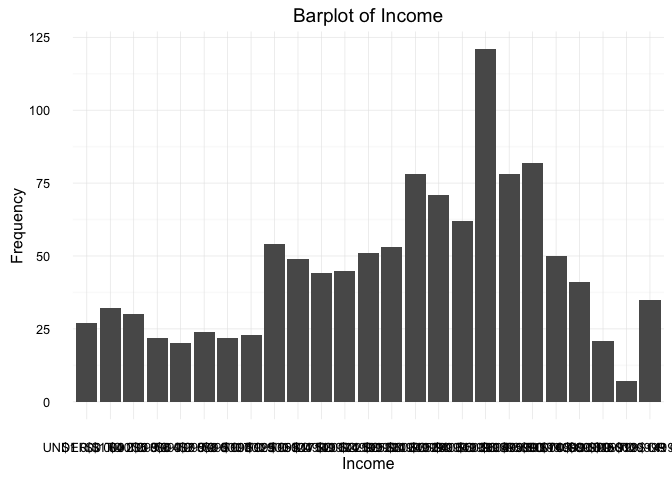<!-- -->

    The data of individual income is right skewed. \

3.
==

``` r
#dot graph for individual income and age
income_summary <- gss %>%
  group_by(rincom06) %>%
  summarise(
    age = mean(age, na.rm = TRUE),
    closewht= mean(closewht, na.rm = TRUE),
    n = n()
  )

ggplot(income_summary, aes(age, fct_relevel(rincom06, "NA"))) +
  geom_point()
```

    ## Warning: Unknown levels in `f`: NA

    ## Warning: Unknown levels in `f`: NA

<!-- -->

    Level of income and age are positively associated.\ 

4.
==

``` r
#dot graph for income and closewht
income_summary <- gss %>%
  group_by(rincom06) %>%
  summarise(
    age = mean(age, na.rm = TRUE),
    closewht= mean(closewht, na.rm = TRUE),
    n = n()
  )

ggplot(income_summary, aes(closewht, fct_relevel(rincom06, "NA"))) +
  geom_point()
```

    ## Warning: Unknown levels in `f`: NA

    ## Warning: Unknown levels in `f`: NA

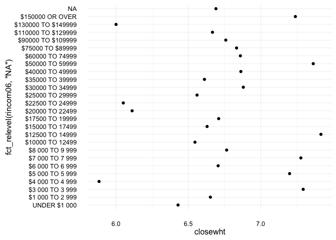<!-- -->

    Mostly concentrated between 6.5 and 7.0 \

5.
==

``` r
#dot graph for family income and closeblk
income_summary <- gss %>%
  group_by(rincom06) %>%
  summarise(
    age = mean(age, na.rm = TRUE),
    closeblk= mean(closeblk, na.rm = TRUE),
    n = n()
  )

ggplot(income_summary, aes(closeblk, fct_relevel(rincom06, 'NA'))) +
  geom_point()
```

    ## Warning: Unknown levels in `f`: NA

    ## Warning: Unknown levels in `f`: NA

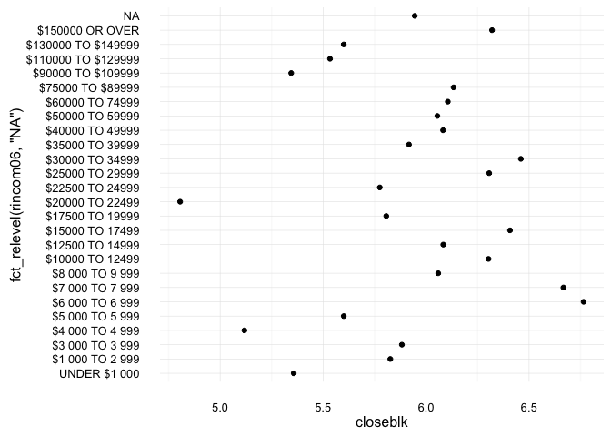<!-- -->

    Mostly between 5.5 and 6.5. \

6.
==

``` r
#dot graph for income and eqwlth
income_summary <- gss %>%
  group_by(rincom06) %>%
  summarise(
    age = mean(age, na.rm = TRUE),
    eqwlth= mean(eqwlth, na.rm = TRUE),
    n = n()
  )

ggplot(income_summary, aes(eqwlth, fct_relevel(rincom06, "NA"))) +
  geom_point()
```

    ## Warning: Unknown levels in `f`: NA

    ## Warning: Unknown levels in `f`: NA

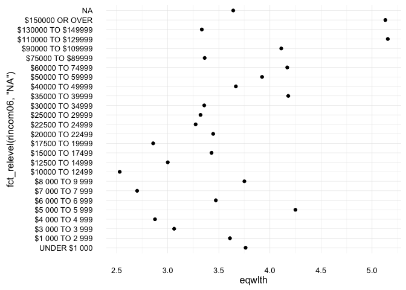<!-- -->

    Eqwlth is likely to be positively associated with income. \ 

7.
==

``` r
#dot graph for family income and number of child
familyincome_summary <- gss %>%
  group_by(income06) %>%
  summarise(
    age = mean(age, na.rm = TRUE),
    childs= mean(childs, na.rm = TRUE),
    n = n()
  )

ggplot(familyincome_summary, aes(childs, fct_relevel(income06, "NA"))) +
  geom_point()
```

    ## Warning: Unknown levels in `f`: NA

    ## Warning: Unknown levels in `f`: NA

<!-- -->

    Families with higher income tend to have fewer child.\

8.
==

``` r
#happy bar plot
ggplot(gss, aes(happy)) +
  geom_bar()
```

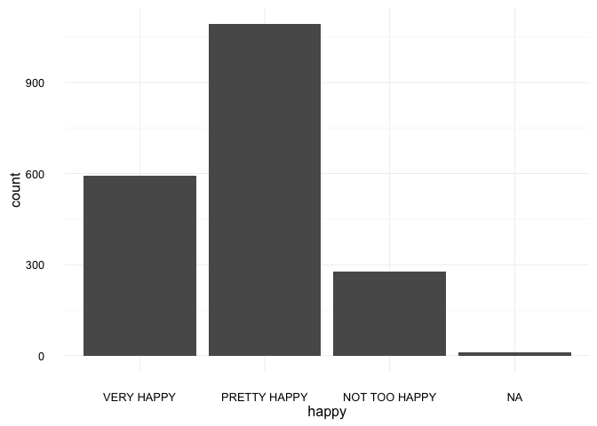<!-- -->

9.
==

``` r
# happy and income
gss %>%
  count(happy, rincom06) %>%
  na.omit() %>%
  mutate(rincome = factor(rincom06)) %>%
  ggplot(aes(rincome, n, fill = happy)) +
  geom_bar(stat = 'identity')
```

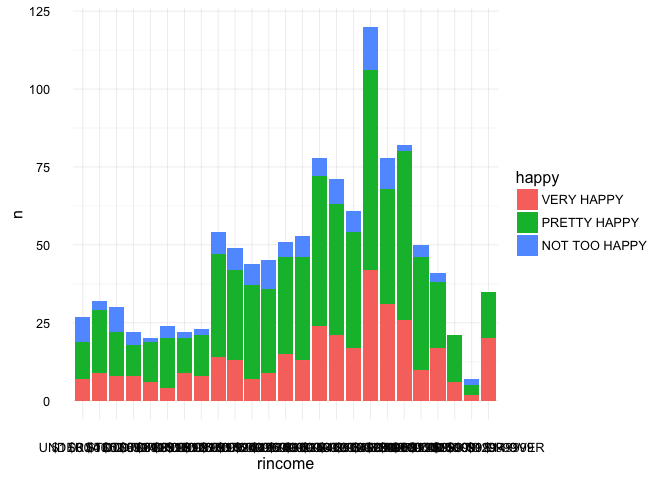<!-- -->

10.
===

``` r
# gunlaw and income
gss %>%
  count(gunlaw, rincom06) %>%
  na.omit() %>%
  mutate(rincome = factor(rincom06)) %>%
  ggplot(aes(rincome, n, fill = gunlaw)) +
  geom_bar(stat = 'identity')
```

<!-- -->

11.
===

``` r
# degree and income
gss %>%
  count(degree, rincom06) %>%
  na.omit() %>%
  mutate(rincome = factor(rincom06)) %>%
  ggplot(aes(rincome, n, fill = degree)) +
  geom_bar(stat = 'identity')
```

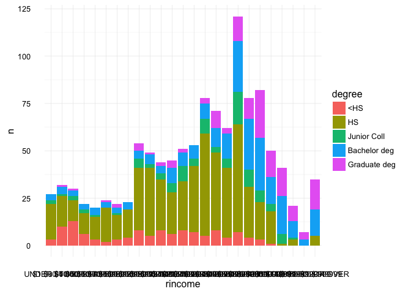<!-- -->

12.
===

``` r
# getahead and income
gss %>%
  count(getahead, rincom06) %>%
  na.omit() %>%
  mutate(rincome = factor(rincom06)) %>%
  ggplot(aes(rincome, n, fill = getahead)) +
  geom_bar(stat = 'identity')
```

<!-- -->

13.
===

``` r
# grass and income
gss %>%
  count(grass, rincom06) %>%
  na.omit() %>%
  mutate(rincome = factor(rincom06)) %>%
  ggplot(aes(rincome, n, fill = grass)) +
  geom_bar(stat = 'identity')
```

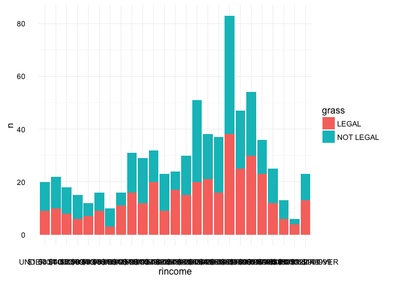<!-- -->

14.
===

``` r
#polviews and guns
gss %>%
  count(polviews, gunlaw) %>%
  na.omit() %>%
  mutate(polviews = factor(polviews)) %>%
  ggplot(aes(polviews, n, fill = gunlaw)) +
  geom_bar(stat = 'identity')
```

<!-- -->

15.
===

``` r
# no more child and income
gss %>%
  count(abnomore, rincom06) %>%
  na.omit() %>%
  mutate(rincome = factor(rincom06)) %>%
  ggplot(aes(rincome, n, fill = abnomore)) +
  geom_bar(stat = 'identity')
```

<!-- -->

16.
===

``` r
# help others and income
gss %>%
  count(helpoth, rincom06) %>%
  na.omit() %>%
  mutate(rincome = factor(rincom06)) %>%
  ggplot(aes(rincome, n, fill = helpoth)) +
  geom_bar(stat = 'identity')
```

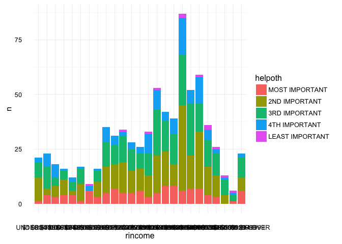<!-- -->

17.
===

``` r
# cappun and gunlaws
gss %>%
  count(cappun, gunlaw) %>%
  na.omit() %>%
  mutate(cappun = factor(cappun)) %>%
  ggplot(aes(cappun, n, fill = gunlaw)) +
  geom_bar(stat = 'identity')
```

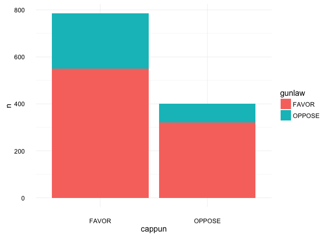<!-- -->

18.
===

``` r
# happy and family income
gss %>%
  count(happy, income06) %>%
  na.omit() %>%
  mutate(income = factor(income06)) %>%
  ggplot(aes(income, n, fill = happy)) +
  geom_bar(stat = 'identity')
```

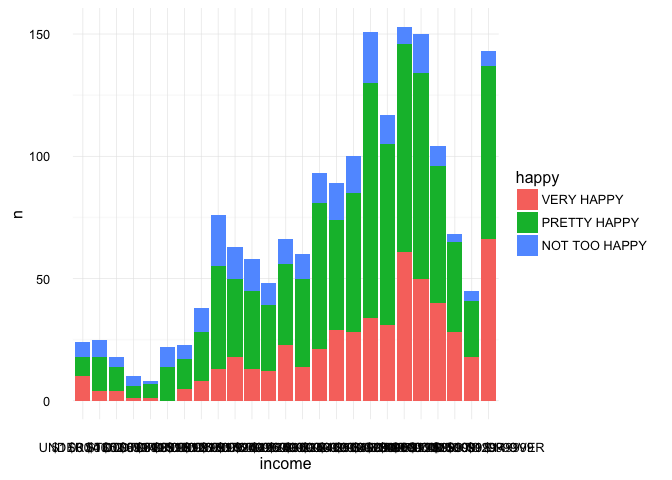<!-- -->

28.
===

``` r
# happy and income excluding students
gss_no_student <- filter(gss, wrkstat != 'SCHOOL')
gss_no_student %>%
  count(happy, rincom06) %>%
  na.omit() %>%
  mutate(rincome = factor(rincom06)) %>%
  ggplot(aes(rincome, n, fill = happy)) +
  geom_bar(stat = 'identity')
```

<!-- -->

29.
===

``` r
# happy and marital
gss %>%
  count(happy, marital) %>%
  na.omit() %>%
  mutate(marital = factor(marital)) %>%
  ggplot(aes(marital, n, fill = happy)) +
  geom_bar(stat = 'identity')
```

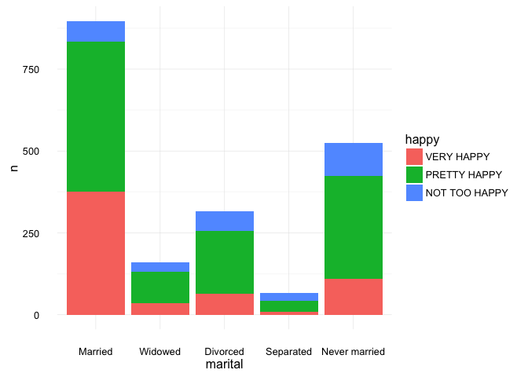<!-- -->

30.
===

``` r
# happy and wrkgvt
gss %>%
  count(happy, wrkgvt) %>%
  na.omit() %>%
  mutate(wrkgvt = factor(wrkgvt)) %>%
  ggplot(aes(wrkgvt, n, fill = happy)) +
  geom_bar(stat = 'identity')
```

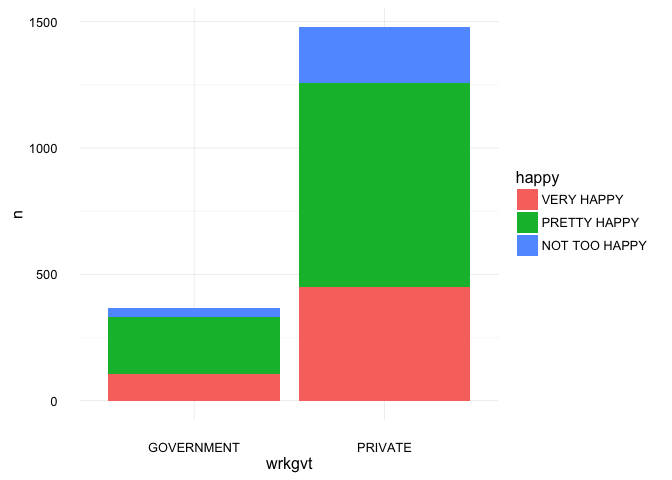<!-- -->

31.
===

``` r
# happy and wrkslf
gss %>%
  count(happy, wrkslf) %>%
  na.omit() %>%
  mutate(wrkslf = factor(wrkslf)) %>%
  ggplot(aes(wrkslf, n, fill = happy)) +
  geom_bar(stat = 'identity')
```

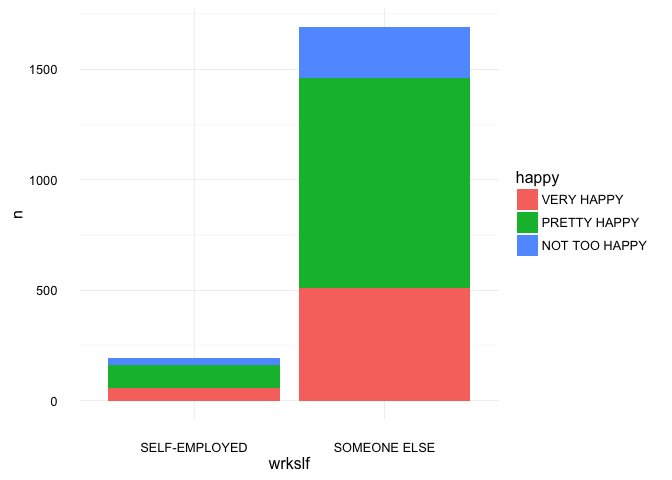<!-- -->

32.
===

``` r
# happy and wrkstat
gss %>%
  count(happy, wrkstat) %>%
  na.omit() %>%
  mutate(wrkstat = factor(wrkstat)) %>%
  ggplot(aes(wrkstat, n, fill = happy)) +
  geom_bar(stat = 'identity')
```

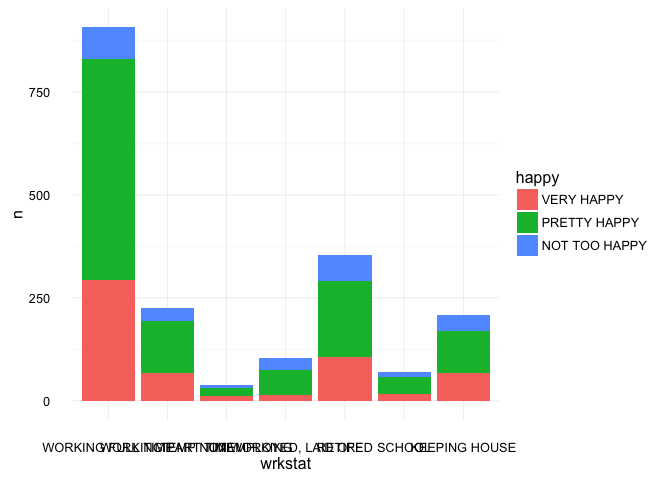<!-- -->

33.
===

``` r
# happy and family income
gss %>%
  count(happy, childs) %>%
  na.omit() %>%
  mutate(childs = factor(childs)) %>%
  ggplot(aes(childs, n, fill = happy)) +
  geom_bar(stat = 'identity')
```

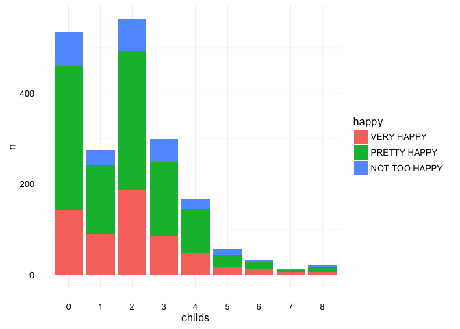<!-- -->

34.
===

``` r
# happy and siblings
gss %>%
  count(happy, sibs) %>%
  na.omit() %>%
  mutate(income = factor(sibs)) %>%
  ggplot(aes(sibs, n, fill = happy)) +
  geom_bar(stat = 'identity')
```

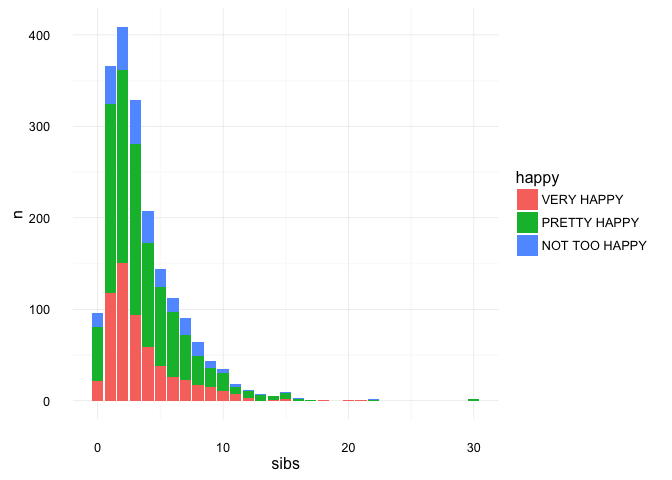<!-- -->

28.
===

``` r
# premarriage sex
gss1 <- read.csv('gss2012.csv', header = TRUE)
ggplot(gss, aes(premarsx)) + geom_bar() + 
labs(title = "Barplot of Opinions on Premarriage Sex",
       x = "Premarsex",
       y = "Frequency")
```

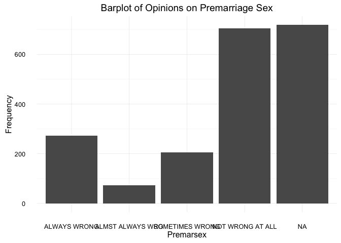<!-- -->

29.
===

``` r
# premarsex and relig
gss %>%
  count(premarsx, relig) %>%
  na.omit() %>%
  mutate(relig = factor(relig)) %>%
  ggplot(aes(relig, n, fill = premarsx)) +
  geom_bar(stat = 'identity')
```

<!-- -->

``` r
summary(gss$relig)
```

    ##              PROTESTANT                CATHOLIC                  JEWISH 
    ##                     916                     444                      28 
    ##                    NONE                   OTHER                BUDDHISM 
    ##                     387                      25                       6 
    ##                HINDUISM           OTHER EASTERN            MOSLEM/ISLAM 
    ##                       9                       5                      13 
    ##      ORTHODOX-CHRISTIAN               CHRISTIAN         NATIVE AMERICAN 
    ##                       6                     120                       6 
    ## INTER-NONDENOMINATIONAL                    NA's 
    ##                       2                       7

30.
===

``` r
# premarsex and marital status
gss %>%
  count(premarsx, marital) %>%
  na.omit() %>%
  mutate(marital = factor(marital)) %>%
  ggplot(aes(marital, n, fill = premarsx)) +
  geom_bar(stat = 'identity')
```

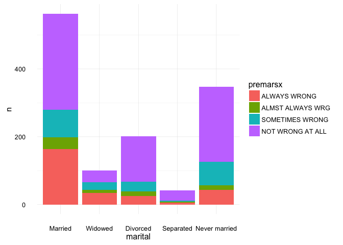<!-- -->

31.
===

``` r
# premarsex and age
gss %>%
  count(premarsx, age) %>%
  na.omit() %>%
  mutate(age = factor(age)) %>%
  ggplot(aes(age, n, fill = premarsx)) +
  geom_bar(stat = 'identity')
```

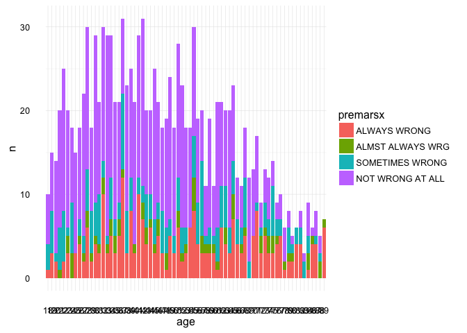<!-- -->

32.
===

``` r
# premarsex and pornlaw
gss %>%
  count(premarsx, pornlaw) %>%
  na.omit() %>%
  mutate(pornlaw = factor(pornlaw)) %>%
  ggplot(aes(pornlaw, n, fill = premarsx)) +
  geom_bar(stat = 'identity')
```

<!-- -->

33.
===

``` r
# premarsex and opinions on homosexual
gss %>%
  count(premarsx, spkhomo) %>%
  na.omit() %>%
  mutate(spkhomo = factor(spkhomo)) %>%
  ggplot(aes(spkhomo, n, fill = premarsx)) +
  geom_bar(stat = 'identity')
```

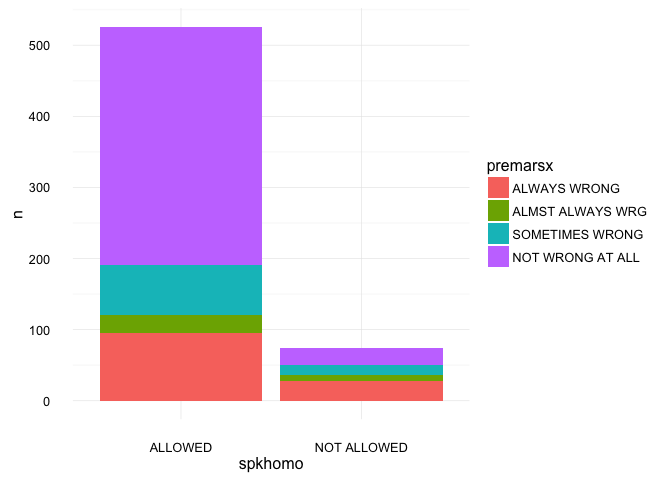<!-- -->

``` r
gss %>%
  count(premarsx, colhomo) %>%
  na.omit() %>%
  mutate(colhomo = factor(colhomo)) %>%
  ggplot(aes(colhomo, n, fill = premarsx)) +
  geom_bar(stat = 'identity')
```

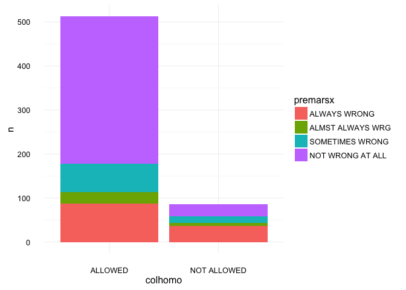<!-- -->

``` r
gss %>%
  count(premarsx, libhomo) %>%
  na.omit() %>%
  mutate(libhomo = factor(libhomo)) %>%
  ggplot(aes(libhomo, n, fill = premarsx)) +
  geom_bar(stat = 'identity')
```

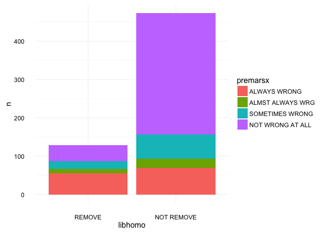<!-- -->

34.
===

``` r
# premarsex and political view
gss %>%
  count(premarsx, polviews) %>%
  na.omit() %>%
  mutate(polviews= factor(polviews)) %>%
  ggplot(aes(polviews, n, fill = premarsx)) +
  geom_bar(stat = 'identity')
```

<!-- -->
