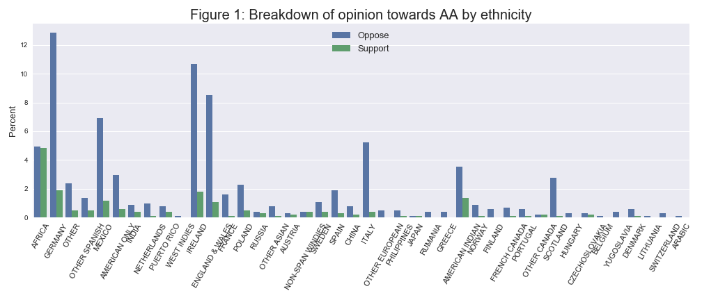
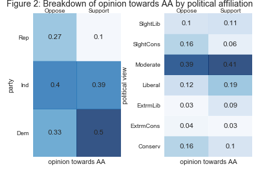
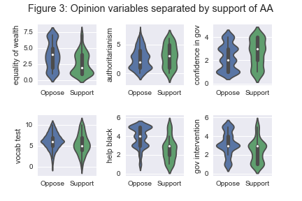

Affirmative action is a policy of favoring members of a disadvantaged group who suffer or have suffered from discrimination within a culture. It is practiced around the globe. In US, affirmative action include government-mandated, government-sanctioned, and voluntary private programs that aim to promote access of education and employment to historically excluded groups such as racial minorities or women. Many affirmative action programs are heatedly under debate, like the recently filed lawsuit tarted at [Harvard's](http://www.cnn.com/2017/08/05/politics/affirmative-action-harvard-justice-department/index.html) unbalanced admission process.  

The 2012 GSS survey provides me with a good data source to fathom what are the some underlying descriptive factors for people's decision to support or oppose the affirmative action. In doing so I can paint a demographic and ideological picture of the proponents and opponents of Affirmative Action.  

The variable of interest in the survey data is called 'affrmact2', which is recoded from the variable 'affrmact', which (supposedly) asks if people have preference in hiring blacks. The label for 'affrmact2' in the dataset says that it stands for people's opinion of the matter. From the data, 983 people opposed and 238 people supported. There were 753 missing data. This gives a support rate of 19.5% and oppose rate of 80.5%. Immediately we can know that among the interviewees, the affirmative action was not very popular. 

The first step that I would like to take is look at the ethnic breakdown of the proponents and opponents. My hypothesis is that more minorities will support AA, where the percentage of people who support AA surpass the percentage that oppose it. Figure 1 shows the distribution of people who support and oppose AA as a percentage of all respondents. We can see that people from European area (Germany, Ireland, France, England, Greece and etc) are much more likely to oppose AA. Surprisingly, minorities like people of native American, Mexican decent also are much more likely to oppose AA. Equally surprising is that half of African Americans would choose to oppose AA as well, albeit the category does hold the highest rate of supporting AA. One reason could be that the variable 'affrmact2' was coded from a question that asked if people have a preference in hiring blacks. Not having a preference in hiring blacks, which could be a perfect illustration of color-blindness, does not necessarily mean that the person opposes AA in general. 

Then I set out to explore how people's opinions and ideologies affect their view of AA. The first thing that come to my mind is the political divide towards AA. The two subplots of  Figure 2 shows exactly that. My hypothesis is that Democrats and more liberal people are more likely to support AA while Republicans and more conservative people are more likely to oppose AA. 

The first subplot shows the breakdown of opinion towards AA by political parties. We already know that significantly more people oppose than support AA. It seems trivial to plot and compare merely the number within the party that supports or opposes AA, because always, more people will oppose than support AA. Instead, I plotted the party divide within the supporters and opponents of AA. Within the people who support AA, Democrats occupies a half while Republicans occupies a mere 10%. Within the people who oppose AA, Republicans occupy more of a share but still less than Democrats. 

The second subplot shows the divide of political ideology within the supporters and opponents of AA. Here, the divide is no as salient as was the case with political parties, but there still is a pattern where conservatives occupy more percentage in opponents than their counterparts in supporters, and vice versa for liberals.

Then, I looked at some scale variables that seemed to have some correlation with people's opinion towards AA. The results are a little counterintuitive for some of the measures. 
First, the variable eqwlth asks if the government should reduce income difference, as a reflection of people's predilection towards equality of wealth. As it turns out, counter intuitively, people who support AA have lower opinions of equality of wealth, with lower variance in its measure than the people who oppose AA. Also counterintuitively, supporters of AA seem to have a higher opinion of authoritarianism, this time with lower variance in its measure than their opponent counterparts. These results could call for further research that investigates whether support for AA is indeed a significant contributing factor to people's opinion towards equality of wealth and authoritarianism.

The result that I considered to be most surprising was that the violin plot of helpblk seems to show that people who support AA are less likely to support government aid to black people. Even though the variable affrmact2 is coded asking whether the respondent has a preference in hiring black people, and should not serve as a proxy for her true opinion of AA, the two variables should be positively correlated. I would think of discrepancies like theses as a wake-up call to look at if there is something wrong with how the data is coded, and track the source to the original survey and how the questions were asked.

The plot of con_govt shows that People who support AA have more confidence in the government than their opposing counter parts, but they don't differ much in their opinion in whether the government should do more or less (helpnot). The former is intuitive in that most of the programs instituted under AA are governmental. The latter is less so in that AA requires a lot of governmental intervention and mandates. 

Finally, as trivial side note, the supporters of AA seem to have a slight lower score in a vocabulary test (wordsum), with similar variance with their opposing counterparts. 

In all, a number of the relationships between people's opinion towards AA and variables representing people's demographics and ideologies are counterintuitive. This calls for better coding and bookkeeping of variables. 

 

 

 
