EDA\_I
================
Zhiyu Fu
11/22/2017

``` r
library(readstata13)
library(data.table)
library(stringi)
library(ggplot2)
library(dplyr)
library(foreign)
library(Hmisc)
library(tidyverse)
library(poliscidata)
library(reshape2)
library(gridExtra)
```

``` r
data(gss, package = "poliscidata")
gss = as_tibble(gss)
var_label = attributes(gss)["variable.labels"]
gss = data.table(gss)
attributes(gss) = c(attributes(gss), var_label)
```

Geographic Descriptive Figures
==============================

In this part, we present basic descriptive geographic figures to give a profile of the U.S. population.

First, sex and age distribution.

``` r
ggplot(gss, aes(age, color = sex))  + geom_density()
```

    ## Warning: Removed 5 rows containing non-finite values (stat_density).


The distribution of marital status:

``` r
ggplot(gss, aes(marital)) + geom_bar(aes(y = (..count..)/sum(..count..))) + scale_y_continuous(labels = scales::percent) + ylab("Percentage")
```

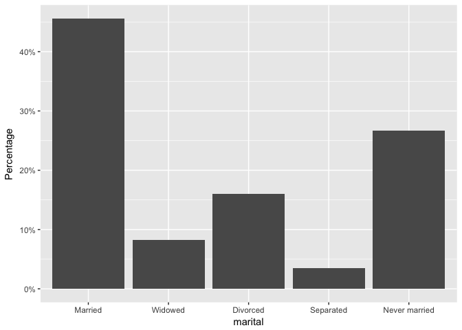

The distribution of number of children:

``` r
ggplot(gss, aes(childs)) + geom_bar(aes(y = (..count..)/sum(..count..))) + scale_y_continuous(labels = scales::percent) + ylab("Percentage")
```

    ## Warning: Removed 3 rows containing non-finite values (stat_count).

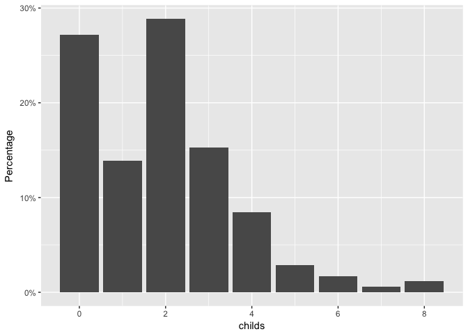

The racial distribution:

``` r
ggplot(gss, aes(race, fill = race)) + geom_bar(aes(y = (..count..)/sum(..count..)), width = 1) + scale_y_continuous(labels = scales::percent) + ylab("Percentage")  + scale_fill_manual(values=c("white", "black", "grey"))
```

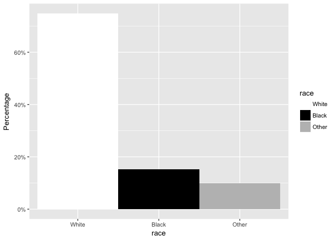

The distribution of highest year of school by races:

``` r
edu_race = gss[,.N, by = .(educ, race)]
edu_race[,group_sum := sum(N), by = .(race)]
edu_race[, perc := N/group_sum]
edu_median = gss[,.(median = median(as.numeric(educ), na.rm = T)), by = .(race)]
ggplot(edu_race[educ!="NA's"], aes(x = educ, y = perc, fill = race)) + 
  geom_bar(stat = "identity") + scale_y_continuous(labels = scales::percent) +
  facet_grid(race ~ .) + theme(axis.text.x = element_text(angle = 90, hjust = 1)) +
  geom_vline(data = edu_median, aes(xintercept = median), color = "red") + scale_fill_manual(values=c("white", "black", "grey")) + labs(title = "Figure 1: Distribution of Years of Education of Racial Groups", x = "Years of Education",y = "Percentage")
```


It is surprising to me as an international student that the education levels for different racial groups are quite similar. White people only get one-year advantage in education in the median. This means the educational equity among races is well-fulfilled in the U.S.

Let's repeat it using the highest degree to have a more intuitive chart.

``` r
degree_race = gss[,.N, by = .(degree, race)]
degree_race[,group_sum := sum(N), by = .(race)]
degree_race[, perc := N/group_sum]
degree_median = gss[,.(median = median(as.numeric(degree), na.rm = T)), by = .(race)]
ggplot(degree_race[degree!="NA's"], aes(x = degree, y = perc, fill = race)) + 
  geom_bar(stat = "identity") + scale_y_continuous(labels = scales::percent) +
  facet_grid(race ~ .) + theme(axis.text.x = element_text(angle = 90, hjust = 1)) +
  geom_vline(data = degree_median, aes(xintercept = median), color = "red") + scale_fill_manual(values=c("white", "black", "grey")) + labs(title = "Figure 2: Distribution of Degrees of Racial Groups", x = "Degree",y = "Percentage")
```


Comparison among Races
======================

The results above tricks me interest. Does the equality in education generate the equality in social-economic status?

First, we look into the family income.

``` r
income_race = gss[,.N, by = .(income06, race)]
income_race[,group_sum := sum(N), by = .(race)]
income_race[, perc := N/group_sum]
income_median = gss[,.(median = median(as.numeric(income06), na.rm = T)), by = .(race)]
ggplot(income_race[income06!="NA's"], aes(x = income06, y = perc, fill = race)) + 
  geom_bar(stat = "identity") + scale_y_continuous(labels = scales::percent) +
  facet_grid(race ~ .) + theme(axis.text.x = element_text(angle = 90, hjust = 1)) +
  geom_vline(data = income_median, aes(xintercept = median), color = "red") + scale_fill_manual(values=c("white", "black", "grey")) + labs(title = "Figure 3: Distribution of Family Incomes of Racial Groups", x = "Level of Family Income",y = "Percentage")
```


From the histograms and the median line, we can see black people are still at a disadvantage in family incomes. Let's impute the income interval with the mean and calculate the average income for different racial groups.

``` r
income_mean_interval = c(500, 2000, 3500, 4500, 5500, 6500, 7500, 9000, 11250, 13750, 16250, 18750, 21250,     
                        23750,27500,32500,37500,45000,55000,67500,82500,100000,120000,140000,17000)
income_mean = gss[, .(race, income06)]
income_mean[,income06:=as.numeric(income06)]
for (i in 1:length(income_mean_interval))
{
  income_mean[income06 == i, income06:= income_mean_interval[i]]
}
income_mean[income06<100, income06:= NA]
ggplot(income_mean, aes(x = race, y = income06, fill = race)) + geom_bar(stat = "summary", width = 0.4) + geom_errorbar(stat = "summary", width=.1) + scale_fill_manual(values=c("white", "black", "grey")) + labs(title = "Figure 4: Means of Family Income of Racial Groups", x = "Race",y = "Family Income")
```

    ## Warning: Removed 216 rows containing non-finite values (stat_summary).

    ## No summary function supplied, defaulting to `mean_se()

    ## Warning: Removed 216 rows containing non-finite values (stat_summary).

    ## No summary function supplied, defaulting to `mean_se()

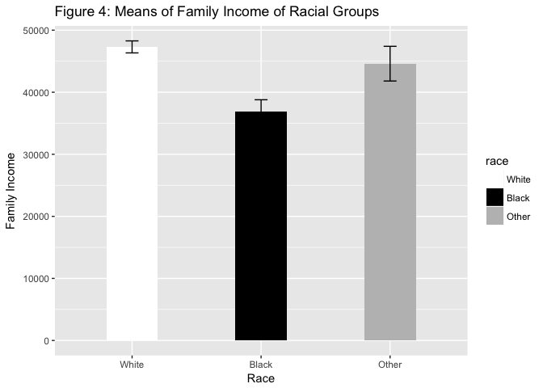

After transforming the categorical data to the continuous data, the pattern is more clear. White people's average family income is slightly higher than others', and significantly higher than Black people's.

Let's repeat it with respondents' own income.

``` r
rincom_race = gss[,.N, by = .(rincom06, race)]
rincom_race[,group_sum := sum(N), by = .(race)]
rincom_race[, perc := N/group_sum]
rincom_median = gss[,.(median = median(as.numeric(rincom06), na.rm = T)), by = .(race)]
ggplot(rincom_race[rincom06!="NA's"], aes(x = rincom06, y = perc, fill = race)) + 
  geom_bar(stat = "identity") + scale_y_continuous(labels = scales::percent) +
  facet_grid(race ~ .) + theme(axis.text.x = element_text(angle = 90, hjust = 1)) +
  geom_vline(data = rincom_median, aes(xintercept = median), color = "red")  + scale_fill_manual(values=c("white", "black", "grey"))
```

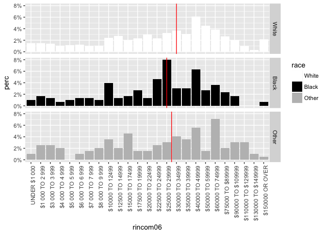

``` r
rincom_mean_interval = c(500, 2000, 3500, 4500, 5500, 6500, 7500, 9000, 11250, 13750, 16250, 18750, 21250,     
                        23750,27500,32500,37500,45000,55000,67500,82500,100000,120000,140000,17000)
rincom_mean = gss[, .(race, rincom06)]
rincom_mean[,rincom06:=as.numeric(rincom06)]
for (i in 1:length(rincom_mean_interval))
{
  rincom_mean[rincom06 == i, rincom06:= rincom_mean_interval[i]]
}
rincom_mean[rincom06<100, rincom06:= NA]
ggplot(rincom_mean, aes(x = race, y = rincom06, fill = race)) + geom_bar(stat = "summary", width = 0.4) + geom_errorbar(stat = "summary", width=.1) + scale_fill_manual(values=c("white", "black", "grey")) +  labs(title = "Figure 6: Means of Respondents' Income of Racial Groups", x = "Race",y = "Mean of Respondents' Income")
```

    ## Warning: Removed 832 rows containing non-finite values (stat_summary).

    ## No summary function supplied, defaulting to `mean_se()

    ## Warning: Removed 832 rows containing non-finite values (stat_summary).

    ## No summary function supplied, defaulting to `mean_se()


In fact, when looking into the respondents' own income, the gaps exists but are narrowed. Respondents of other racial groups even earn higher than white people, thoug. A straightforward hypothesis is that the work participation in the black or other racial groups are lower than that of white people. Thus, we examine the difference of working status among different races. First we take a look at the percentage of full-time workers in each racial group.

``` r
gss[!is.na(wrkstat), .(perc_full_time = as.numeric(wrkstat=="WORKING FULL TIME"), race)] %>%
  ggplot(aes(x = race, y = perc_full_time, fill = race)) + geom_bar(stat = "summary", width = 0.4) + 
  geom_errorbar(stat = "summary", width = 0.1) + 
  scale_fill_manual(values=c("white", "black", "grey")) + labs(title = "Figure 5: Percentage of Full-Time Work Participation of Racial Groups", x = "Race",y = "Percentage") + scale_y_continuous(labels = scales::percent)
```

    ## No summary function supplied, defaulting to `mean_se()
    ## No summary function supplied, defaulting to `mean_se()

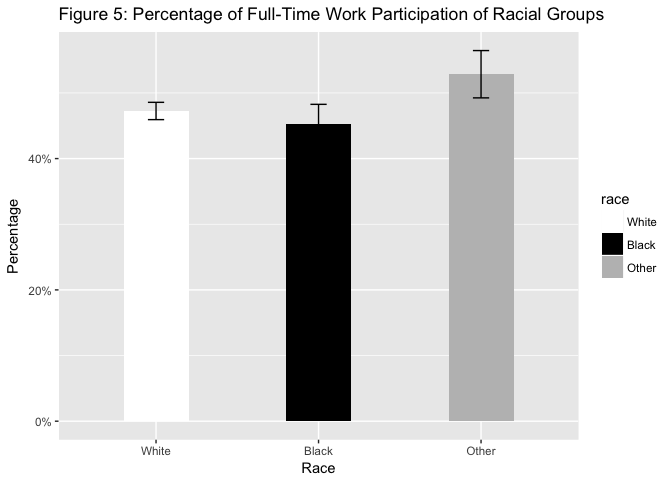

It seems the differences in work participation are not large. There is no significant difference in work participation. The larger gap of family income may simply be the double size of the difference in a single workers' income.

Let's look at the general happiness of different raical groups.

``` r
happy_sum =  gss[!is.na(happy), .N, by = .(happy, race)]
happy_sum[,raceN := sum(N), by = race]
happy_sum[, perc := N/raceN]
ggplot(happy_sum, aes(race, perc, fill = happy)) + geom_bar(stat = "identity", position = "stack") + scale_y_continuous(labels = scales::percent) + labs(title = "Figure 7: Distribution of General Happiness of Racial Groups", x = "Race",y = "Percentage")
```


It reveals that the Black people not only earn less, but also feel less happier.

Why different racial groups received similar years of education, while their life outcomes are different? A direct conjecture is that the quality of education is different.

We look into the quality of education, proxied by the performance in the verbal test and science quiz.

``` r
  ggplot(gss, aes(x = race, y = wordsum, fill = race)) + geom_bar(stat = "summary", width = 0.4) + 
  geom_errorbar(stat = "summary", width = 0.1) + 
  scale_fill_manual(values=c("white", "black", "grey")) + labs(title = "Figure 8: Number of Words Correct in the Verbal Test", x = "Race",y = "Number of Word Correct")
```

    ## Warning: Removed 696 rows containing non-finite values (stat_summary).

    ## No summary function supplied, defaulting to `mean_se()

    ## Warning: Removed 696 rows containing non-finite values (stat_summary).

    ## No summary function supplied, defaulting to `mean_se()


There is a sharp difference in verbal ability between white people and other racial groups, indicating the quality of education are quite different among racial groups.

Science quiz may be a better measurement of educational quality as it can rule out the difference in native languages, if any.

``` r
  ggplot(gss, aes(x = race, y = science_quiz, fill = race)) + geom_bar(stat = "summary", width = 0.4) + 
  geom_errorbar(stat = "summary", width = 0.1) + 
  scale_fill_manual(values=c("white", "black", "grey")) + labs(title = "Figure 9: Number Correct in the Science Quiz", x = "Race",y = "Number Correct")
```

    ## Warning: Removed 1466 rows containing non-finite values (stat_summary).

    ## No summary function supplied, defaulting to `mean_se()

    ## Warning: Removed 1466 rows containing non-finite values (stat_summary).

    ## No summary function supplied, defaulting to `mean_se()


The pattern is the same as that from verbal text.

Are these advantages in educational quality positively related to the market?

``` r
gss$logrincome = log(rincom_mean$rincom06)
ggplot(gss, aes(wordsum, logrincome))+geom_point(position = "jitter", aes(color = race)) + geom_smooth() + labs(title = "Figure 10: The relation of Number of Words Correct in the Verbal Test and Respondents' Income", x = "Number Correct in Verbal Test",y = "log(Respondents' Income)") 
```

    ## `geom_smooth()` using method = 'gam'

    ## Warning: Removed 1216 rows containing non-finite values (stat_smooth).

    ## Warning: Removed 1216 rows containing missing values (geom_point).


``` r
ggplot(gss, aes(science_quiz, logrincome))+geom_point(position = "jitter", aes(color = race)) + geom_smooth() + 
labs(title = "Figure 11: The relation of Number of Words Correct in the Science Quiz and Respondents' Income", x = "Number Correct in Science Quiz",y = "log(Respondents' Income)") 
```

    ## `geom_smooth()` using method = 'gam'

    ## Warning: Removed 1678 rows containing non-finite values (stat_smooth).

    ## Warning: Removed 1678 rows containing missing values (geom_point).


There are clear patterns that the respondent's income increses with the educational outcome.

``` r
gss[!is.na(happy), .(mean_happy =  4 - mean(as.numeric(happy))), by = wordsum] %>%
  ggplot(aes(wordsum, mean_happy)) + geom_point() + geom_smooth(method = "lm")
```

    ## Warning: Removed 1 rows containing non-finite values (stat_smooth).

    ## Warning: Removed 1 rows containing missing values (geom_point).

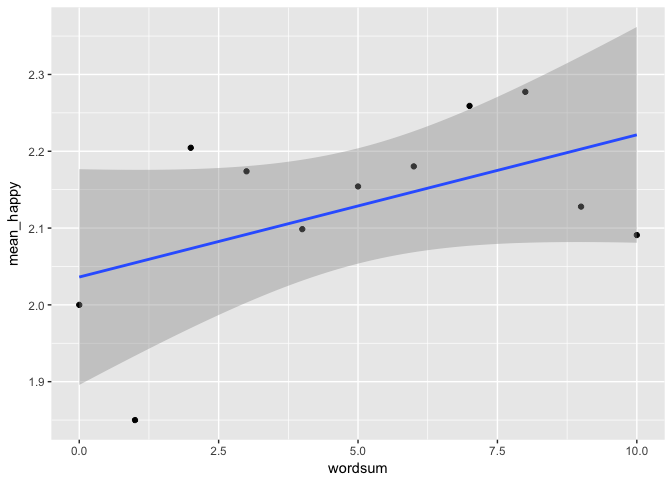

``` r
gss[!is.na(happy), .(mean_happy = 4 - mean(as.numeric(happy))), by = science_quiz] %>%
  ggplot(aes(science_quiz, mean_happy)) + geom_point() + geom_smooth(method = "lm")
```

    ## Warning: Removed 1 rows containing non-finite values (stat_smooth).

    ## Warning: Removed 1 rows containing missing values (geom_point).

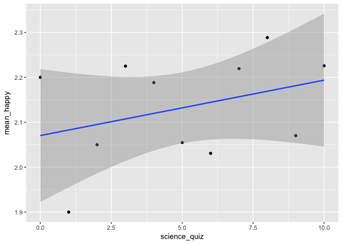

The educational outcome is also positively correlated with the happiness.

Therefore, we can conclude that the though receiving the same years of education, the educational quality for the white people are better than that of others, which generates different market outcomes and happiness.

Who hates communists most?
==========================

A set of interesting questions in the survey are about their opinions toward certain sensitive political concepts, like communism and racism. I hope to draw the profile of those people who hate communists most.

First of all, the distribution of attitude toward communists.

``` r
p1 = ggplot(gss[!is.na(spkcom)], aes(spkcom)) + geom_bar(aes(y = (..count..)/sum(..count..))) + scale_y_continuous(labels = scales::percent) + ylab("Percentage")+xlab("Allow communists to speak")

p2 = ggplot(gss[!is.na(colcom)], aes(colcom)) + geom_bar(aes(y = (..count..)/sum(..count..))) + scale_y_continuous(labels = scales::percent) + ylab("Percentage")+xlab("Allow communists to teach")


p3 = ggplot(gss[!is.na(libcom)], aes(libcom)) + geom_bar(aes(y = (..count..)/sum(..count..))) + scale_y_continuous(labels = scales::percent) + ylab("Percentage")+xlab("Allow communists  book in libraries")
grid.arrange(p1, p2, p3, ncol = 3, top = "Figure 12: The Responses of the Three Anti-Communism Questions")
```

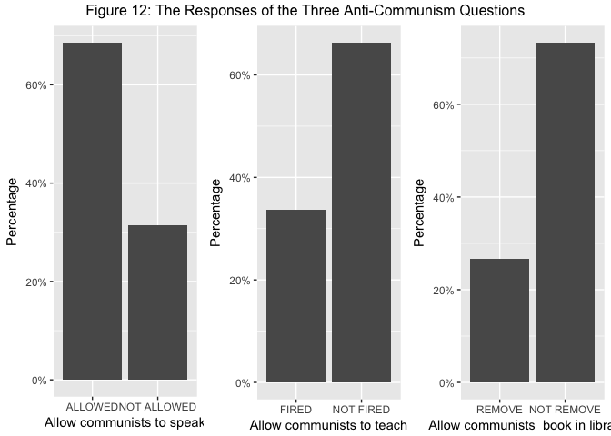

``` r
cormat_heatmap <- function(data){
  # generate correlation matrix
  cormat <- round(cor(data, use = "pairwise.complete.obs"), 2)
  
  # melt into a tidy table
  get_upper_tri <- function(cormat){
    cormat[lower.tri(cormat)]<- NA
    return(cormat)
  }
  
  upper_tri <- get_upper_tri(cormat)
  
  # reorder matrix based on coefficient value
  reorder_cormat <- function(cormat){
    # Use correlation between variables as distance
    dd <- as.dist((1-cormat)/2)
    hc <- hclust(dd)
    cormat <-cormat[hc$order, hc$order]
  }
  
  cormat <- reorder_cormat(cormat)
  upper_tri <- get_upper_tri(cormat)
  
  # Melt the correlation matrix
  melted_cormat <- reshape2::melt(upper_tri, na.rm = TRUE)
  
  # Create a ggheatmap
  ggheatmap <- ggplot(melted_cormat, aes(Var2, Var1, fill = value))+
    geom_tile(color = "white")+
    scale_fill_gradient2(low = "blue", high = "red", mid = "white", 
                         midpoint = 0, limit = c(-1,1), space = "Lab", 
                         name="Pearson\nCorrelation") +
    theme_minimal()+ # minimal theme
    theme(axis.text.x = element_text(angle = 45, vjust = 1, 
                                     size = 12, hjust = 1))+
    coord_fixed()
  
  # add correlation values to graph
  ggheatmap + geom_text(aes(Var2, Var1, label = value), color = "black", size = 4) +
    theme(
      axis.title.x = element_blank(),
      axis.title.y = element_blank(),
      panel.grid.major = element_blank(),
      panel.border = element_blank(),
      panel.background = element_blank(),
      axis.ticks = element_blank(),
      legend.position = "bottom")
}

gss[,lapply(.SD, as.numeric),.SDcols = c("libcom", "colcom", "spkcom")] %>%
  mutate(spkcom = 3 - spkcom) %>%
cormat_heatmap()
```

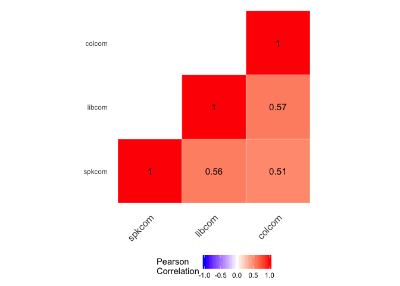

The heatmap shows that these three attitudes are highly correlated. That is, those who does not allow communists to speak and those who does not allow communists to teach are very likely to be the same group of people.

We can get a score of anti-communism by simply summing these three variables. The distribution is as follows:

``` r
gss[["anti_communism"]] = gss[,lapply(.SD, as.numeric),.SDcols = c("libcom", "colcom", "spkcom")] %>%
  mutate(spkcom = 3 - spkcom) %>% rowSums(na.rm = F) 
  gss[anti_communism == 0,anti_communism:=NA]
gss[,anti_communism:= 6 - anti_communism]
gss[, anti_communism := factor(anti_communism, levels = 0:3, labels = c("No anti-communism", "Mild anti-communism", "Medium anti-communism", "Strong anti-communism"))]
ggplot(gss[!is.na(anti_communism)], aes(anti_communism)) + geom_bar(aes(y = (..count..)/sum(..count..))) + scale_y_continuous(labels = scales::percent) + labs(title = "Figure 13: Distribution of Levels of Anti-Communism", x = "Level of Anti-Communism", y = "Percentage")
```


To be honest, it kind of scares me given I am from a communist country. I was wondering how horrible communism is compared to other "bad" political concepts.

``` r
gss[["anti_relig"]] = gss[,lapply(.SD, as.numeric),.SDcols = c("libath", "colath", "spkath")] %>%
  mutate(spkath = 3 - spkath) %>% rowSums(na.rm = F) 
  gss[anti_relig == 0,anti_relig:=NA]
gss[,anti_relig:= 6 - anti_relig]

gss[["anti_racist"]] = gss[,lapply(.SD, as.numeric),.SDcols = c("librac", "colrac", "spkrac")] %>%
  mutate(spkrac = 3 - spkrac) %>% rowSums(na.rm = F) 
  gss[anti_racist == 0,anti_racist:=NA]
gss[,anti_racist:= 6 - anti_racist]

gss[["anti_millit"]] = gss[,lapply(.SD, as.numeric),.SDcols = c("libmil", "colmil", "spkmil")] %>%
  mutate(spkmil = 3 - spkmil) %>% rowSums(na.rm = F) 
  gss[anti_millit == 0,anti_millit:=NA]
gss[,anti_millit:= 6 - anti_millit]

gss[["anti_homo"]] = gss[,lapply(.SD, as.numeric),.SDcols = c("libhomo", "colhomo", "spkhomo")] %>%
  mutate(spkhomo = 3 - spkhomo) %>% rowSums(na.rm = F) 
  gss[anti_homo == 0,anti_homo:=NA]
gss[,anti_homo:= 6 - anti_homo]

gss[["anti_mslm"]] = gss[,lapply(.SD, as.numeric),.SDcols = c("libmslm", "colmslm", "spkmslm")] %>%
  mutate(spkmslm = 3 - spkmslm) %>% rowSums(na.rm = F) 
  gss[anti_mslm == 0,anti_mslm:=NA]
gss[,anti_mslm:= 6 - anti_mslm]

select(gss, starts_with("anti_")) %>% mutate(anti_communism = as.numeric(anti_communism)) %>%
cormat_heatmap()
```

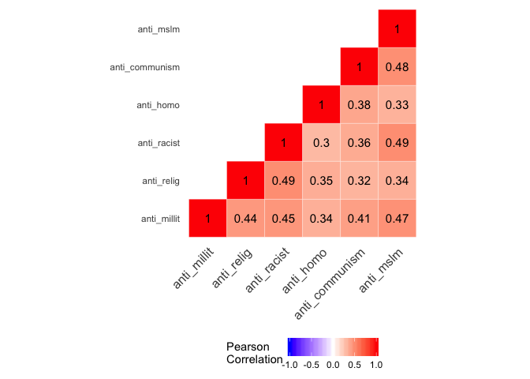

``` r
select(gss, starts_with("anti_")) %>% melt() %>%
  ggplot(aes(x = variable, y = value, fill = variable)) + geom_bar(stat = "summary", width = 0.4) + 
  geom_errorbar(stat = "summary", width = 0.1)
```

    ## Warning in melt.data.table(.): To be consistent with reshape2's melt,
    ## id.vars and measure.vars are internally guessed when both are 'NULL'. All
    ## non-numeric/integer/logical type columns are conisdered id.vars, which in
    ## this case are columns [anti_communism]. Consider providing at least one of
    ## 'id' or 'measure' vars in future.

    ## Warning: Removed 3650 rows containing non-finite values (stat_summary).

    ## No summary function supplied, defaulting to `mean_se()

    ## Warning: Removed 3650 rows containing non-finite values (stat_summary).

    ## No summary function supplied, defaulting to `mean_se()


It seems communism is the mildest one among those "extreme" political views.

We try to understand who hates communists most, and what common features do they possess.

``` r
ggplot(gss[!is.na(anti_communism)], aes(x = as.factor(anti_communism), y = age, fill = anti_communism)) + geom_boxplot(aes(fill = anti_communism)) + theme(axis.text.x = element_text(angle = 45, hjust = 1)) + 
  labs(title = "Figure 14: Distribution of Ages at Different Levels of Anti-Communism",
       x  = "Levels of Anti-Communism", 
       y = "Age")
```

    ## Warning: Removed 5 rows containing non-finite values (stat_boxplot).


Those people who are strongly anti-communism tend to be older.

``` r
  ggplot(gss[!is.na(anti_communism)], aes(x = anti_communism, y = as.numeric(sex)-1, fill = anti_communism)) + geom_bar(stat = "summary", width = 0.4) + 
  geom_errorbar(stat = "summary", width = 0.1) 
```

    ## No summary function supplied, defaulting to `mean_se()
    ## No summary function supplied, defaulting to `mean_se()

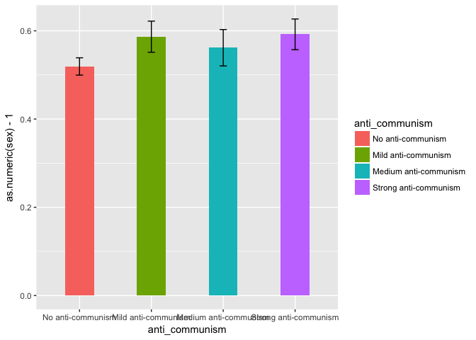

anti-communism people tend to be female, though this pattern is not very strong.

``` r
anticom_race = gss[!is.na(anti_communism), .N, by = .(race, anti_communism)]
anticom_race[,raceN := sum(N), by = .(anti_communism)]
anticom_race[,perc := N/raceN]
ggplot(anticom_race, aes(anti_communism, perc, fill = race)) + 
  geom_bar(stat = "identity", position = "stack") + scale_y_continuous(label = scales::percent)
```

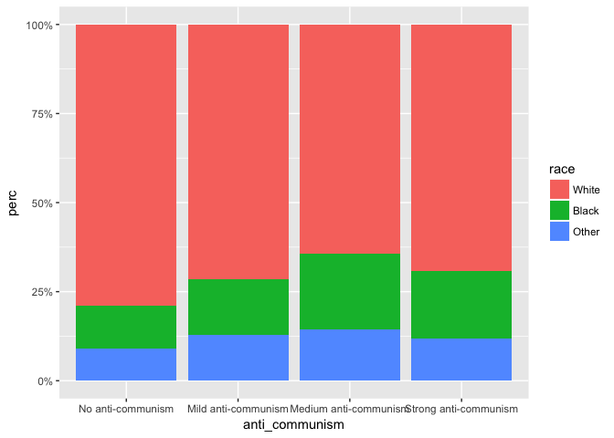

``` r
anticom_race = gss[!is.na(anti_communism), .N, by = .(race, anti_communism)]
anticom_race[,raceN := sum(N), by = .(race)]
anticom_race[,perc := N/raceN]
ggplot(anticom_race, aes(race, perc, fill = anti_communism)) + 
  geom_bar(stat = "identity", position = "stack") + scale_y_continuous(label = scales::percent) +  
  labs(title = "Figure 15: Distribution of Races at Different Levels of Anti-Communism",
       x  = "Levels of Anti-Communism", 
       y = "Race")
```


It shows that white people tend to have higher tolerance toward communists, compared to other races.

``` r
ggplot(gss[!is.na(anti_communism)], aes(x = as.factor(anti_communism), y = logrincome, fill = anti_communism)) + geom_boxplot(aes(fill = anti_communism)) + 
  labs(title = "Figure 16: Distribution of Respondents' Income at Different Levels of Anti-Communism",
       x  = "Levels of Anti-Communism", 
       y = "Years of Education") + theme(axis.text.x = element_text(angle = 45, hjust = 1)) 
```

    ## Warning: Removed 488 rows containing non-finite values (stat_boxplot).

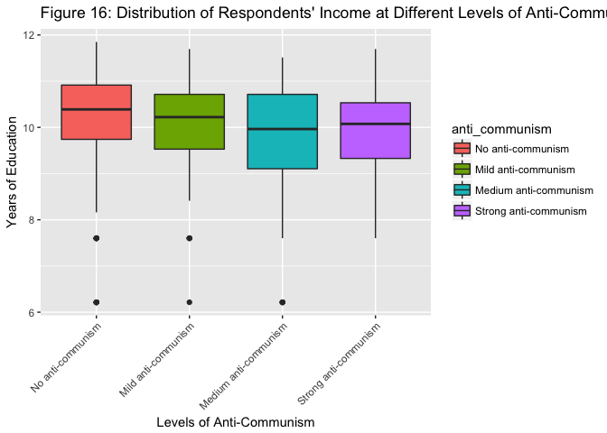

There is a trend that those people who are strongly against communists tend to earn less.

``` r
ggplot(gss[!is.na(anti_communism)], aes(x = anti_communism, y = as.numeric(educ), fill = anti_communism)) + geom_boxplot(aes(fill = anti_communism)) + 
  labs(title = "Figure 17: Distribution of Years of Education at Different Levels of Anti-Communism",
       x  = "Levels of Anti-Communism", 
       y = "Years of Education") + theme(axis.text.x = element_text(angle = 45, hjust = 1)) 
```

    ## Warning: Removed 1 rows containing non-finite values (stat_boxplot).


Those anti-communism people received significantly less education.

``` r
anticom_polviews = gss[!is.na(anti_communism) & !is.na(polviews), .N, by = .(polviews, anti_communism)]
anticom_polviews[,polviewsN := sum(N), by = .(anti_communism)]
anticom_polviews[,perc := N/polviewsN]
ggplot(anticom_polviews, aes(anti_communism, perc, fill = polviews)) + 
  geom_bar(stat = "identity", position = "stack") + scale_y_continuous(label = scales::percent)
```


``` r
anticom_polviews = gss[!is.na(anti_communism) & !is.na(polviews), .N, by = .(polviews, anti_communism)]
anticom_polviews[,polviewsN := sum(N), by = .(polviews)]
anticom_polviews[,perc := N/polviewsN]
ggplot(anticom_polviews, aes(polviews, perc, fill = anti_communism)) + 
  geom_bar(stat = "identity", position = "stack") + scale_y_continuous(label = scales::percent)
```

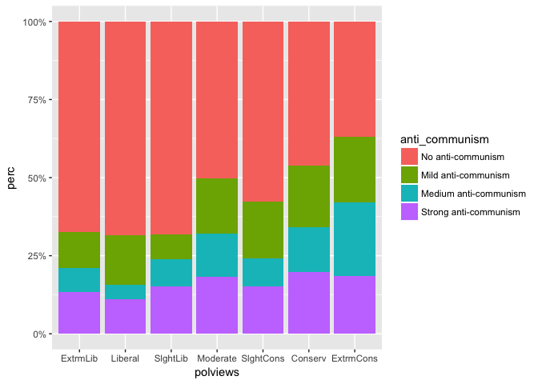

As the political views go to be more conservative, the tolerance of communists decreases.

``` r
anticom_natsoc = gss[!is.na(anti_communism) & !is.na(natsoc), .N, by = .(natsoc, anti_communism)]
anticom_natsoc[,natsocN := sum(N), by = .(anti_communism)]
anticom_natsoc[,perc := N/natsocN]
ggplot(anticom_natsoc, aes(anti_communism, perc, fill = natsoc)) + 
  geom_bar(stat = "identity", position = "stack") + scale_y_continuous(label = scales::percent) +
  theme(axis.text.x = element_text(angle = 45, hjust = 1)) +
    labs(title = "Figure 18: Distribution of Attitude toward Social Security",
       x  = "Levels of Anti-Communism", 
       y = "Percentages of Attitude")
```


``` r
anticom_natsoc = gss[!is.na(anti_communism) & !is.na(natsoc), .N, by = .(natsoc, anti_communism)]
anticom_natsoc[,natsocN := sum(N), by = .(natsoc)]
anticom_natsoc[,perc := N/natsocN]
ggplot(anticom_natsoc, aes(natsoc, perc, fill = anti_communism)) + 
  geom_bar(stat = "identity", position = "stack") + scale_y_continuous(label = scales::percent) + theme(axis.text.x = element_text(angle = 45, hjust = 1)) 
```

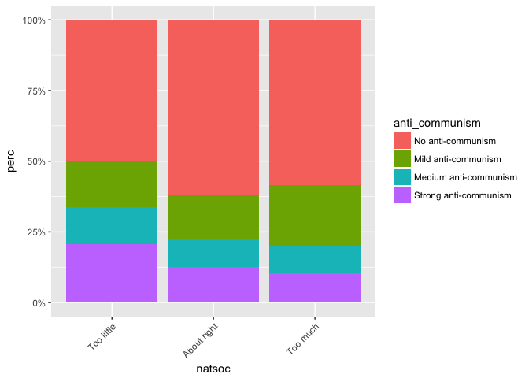

``` r
anticom_thnkself = gss[!is.na(anti_communism) & !is.na(thnkself), .N, by = .(thnkself, anti_communism)]
anticom_thnkself[,thnkselfN := sum(N), by = .(anti_communism)]
anticom_thnkself[,perc := N/thnkselfN]
ggplot(anticom_thnkself, aes(anti_communism, perc, fill = thnkself)) + 
  geom_bar(stat = "identity", position = "stack") + scale_y_continuous(label = scales::percent)  +
  theme(axis.text.x = element_text(angle = 45, hjust = 1)) +
    labs(title = "Figure 19: Distribution of Attitude toward thinking for oneself",
       x  = "Levels of Anti-Communism", 
       y = "Percentages of Attitude")
```


``` r
anticom_thnkself = gss[!is.na(anti_communism) & !is.na(thnkself), .N, by = .(thnkself, anti_communism)]
anticom_thnkself[,thnkselfN := sum(N), by = .(thnkself)]
anticom_thnkself[,perc := N/thnkselfN]
ggplot(anticom_thnkself, aes(thnkself, perc, fill = anti_communism)) + 
  geom_bar(stat = "identity", position = "stack") + scale_y_continuous(label = scales::percent) + theme(axis.text.x = element_text(angle = 45, hjust = 1))
```

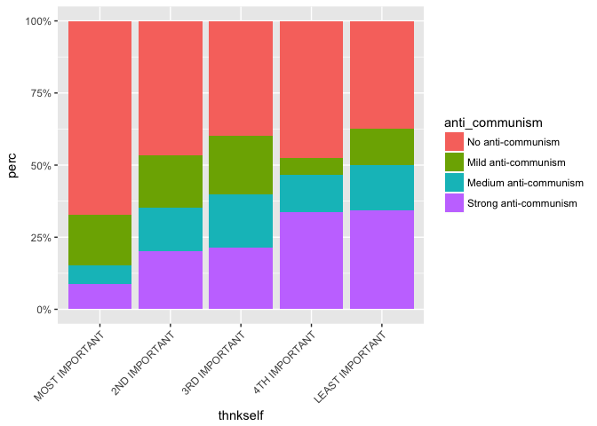
