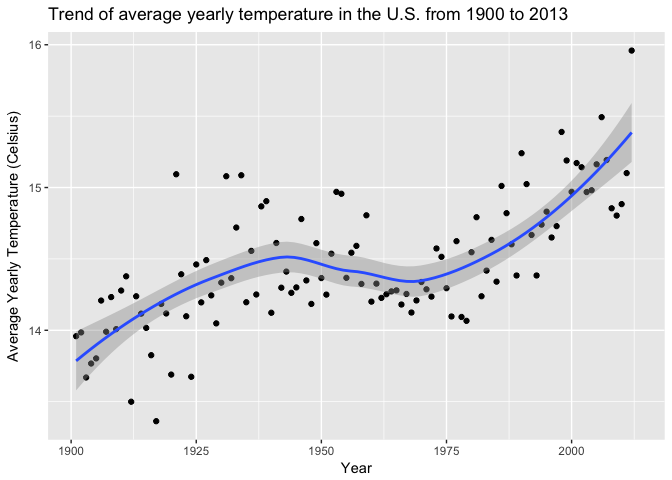

Q1
==

Interested competition: House Prices: Advanced Regression Techniques
--------------------------------------------------------------------

### Goal

The goal of the competition is to predict the house price in Ames, Iowa
with 79 explanatory variables describing almost every aspect of
residential homes.

### What to do

I would train a (advanced) regression model based on the training set,
use the model to predict the sale prices of houses in the test set, then
submit my predicted prices.

    #inbclude libraries
    library(data.table)
    library(dplyr)
    library(stringi)
    library(ggplot2)
    if (file.exists("GlobalLandTemperaturesByCity.csv"))
      # due to the large size of the dataset, I cannot upload it to the github.
      # Therefore, I extract a subset saved as "plot_data.csv".
      # The whole data can be found at "GlobalLandTemperaturesByCity.csv"
    {
    dt = fread("GlobalLandTemperaturesByCity.csv")
    dt = dt[Country == "United States",] # select the U.S. only
    dt[, year:=year(as.Date(dt))]
    dt[, avg_temp := mean(AverageTemperature), by = year] # calculate the average yearly temperature
    dt = unique(dt[year>1900, .(avg_temp, year)]) # collapse dataset
    write.csv(dt, "plot_data.csv")
    } else
    {
      dt = fread("plot_data.csv")
    }

    p = ggplot(dt, aes(year, avg_temp)) + geom_point() + geom_smooth(se = TRUE) +
     ggtitle("Trend of average yearly temperature in the U.S. from 1900 to 2013") + ylab("Average Yearly Temperature (Celsius)") +
     xlab("Year")
    # produce a pdf figure
    pdf("Trend_of_average_yearly_temperature.pdf", width = 7, height = 5)
    p
    res = dev.off()
    # display the plot here
    p

 \#
Q2

Thinking More or Feeling Less? Explaining the Foreign-Language Effect on Moral Judgment
---------------------------------------------------------------------------------------

This paper found that speaking in a foreign language may blunt emotional
reactions and amplify utilitarian considerations.

Their general method is as follows: They recruited 200 bilingual
participants and randomly assign them to complete the study in either
their native language or their foreign language.Then they were presented
with 20 moral dilemmas and asked to determine whether a given action is
appropriate.

Their work can be easily reformulated as a human computation project. It
is not difficult to do: just move the environment of the experiment from
the laboratory to Amazon Mechanical Turk, and all procedures can keep
the same.

Several benefits come with the reformulation. First, it can save the
compensation considerably. The whole procedure can be completed in
roughly ten minutes, which only costs 0.5 dollars per participant on
MTurk, while they paid their participants 2 to 5 dollars. Second, they
can get a more representative sample instead of a group which mainly
consists of undergraduate students. Third, they can cover more languages
to improve the external validity. In their experiment, they only test
three languages: German, English, and Spanish. It may not be effective
enough to be generalized to other language users. On Mturk,
experimenters can easily recruit participants from 43 countries speaking
various languages.

Q3
==

Since I don't have an SSN, I cannot sign up for MTurk. I worked on
Microworker instead.

