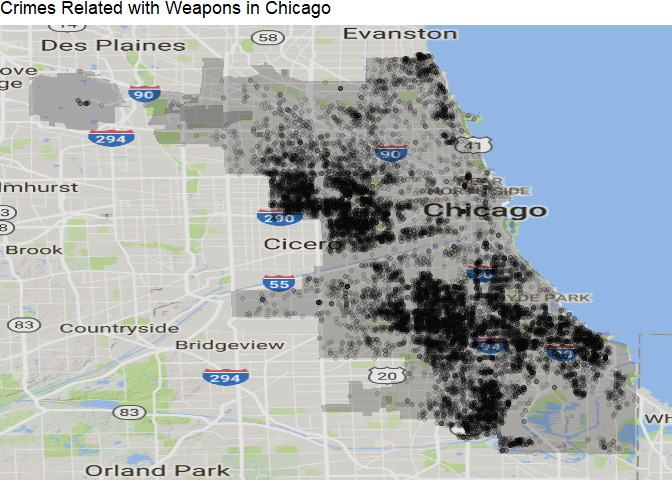

    library(tidyverse)

    ## -- Attaching packages --------------------------------------------------------------------------------------- tidyverse 1.2.0 --

    ## √ ggplot2 2.2.1     √ purrr   0.2.4
    ## √ tibble  1.3.4     √ dplyr   0.7.4
    ## √ tidyr   0.7.2     √ stringr 1.2.0
    ## √ readr   1.1.1     √ forcats 0.2.0

    ## -- Conflicts ------------------------------------------------------------------------------------------ tidyverse_conflicts() --
    ## x dplyr::filter() masks stats::filter()
    ## x dplyr::lag()    masks stats::lag()

    library(knitr)
    library(broom)
    library(stringr)
    library(modelr)

    ## 
    ## Attaching package: 'modelr'

    ## The following object is masked from 'package:broom':
    ## 
    ##     bootstrap

    library(forcats)
    library(ggmap)
    library(maps)

    ## 
    ## Attaching package: 'maps'

    ## The following object is masked from 'package:purrr':
    ## 
    ##     map

    library(foreign)
    library(rgdal)

    ## Loading required package: sp

    ## rgdal: version: 1.2-15, (SVN revision 691)
    ##  Geospatial Data Abstraction Library extensions to R successfully loaded
    ##  Loaded GDAL runtime: GDAL 2.2.0, released 2017/04/28
    ##  Path to GDAL shared files: C:/Users/Hyunku Kwon/Documents/R/win-library/3.4/rgdal/gdal
    ##  GDAL binary built with GEOS: TRUE 
    ##  Loaded PROJ.4 runtime: Rel. 4.9.3, 15 August 2016, [PJ_VERSION: 493]
    ##  Path to PROJ.4 shared files: C:/Users/Hyunku Kwon/Documents/R/win-library/3.4/rgdal/proj
    ##  Linking to sp version: 1.2-5

    library(readr)

    # you can directly download the dataset from the following code (read.csv(url("https://data.cityofchicago.org/api/views/ijzp-q8t2/rows.csv?accessType=DOWNLOAD"))). But, it is a very big dataset, and thus takes too long to knit or directly download directly from the link. So I draw on 2012-2017 dataset from kaggle (https://www.kaggle.com/currie32/crimes-in-chicago). There is a way to download dataset from Kaggle directly (https://stackoverflow.com/questions/35303779/downloading-kaggle-zip-files-in-r), but this code requires my ID and password. So, I'm just uploading the file directly to the repository.  

    # importing the file
    chicago <- read.csv("Chicago_Crimes_2012_to_2017.csv")%>%
      select(Primary.Type,Longitude,Latitude, Year) 

    # tidying the file 
    ch1<-chicago %>%
      filter(Primary.Type == "WEAPONS VIOLATION") %>%
      filter(!Year == "2017")

    # draw on google maps for background

    qm <- qmap("chicago", darken=.1, zoom=10) + geom_point(data=ch1, aes(x=Longitude, y=Latitude), size=1.5, alpha=.05) +
        coord_cartesian(xlim=c(-87.96, -87.5), ylim=c(41.62, 42.05))

    ## Map from URL : http://maps.googleapis.com/maps/api/staticmap?center=chicago&zoom=10&size=640x640&scale=2&maptype=terrain&language=en-EN&sensor=false

    ## Information from URL : http://maps.googleapis.com/maps/api/geocode/json?address=chicago&sensor=false

    ## Warning: `panel.margin` is deprecated. Please use `panel.spacing` property
    ## instead

    # delineating chicago area

    shapefile <- readOGR("City_20Boundary", "City_Boundary")

    ## OGR data source with driver: ESRI Shapefile 
    ## Source: "City_20Boundary", layer: "City_Boundary"
    ## with 1 features
    ## It has 4 fields
    ## Integer64 fields read as strings:  OBJECTID

    shapefile.converted <- spTransform(shapefile, CRS("+proj=longlat +datum=WGS84"))

    # 

    chicagocrime <- qm + geom_polygon(aes(x = long, y = lat, group=group), alpha=.2, fill="black", 
                     data = shapefile.converted) + 
        coord_cartesian(xlim=c(-87.96, -87.5), ylim=c(41.62, 42.05)) +
        geom_point(data=ch1, aes(x=Longitude, y=Latitude), size=1.5, alpha=.05)+
      labs(title = "Crimes Related with Weapons in Chicago")

    ## Regions defined for each Polygons

    chicagocrime

    ## Warning: Removed 74 rows containing missing values (geom_point).

    ## Warning: Removed 74 rows containing missing values (geom_point).

Bottomline: Hyde park itself is not very dangerous, but it is surrounded
by dangerous place rife with gun-related crimes. So, be careful :)
