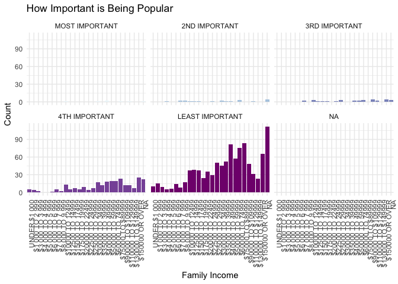
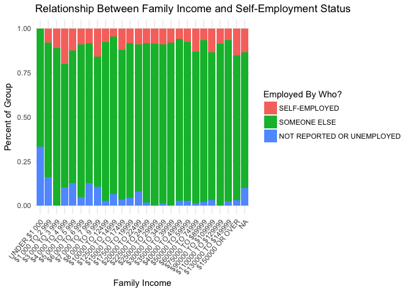
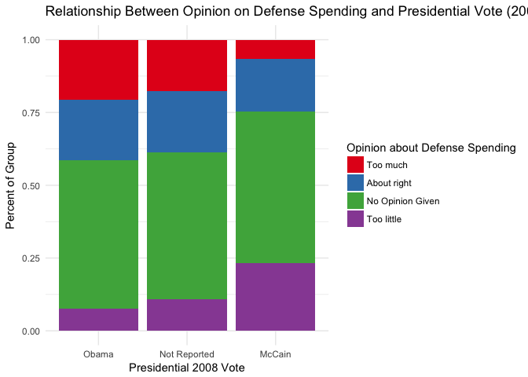
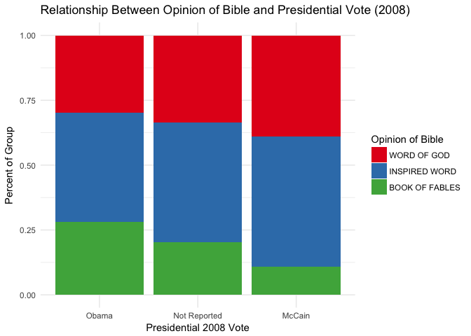
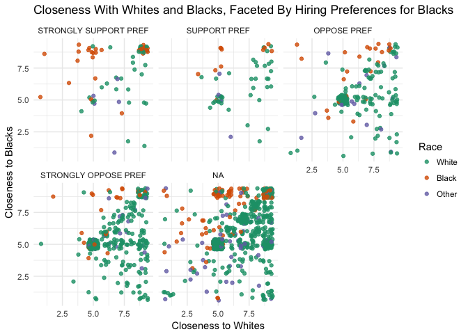

Exploration Write-Up (Part 2)
================

Introduction
------------

In exploring through this data I separated my work into 3 main categories. These categories are family income, factors relating to how people voted in the 2008 presidential election, and racial preferences (i.e. differences stemming from self-reported closeness with black people). In this write-up I will go through each of these sections and give a general write-up about what I found, and include graphs supporting my findings.

Family Incomes
--------------

The first factor I looked at was family incomes. I made graphs looking at the relationship between family income, education, happiness, work status, and more. The relationship between education and income was positive but not tight, likewise there was a positive relationship between happiness and family income, but most people still reported being "pretty happy" compared to "very happy". There was little to no relationship between age and family income.

One group who was especially interesting to study, was the group with the highest family incomes ($150,000 OR OVER). The families with the highest incomes were especially likely to report that hard work is key to getting ahead, but in comparison, the group third in family incomes ($110,000 TO $129,999) did not share that sentiment which was a bit counter intuitive. It could be that this is the group that begins to consider themselves middle class, but this is only speculation. It also could be that they consider social factors more important. This lead me to wonder about the research question -- "what's the correlation between family income and needing to be liked by other people?" I was wondering if some of the higher income families would be especially anti-social compared to less well off families. The closest representation of this I could find is the "importance of popularity". My results are graphed below:

People of all wealth groups agreed that "being popular" was not important, but this attitude was especially prevalent among the families with the highest incomes. The third most wealthy group again shows deviation, which would be interesting to look into in further research.

The highest group for family income was also much more likely than other groups to rate religion as "strongly important". This was intuitive to me because I read the book "The Millionaire Mind" several years ago which reports a similar finding. Families in the highest income bracket did not want to answer how they voted in the 2008 presidential election more than any other group. This non-response bias could be interesting to look at in further research.

Another finding I was curious to look at was the relationship between self employment and family income. Intuitively I thought that self-employed people would be more wealthy than people employed by others because self-employed people would most likely keep their own profits. My research question was "Do self employed people live in higher income families?" It turns out, self-employment is more or less homogeneous among family incomes. My hypothesis was that the families with the highest incomes would be more likely to be self-employed because they were well off entrepreneurs, but this generally not true. Below is a graph with the supporting data:

Besides a small flare in the lowest income group of not being self-employed, there seemed to be little relationship between employer and family income.

Voting in the 2008 Presidential Election
----------------------------------------

In this sample, most people reported voting for Obama, but there was a huge number of people who did not respond who they voted for. This was also salient when I plotted who people voted for against where they people placed themselves on the political spectrum. It was fairly rare for someone who considered themselves liberal to vote for McCain. However, people from all across the political spectrum decided not to report how they voted. This is definitely something for researchers to look further into, and is likely that this phenomenon is related to the failure by most people to predict the Trump win in 2016.

I then tried to look at the connections between who people voted for and their opinions about other factors. There was little to no relationship between supporting space exploration and how people voted. Similarly, there was only a weak relationship between who people voted for and halting natural crime. I realized that perhaps some of my stereotypes against replublicans were inaccurate. I then decided to think more deeply -- I remembered McCain was a war veteran, and campaigned on that. This lead to the research question "Is there a correlation between opinions on defense spending and Voting for John McCain?" The findings are graphed below: 

People who voted for McCain seemed more likely than the other two groups to think that not enough money was being spent on defense. This was an intuitive finding based on McCain's background. However regardless of who people voted for, about half of that group did not have an opinion on defense spending.

People who voted for Obama also tended to think the Bible was less "important" than people who voted for McCain or did not report their votes. This is graphed below:

Racial Preferences
------------------

The first graph a made for this section was a jittered scatter plot comparing people’s self reported closeness with whites and blacks. The finding were intuitive -- black people tended to reported more closeness with black people than whites pope did, and vice versa. However, there was a fairly strong relationship of people feeling equally close with both races. Next I looked into opinions about marijuana legalization and closeness with blacks, as well as bible opinions. Both of these graphs were fairly uninformative because of the large number of people reported a medium (5) closeness with blacks which dominated the other groups.

Next I filtered the results to look at only people who did not feel close with black (which I defined as closeness with blacks less than 2.5), and found that these people were less likely to vote for Obama, but this wasn’t very related with strength of religion or opinion on homosexual speech or even “preference for hiring blacks”.

However, when I faceted by hiring preferences in regards to blacks, and graphed by reported closeness to whites and blacks I found pretty interesting results. People who “strongly opposed” hiring blacks generally tended to feel slightly more close with whites, whereas people who “strongly supported” hiring black people, were much more likely to be neutral or more favorable to black people.

However both groups were largely outnumbered by people who preferred not to answer the hiring preferences question.

