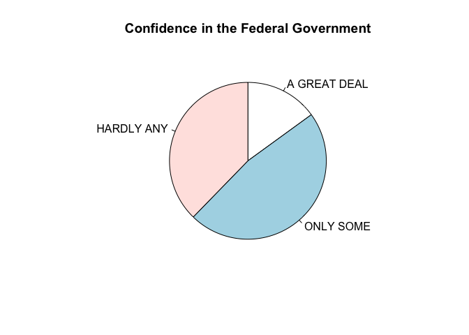
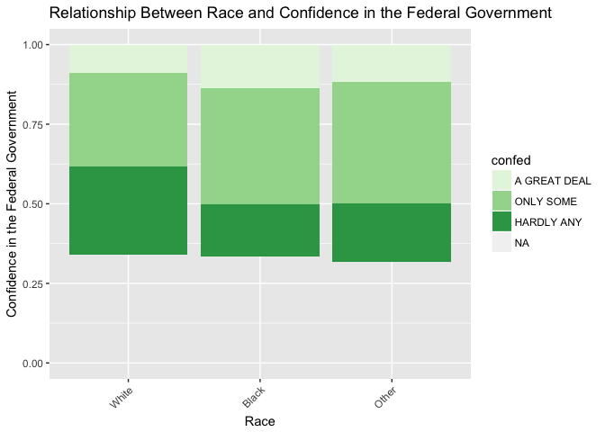
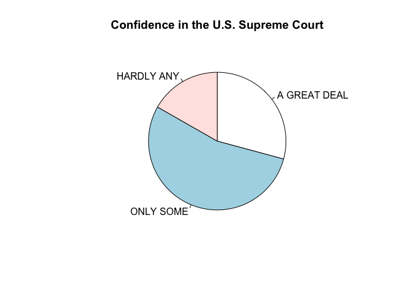
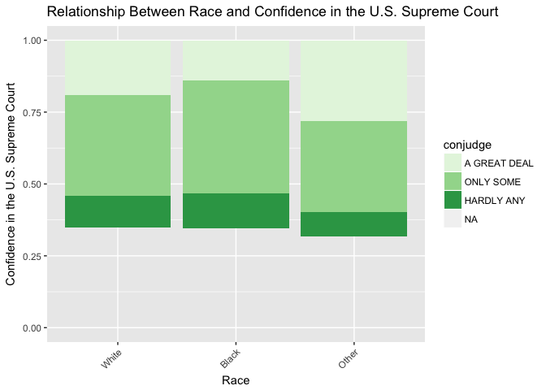
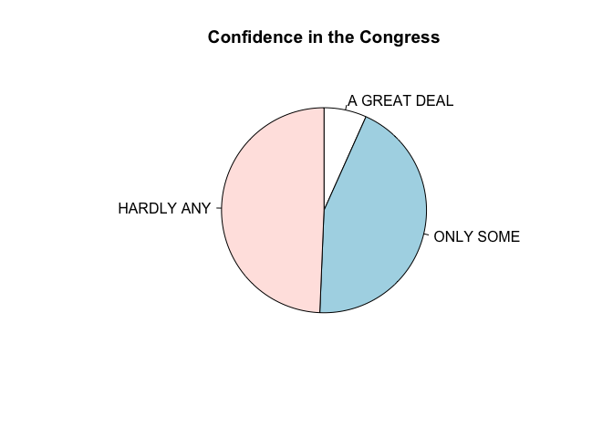
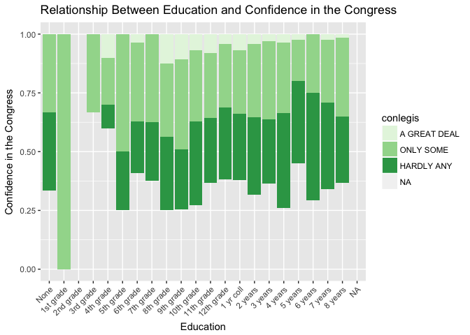

Exploration write-up
================
Mengchen Shi
11/26/2017

### Introduction

In this part, I explore a research question that I find interesting -- what are the factors that are asscociated with peoples' confidence in the political authorities, namely, the Federal Government, the U.S. Supreme Court and Congress? There are four possible factors: individual's age, race, income, education and ideology. In this paper, I will only present the factors that seem to have strong relationship with peoples' confidence.

``` r
data(gss, package = "poliscidata")
library(tidyverse)
```

    ## Loading tidyverse: ggplot2
    ## Loading tidyverse: tibble
    ## Loading tidyverse: tidyr
    ## Loading tidyverse: readr
    ## Loading tidyverse: purrr
    ## Loading tidyverse: dplyr

    ## Conflicts with tidy packages ----------------------------------------------

    ## filter(): dplyr, stats
    ## lag():    dplyr, stats

``` r
gss <- as_tibble(gss)
```

#### Confidence in the Federal Government

The first graph shows the general confidence in the Federal Government. It seems as nearly half of those who replied to this question have only some confidence in the Federal Government, and less than 20% of them have a great deal of confidence.

``` r
gss %>%
  count(confed) %>%
  na.omit() %>%
  mutate(pct = n / sum(n)) %>%
  with(pie(pct, labels = confed, clockwise = TRUE, main = "Confidence in the Federal Government"))
```



``` r
gss %>% 
  ggplot(aes(as.factor(age), fill=confed))+
  geom_histogram(stat="count", position = "fill", binwidth = 30)+
  scale_fill_brewer(palette = "Set4")+
  labs(x = "Age",
       y = "Confidence in the Federal Government",
       title = "Relationship Between Age and Confidence in the Federal Government")+
   theme(axis.text.x = element_text(angle = 90, hjust = 1))
```

    ## Warning: Ignoring unknown parameters: binwidth, bins, pad

    ## Warning in pal_name(palette, type): Unknown palette Set4


The difference of confidence in the Federal Governmnet among different age groups is not great, but a general trend can be observed. The general trend among age groups is that people in elder group are more likey to have "hardly any" confidence in the Federal Government, and people in younger group are less likey to have "hardly any" confidence in the Federal Government. However, the proportions of people who have "a great deal" confidence do not change among different age groups.

``` r
gss %>% 
  ggplot(aes(as.factor(race), fill=confed))+
  geom_histogram(stat="count", position = "fill", binwidth = 30)+
  scale_fill_brewer(palette = "Set4")+
  labs(x = "Race",
       y = "Confidence in the Federal Government",
       title = "Relationship Between Race and Confidence in the Federal Government")+
   theme(axis.text.x = element_text(angle = 45, hjust = 1))
```

    ## Warning: Ignoring unknown parameters: binwidth, bins, pad

    ## Warning in pal_name(palette, type): Unknown palette Set4



There is a huge difference in confidence in the Federal Government among people with different races. White people have the less confidence in the Federal Government than other races. This outcome confirm my guess that white people are less confident in the government, which might be a reflection of the fact that more conservative people are white. As shown in the notebook and as is known to all, people who are more conservative are more anti-government, while liberal people support the government more.

``` r
gss %>% 
  ggplot(aes(as.factor(educ), fill=confed))+
  geom_histogram(stat="count", position = "fill", binwidth = 30)+
  scale_fill_brewer(palette = "Set4")+
  labs(x = "Education",
       y = "Confidence in the Federal Government",
       title = "Relationship Between Education and Confidence in the Federal Government")+
   theme(axis.text.x = element_text(angle = 45, hjust = 1))
```

    ## Warning: Ignoring unknown parameters: binwidth, bins, pad

    ## Warning in pal_name(palette, type): Unknown palette Set4


There is an interesting fact among people with different years of education and degrees. The proportion of people who have "a great deal" of confidence in the Federal Government is the lowest among people who have medium years of education, and the proportion of people who have "hardly any" confidence is the highest in those people. When people have more years of education(&gt;4 years in college) or higher degrees, their probability to have "a great deal" of confidence rise. Likewise, when people have fewer years of education(&lt; 6th grade) , their probability to have "a great deal" of confidence are higher than those people with medium education.

#### Confidence in the U.S. Supreme Court

The first graph shows the general confidence in the U.S. Supreme Court. It seems that more than 30% of those who replied to this question have a gread deal of confidence, and more than half of them have only some confidence. In general, peoples' confidence in the U.S. Supreme Court is much higher than their confidence in the Federal Government.

``` r
gss %>%
  count(conjudge) %>%
  na.omit() %>%
  mutate(pct = n / sum(n)) %>%
  with(pie(pct, labels = conjudge, clockwise = TRUE, main = "Confidence in the U.S. Supreme Court"))
```



``` r
gss %>% 
  ggplot(aes(as.factor(race), fill=conjudge))+
  geom_histogram(stat="count", position = "fill", binwidth = 30)+
  scale_fill_brewer(palette = "Set4")+
  labs(x = "Race",
       y = "Confidence in the U.S. Supreme Court",
       title = "Relationship Between Race and Confidence in the U.S. Supreme Court")+
   theme(axis.text.x = element_text(angle = 45, hjust = 1))
```

    ## Warning: Ignoring unknown parameters: binwidth, bins, pad

    ## Warning in pal_name(palette, type): Unknown palette Set4



Unlike the Federal Government, people in "other races" have the the most confidence in the U.S. Supreme Court, while black people have the largest proportion of people that have hardly any confidence in the U.S. Supreme Court.

#### Confidence in the Congress

The first graph shows the general confidence in the Congress. Campared to the Federal Goverment and The Court, it seems that the Congress gains the least confidence from people. Nearly half of those who replied to this question claim that they have hardly any confidence in the Congres, and only about 15% of them have a great deal confidence.

``` r
gss %>%
  count(conlegis) %>%
  na.omit() %>%
  mutate(pct = n / sum(n)) %>%
  with(pie(pct, labels = conlegis, clockwise = TRUE, main = "Confidence in the Congress"))
```



``` r
gss %>% 
  ggplot(aes(as.factor(age), fill=conlegis))+
  geom_histogram(stat="count", position = "fill", binwidth = 30)+
  scale_fill_brewer(palette = "Set4")+
  labs(x = "Age",
       y = "Confidence in the Congress",
       title = "Relationship Between Age and Confidence in the Congress")+
   theme(axis.text.x = element_text(angle = 90, hjust = 1))
```

    ## Warning: Ignoring unknown parameters: binwidth, bins, pad

    ## Warning in pal_name(palette, type): Unknown palette Set4


The difference of confidence in the Federal Governmnet among different age groups is not great, but a general trend can be observed. For people under 80 years old, the general trend among age groups is that people in younger group are more likey to have "a great deal" or "only some" confidence in the Congress" confidence, and elder people are more likely to have "hardly any. However, for people older than 80 years old, their proportions of having confidence in the Congress rise.

``` r
gss %>% 
  ggplot(aes(as.factor(race), fill=conlegis))+
  geom_histogram(stat="count", position = "fill", binwidth = 30)+
  scale_fill_brewer(palette = "Set4")+
  labs(x = "Race",
       y = "Confidence in the Congress",
       title = "Relationship Between Race and Confidence in the Congress")+
   theme(axis.text.x = element_text(angle = 45, hjust = 1))
```

    ## Warning: Ignoring unknown parameters: binwidth, bins, pad

    ## Warning in pal_name(palette, type): Unknown palette Set4


There is a huge difference in confidence in the Federal Government among people with different races. Similar to the Federal Government, the Congress wins the least confidence from white people. Less than 30% of white people have confidence in the Congress. People in other races are more likely to have confidence.

``` r
gss %>% 
  ggplot(aes(as.factor(educ), fill=conlegis))+
  geom_histogram(stat="count", position = "fill", binwidth = 30)+
  scale_fill_brewer(palette = "Set4")+
  labs(x = "Education",
       y = "Confidence in the Congress",
       title = "Relationship Between Education and Confidence in the Congress")+
   theme(axis.text.x = element_text(angle = 45, hjust = 1))
```

    ## Warning: Ignoring unknown parameters: binwidth, bins, pad

    ## Warning in pal_name(palette, type): Unknown palette Set4



Generally speaking, the proportions of having "a great deal" or "only some" confidence in the Congress are higher among people with fewer years of education.

#### Conclusion

Peoples' confidence in the Congress is the lowest, and their confidence in the U.S Supreme Court is the highest. It indicates that the judiciary wins the most confidence and trust from people than the governmnet and the legislature. Peoples' confidence in those authories is very likely to be associated with factors such as age, education and races, but the relationships are not simply linear.
