Lab Notebook\_Sumer Vaid
================

``` r
install.packages("poliscidata", repos = "http://cran.us.r-project.org")
```

    ## 
    ## The downloaded binary packages are in
    ##  /var/folders/0c/yv9tjmzd6gz_brc4s5w0v7b00000gn/T//RtmpJBAExC/downloaded_packages

``` r
install.packages("tidyverse",repos = "http://cran.us.r-project.org")
```

    ## 
    ## The downloaded binary packages are in
    ##  /var/folders/0c/yv9tjmzd6gz_brc4s5w0v7b00000gn/T//RtmpJBAExC/downloaded_packages

``` r
library(tidyverse)
```

    ## Warning: package 'tidyverse' was built under R version 3.4.2

    ## ── Attaching packages ────────────────────────────────── tidyverse 1.2.1 ──

    ## ✔ ggplot2 2.2.1     ✔ purrr   0.2.4
    ## ✔ tibble  1.3.4     ✔ dplyr   0.7.4
    ## ✔ tidyr   0.7.2     ✔ stringr 1.2.0
    ## ✔ readr   1.1.1     ✔ forcats 0.2.0

    ## Warning: package 'tidyr' was built under R version 3.4.2

    ## Warning: package 'purrr' was built under R version 3.4.2

    ## Warning: package 'dplyr' was built under R version 3.4.2

    ## ── Conflicts ───────────────────────────────────── tidyverse_conflicts() ──
    ## ✖ dplyr::filter() masks stats::filter()
    ## ✖ dplyr::lag()    masks stats::lag()

``` r
library(ggplot2)
library(poliscidata)
data(gss, package = "poliscidata")

# convert to tibble
library(tidyverse)
library(ggplot2)
gss <- as_tibble(gss)
```

A quick look at how family incomes are distributed.

``` r
indiv_incomes<- ggplot(aes(income06), data = gss) + geom_bar() + theme(axis.text.x = element_text(angle = 90, hjust = 1))
print(indiv_incomes)
```


``` r
ggsave("income_trends.jpg")
```

    ## Saving 7 x 5 in image

A quick look at how ages are distributed in the sample.

``` r
ages<- ggplot(aes(age), data = gss) + geom_bar() + theme(axis.text.x = element_text(angle = 90, hjust = 1))
print(ages)
```

    ## Warning: Removed 5 rows containing non-finite values (stat_count).

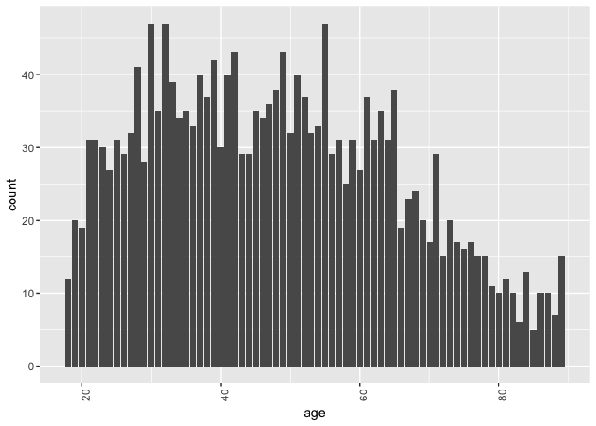

``` r
ggsave("ages.jpg")
```

    ## Saving 7 x 5 in image

    ## Warning: Removed 5 rows containing non-finite values (stat_count).

A quick look at education levels represented in the sample.

``` r
education<- ggplot(aes(educ), data = gss) + geom_bar() + theme(axis.text.x = element_text(angle = 90, hjust = 1))
print(education)
```

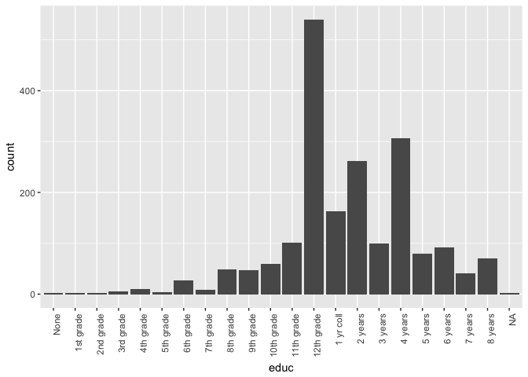

``` r
ggsave("education.jpg")
```

    ## Saving 7 x 5 in image

A quick look at how race is represented in the data.

``` r
race<- ggplot(aes(race), data = gss) + geom_bar() + theme(axis.text.x = element_text(angle = 90, hjust = 1))
print(race)
```

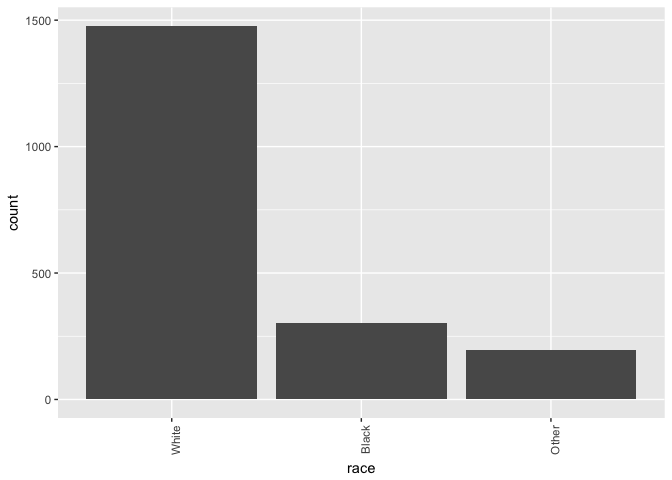

``` r
ggsave("race.jpg")
```

    ## Saving 7 x 5 in image

A quick look at how income and political views are related

``` r
income_politics<- ggplot(aes(polviews, income06), data = gss) + geom_count() + theme(axis.text.x = element_text(angle = 90, hjust = 1))
print(income_politics)
```

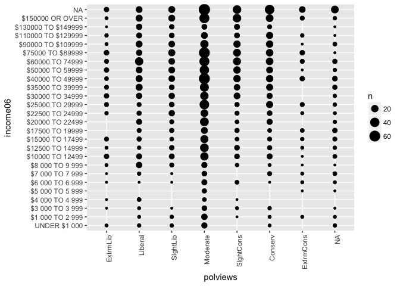

``` r
ggsave("income_politics.jpg")
```

    ## Saving 7 x 5 in image

A quick look at how income and education levels are related.

``` r
income_education<- ggplot(aes(educ, income06, color=race), data = gss) + geom_jitter() + theme(axis.text.x = element_text(angle = 90, hjust = 1))
print(income_education)
```


``` r
ggsave("income_education.jpg")
```

    ## Saving 7 x 5 in image

How happy are people in different income levels?

``` r
income_happy<-ggplot(aes(happy, income06), data = gss) + geom_count() + theme(axis.text.x = element_text(angle = 90, hjust = 1))
print(income_happy)
```

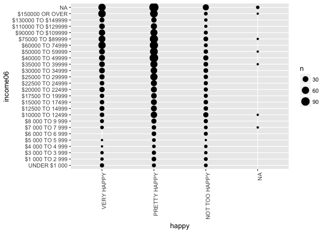

``` r
ggsave("income_happy.jpg")
```

    ## Saving 7 x 5 in image

It looks like that income and happiness levels are not really correlated.

Maybe happiness also varies as function of how much confidence participants placed in financial institutions?

``` r
confidence_happy<-ggplot(aes(confinan, happy), data = gss) + geom_count() + theme(axis.text.x = element_text(angle = 90, hjust = 1))
print(confidence_happy)
```


``` r
ggsave("confidence_happy.jpg")
```

    ## Saving 7 x 5 in image

Looks like people who place only some confidence in financial institutions are the happiest of the lot.

Do families who have greater confidence in financial institutions make more money?

``` r
confidence_income<-ggplot(aes(confinan,income06), data = gss) + geom_jitter() + theme(axis.text.x = element_text(angle = 90, hjust = 1))
print(confidence_income)
```

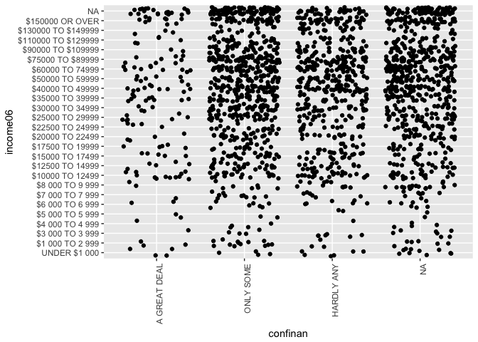

``` r
ggsave("confidence_income.jpg")
```

    ## Saving 7 x 5 in image

Once again, only people who place some level of confidence in financial institutions appear to make the most money.

Do people with higher confidence in the scientific community feel more happy in general?

``` r
science_happiness<-ggplot(aes(consci), data = gss) + geom_bar() + facet_wrap(~happy)+theme(axis.text.x = element_text(angle = 90, hjust = 1))
print(science_happiness)
```


``` r
ggsave("science_happiness.jpg")
```

    ## Saving 7 x 5 in image

Yeap -- that pane on the top right suggests that "pretty happy" people over all have a greater confidence in the scientific method.

How are people's opinions of hard-work related to their income levels?

``` r
hard_income<-ggplot(aes(workhard,income06), data = gss) + geom_count() + theme(axis.text.x = element_text(angle = 90, hjust = 1))
print(hard_income)
```

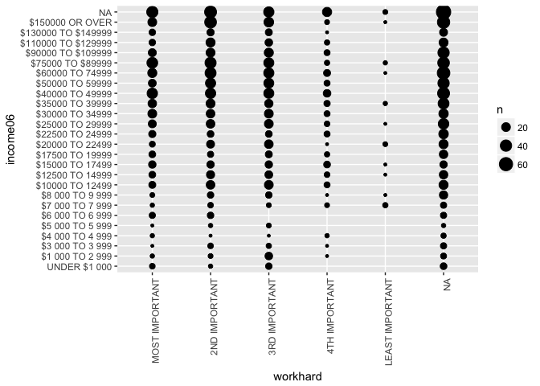

``` r
ggsave("hard_income.jpg")
```

    ## Saving 7 x 5 in image

Yeap, those people who think hardwork is least important for them also make the least money.

On second thoughts, makes more sense to first examine how hard-work opinions are disributed in general.

``` r
hard_work<-ggplot(aes(workhard), data = gss) + geom_bar() + theme(axis.text.x = element_text(angle = 90, hjust = 1))
print(hard_work)
```

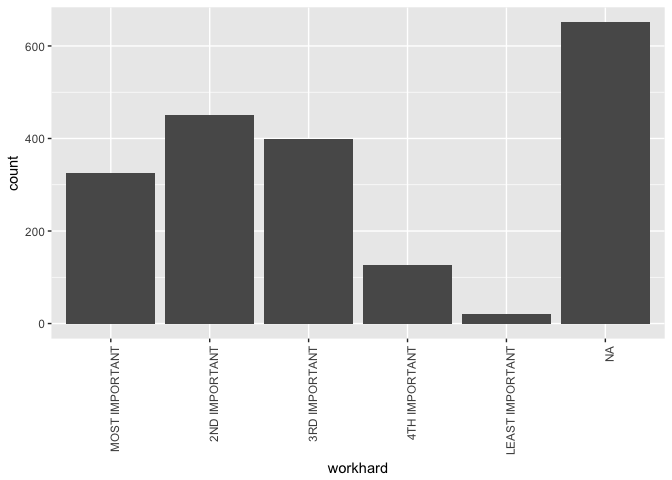

``` r
ggsave("hard_work.jpg")
```

    ## Saving 7 x 5 in image

Who are these people who didn't respond to the hard-work question? Let's first check by Income levels:

``` r
missing_hardwork<- subset(gss,is.na(workhard))
missingh_incomes<- ggplot(aes(income06), data = missing_hardwork) + geom_bar() + theme(axis.text.x = element_text(angle = 90, hjust = 1))
print(missingh_incomes)
```

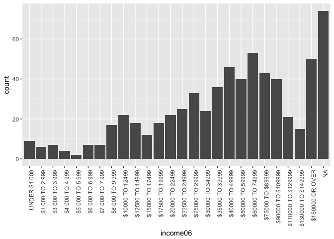

``` r
ggsave("income_hardwork_norespondents.jpg")
```

    ## Saving 7 x 5 in image

Yeap, looks like most of the rich people decided not to answer this question. Concerns about potential nepotism? Let's see what was the race distribution of the non-respondents was:

``` r
missing_hardwork<- subset(gss,is.na(workhard))
missingh_race<-ggplot(aes(race), data = missing_hardwork) + geom_bar() + theme(axis.text.x = element_text(angle = 90, hjust = 1))
print(missingh_race)
```


``` r
ggsave("race_hardwork_norespondents.jpg")
```

    ## Saving 7 x 5 in image

Yeaps, looks like it was mostly White and rich individuals who decided to skip the hardwork question. Interesting!

How does political affiliation relate to one's assignment of importance to hard-work?

``` r
political_hardwork<-ggplot(aes(workhard), data = gss) + geom_bar() + facet_wrap(~polviews)+theme(axis.text.x = element_text(angle = 90, hjust = 1))
print(political_hardwork)
```


``` r
ggsave("political_hardwork.jpg")
```

    ## Saving 7 x 5 in image

No real cool trends, although I am suspicious as to why mostly moderates chose to skip out of this question.

``` r
raceprox_pol<-ggplot(aes(polviews, closewht), data = gss) + geom_jitter()+ theme(axis.text.x = element_text(angle = 90, hjust = 1)) 
print(raceprox_pol)
```

    ## Warning: Removed 677 rows containing missing values (geom_point).

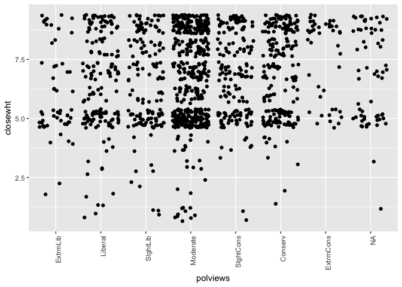

``` r
ggsave("raceprox_pol.jpg")
```

    ## Saving 7 x 5 in image

    ## Warning: Removed 677 rows containing missing values (geom_point).

What is the relationship between proximity to whites and proximity to blacks?

``` r
set.seed(1)
bwprox<-ggplot(aes(closeblk, closewht), data = gss) + geom_jitter() + theme(axis.text.x = element_text(angle = 90, hjust = 1)) + ggtitle("Proximity between blacks and whites")+labs(x="Political Views", y="Average Proximity to Whites") + geom_smooth(method="glm")
print(bwprox)
```

    ## Warning: Removed 680 rows containing non-finite values (stat_smooth).

    ## Warning: Removed 680 rows containing missing values (geom_point).

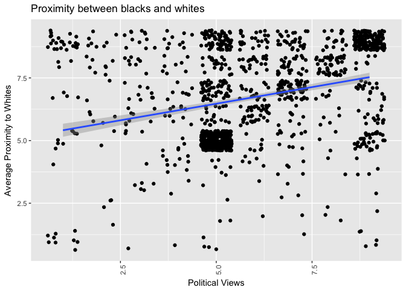

``` r
ggsave("bwprox.jpg")
```

    ## Saving 7 x 5 in image

    ## Warning: Removed 680 rows containing non-finite values (stat_smooth).

    ## Warning: Removed 680 rows containing missing values (geom_point).

How does political affiliation relate to feelings of proximity to whites?

``` r
averaceprox<-ggplot(aes(polviews, closewht), data = gss) + stat_summary(fun.y = "mean", geom="point") + theme(axis.text.x = element_text(angle = 90, hjust = 1))
print(averaceprox)
```

    ## Warning: Removed 677 rows containing non-finite values (stat_summary).

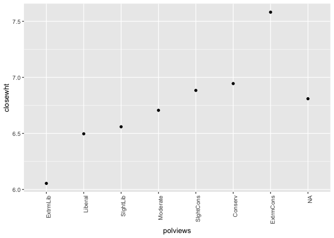

``` r
ggsave("averaceprox.jpg")
```

    ## Saving 7 x 5 in image

    ## Warning: Removed 677 rows containing non-finite values (stat_summary).

As expected, a pretty linear relationship between increasing conservativism and increasing proximity to whites. Let's check for outliers in the trend using a boxplot:

``` r
pol_raceprox<-ggplot(aes(polviews, closewht), data = gss) + geom_boxplot() + theme(axis.text.x = element_text(angle = 90, hjust = 1))
print(pol_raceprox)
```

    ## Warning: Removed 677 rows containing non-finite values (stat_boxplot).


``` r
ggsave("pol_raceprox.jpg")
```

    ## Saving 7 x 5 in image

    ## Warning: Removed 677 rows containing non-finite values (stat_boxplot).

No real observable outliers in the data. Hmm.

Let's rinse and repeat with feelings of proximity towards blacks:

``` r
aveblackprox<-ggplot(aes(polviews, closeblk), data = gss) + stat_summary(fun.y = "mean", geom="point") + theme(axis.text.x = element_text(angle = 90, hjust = 1))
print(aveblackprox)
```

    ## Warning: Removed 680 rows containing non-finite values (stat_summary).

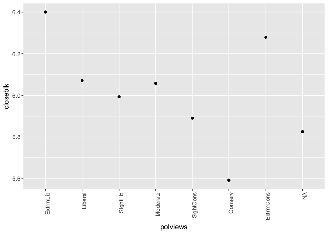

``` r
ggsave("aveblackprox.jpg")
```

    ## Saving 7 x 5 in image

    ## Warning: Removed 680 rows containing non-finite values (stat_summary).

Weird - the trend is not as robust as for whites. Even more suprisingly, extreme conservatives display a heightened perception of closeness with blacks. Maybe because they interacted with African Americans heavily in Southern USA?

A peek at outliers:

``` r
pol_blackprox<-ggplot(aes(polviews, closeblk), data = gss) + geom_boxplot() + theme(axis.text.x = element_text(angle = 90, hjust = 1))
print(pol_blackprox)
```

    ## Warning: Removed 680 rows containing non-finite values (stat_boxplot).

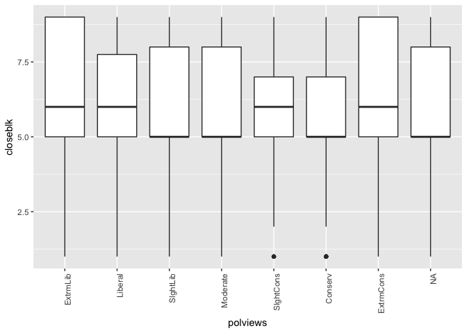

``` r
ggsave("pol_blackprox.jpg")
```

    ## Saving 7 x 5 in image

    ## Warning: Removed 680 rows containing non-finite values (stat_boxplot).

Interesting - two outliers in the slight conservative and conservative category. Could explain the overtly low mean for conservatives in the trend.

I noticed a marijuana legalization variable. Let's see who wants to legalize marijuana. First the general trends:

``` r
weed_opinions<- ggplot(aes(grass), data = gss) + geom_bar() + theme(axis.text.x = element_text(angle = 90, hjust = 1))
print(weed_opinions)
```

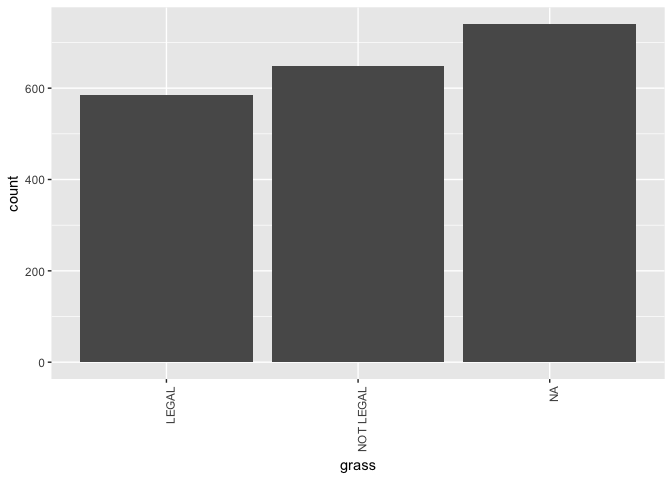

``` r
ggsave("weed_opinions.jpg")
```

    ## Saving 7 x 5 in image

Wow look at those non-responses. Lets see who didn't want to answer this question.

``` r
missing_weed<- subset(gss,is.na(grass))
missingw_race<-ggplot(aes(race), data = missing_weed) + geom_bar() + theme(axis.text.x = element_text(angle = 90, hjust = 1))
print(missingw_race)
```


``` r
ggsave("missingw_race.jpg")
```

    ## Saving 7 x 5 in image

Looks like whites decided to not answer this question. Let's see the politics of it all:

``` r
missing_weed<- subset(gss,is.na(grass))
missingw_politics<-ggplot(aes(polviews), data = missing_weed) + geom_bar() + theme(axis.text.x = element_text(angle = 90, hjust = 1))
print(missingw_politics)
```

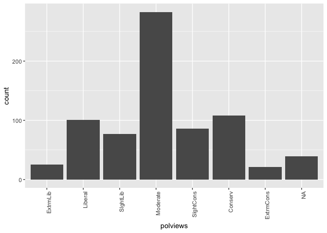

``` r
ggsave("missingw_politics.jpg")
```

    ## Saving 7 x 5 in image

Looks like mostly moderates skipped out of the question on Marijuana legalization. This makes sense because most moderates are probably confused about the matter or simply don't have a position as conservative or liberal as those of their counterparts.

I would assume that those people who have confidence in scientific society are more likely to push for the legalization of Marjiuana. Let's see:

``` r
weed_science<-ggplot(aes(grass,consci), data = gss) + geom_jitter() + theme(axis.text.x = element_text(angle = 90, hjust = 1))
print(weed_science)
```


``` r
ggsave("weed_science.jpg")
```

    ## Saving 7 x 5 in image

I was wrong -- looks like confidence in science has little to do with issues of marijuana legalization.

Maybe respondents with no children are in greater favor of marijuana legalization. It would make sense for parents to be wary of a newly legalized drug affecting their child. Let's take a look:

``` r
no_children<- subset(gss,childs==0)
children<-subset(gss, childs!=0)
weed_nochildren<-ggplot(aes(grass), data = no_children) + geom_bar() + theme(axis.text.x = element_text(angle = 90, hjust = 1))
print(weed_nochildren)
```

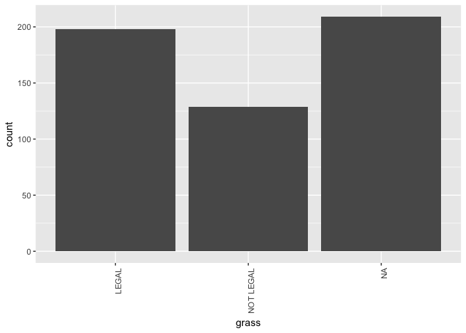

``` r
ggsave("no_children_weed.jpg")
```

    ## Saving 7 x 5 in image

Interesting - the number is definitely higher than before. Maybe, people with no children are typically too poor to afford legal grass? Let's see the income distribution of no-children responders who were against weed legalization.

``` r
no_children_no_weed<- subset(no_children, grass=="NOT LEGAL")
noweed_nochildren<-ggplot(aes(income06), data = no_children_no_weed) + geom_bar() + theme(axis.text.x = element_text(angle = 90, hjust = 1))
print(noweed_nochildren)
```

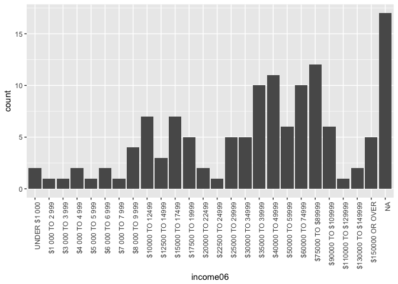

``` r
ggsave("no_children_no_weed.jpg")
```

    ## Saving 7 x 5 in image

Interesting, the distribution is still skewed to the right with a tail on the left. Maybe these upper middle class people with no children oppose marijuana legalization because of their political affiliation?

``` r
noweed_nochildren_politics<-ggplot(aes(polviews), data = no_children_no_weed) + geom_bar() + theme(axis.text.x = element_text(angle = 90, hjust = 1))
print(noweed_nochildren_politics)
```

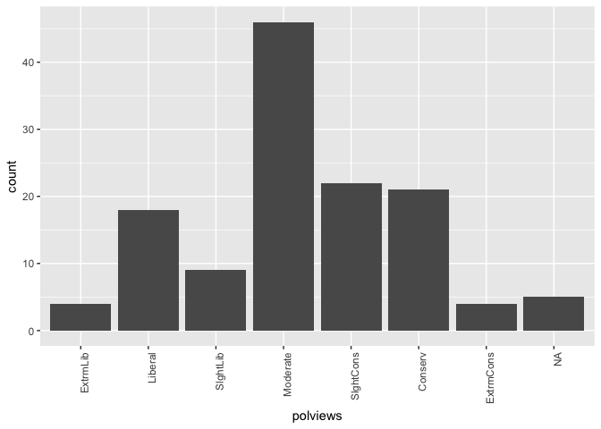

``` r
ggsave("no_children_no_weed_politics.jpg")
```

    ## Saving 7 x 5 in image

Interesting - so most upper-middle class people with no children who oppose marijuana legalization are moderates on the political ideology spectrum. That does make tentative sense.

I am really interested in confidence in science measure. Let's dig deeper. General patterns:

``` r
con_sci<- ggplot(aes(consci), data = gss) + geom_bar() + theme(axis.text.x = element_text(angle = 90, hjust = 1))
print(con_sci)
```

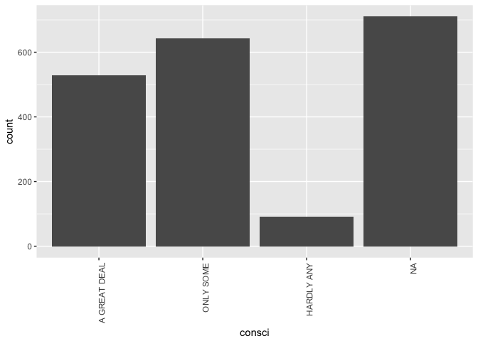

``` r
ggsave("con_sci.jpg")
```

    ## Saving 7 x 5 in image

I assume here that people with a high confidence in science would believe less in luck and more in hardwork. Let's see:

``` r
confi_sci_data<- subset(gss, consci=="A GREAT DEAL")
luck_science<-ggplot(aes(getahead), data = confi_sci_data) + geom_bar() + theme(axis.text.x = element_text(angle = 90, hjust = 1))
print(luck_science)
```

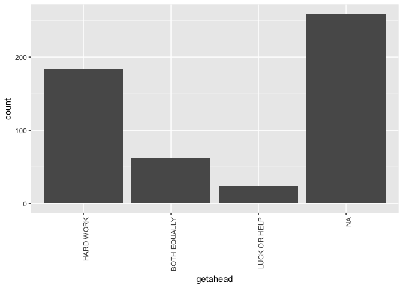

``` r
ggsave("luck_science.jpg")
```

    ## Saving 7 x 5 in image

As expected, those with a greater confidence in the scientific community report believing that Hard Work is the best option in getting ahead as compared to luck/help and both.

How confident in medicine are these individuals who are very confident in science?

``` r
confi_sci_data<- subset(gss, consci=="A GREAT DEAL")
med_science<-ggplot(aes(conmedic), data = confi_sci_data) + geom_bar() + theme(axis.text.x = element_text(angle = 90, hjust = 1))
print(med_science)
```


``` r
ggsave("med_science.jpg")
```

    ## Saving 7 x 5 in image

As expected, most of these indivduals also have a great deal of confidence in the current medicinal community.

Maybe the science-inclined nature of these people makes them less aversive to marginalized groups in society?

``` r
science_race<-ggplot(aes(consci, closeblk), data = gss) + stat_summary(fun.y = "mean", geom="point") + theme(axis.text.x = element_text(angle = 90, hjust = 1))
print(science_race)
```

    ## Warning: Removed 680 rows containing non-finite values (stat_summary).


``` r
ggsave("science_race.jpg")
```

    ## Saving 7 x 5 in image

    ## Warning: Removed 680 rows containing non-finite values (stat_summary).

What do they think about caucasians?

``` r
science_white<-ggplot(aes(consci, closewht), data = gss) + stat_summary(fun.y = "mean", geom="point") + theme(axis.text.x = element_text(angle = 90, hjust = 1))
print(science_white)
```

    ## Warning: Removed 677 rows containing non-finite values (stat_summary).

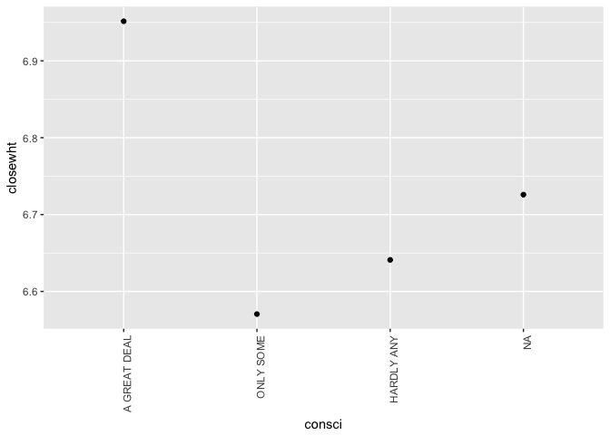

``` r
ggsave("science_white.jpg")
```

    ## Saving 7 x 5 in image

    ## Warning: Removed 677 rows containing non-finite values (stat_summary).

A higher average rating of proximity to whites than blacks by this population, but overall, these people appear to be racially unbiased and equally proximate to both races.

How does confidence in the scientific community interact with preferences for capital punishments?

``` r
set.seed(15)
science_capitalpunishment<-ggplot(aes(consci,cappun), data = gss) + geom_jitter() + theme(axis.text.x = element_text(angle = 90, hjust = 1))
print(science_capitalpunishment)
```

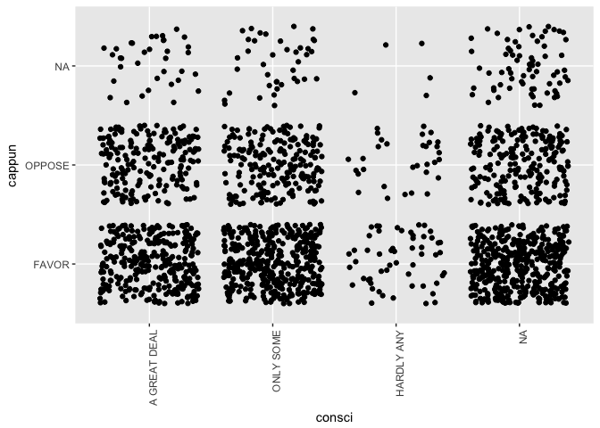

``` r
ggsave("science_capitalpunishment.jpg")
```

    ## Saving 7 x 5 in image

It looks like people with a higher confidence in the scientific community favor capital punishment.

What do people with a high confidence in the scientific community think about the current budget expenditure on scientific research?

``` r
set.seed(2)
science_funding<-ggplot(aes(natsci,consci), data = gss) + geom_jitter() + theme(axis.text.x = element_text(angle = 90, hjust = 1))
print(science_funding)
```


``` r
ggsave("science_funding.jpg")
```

    ## Saving 7 x 5 in image

How does faith in science spending relate to attitudes towards the current budget allocation to space exploration and attitudes towards current science spending?

``` r
space_science<-ggplot(aes(natspac, natsci, color=consci), data=gss)+geom_jitter()
print(space_science)
```

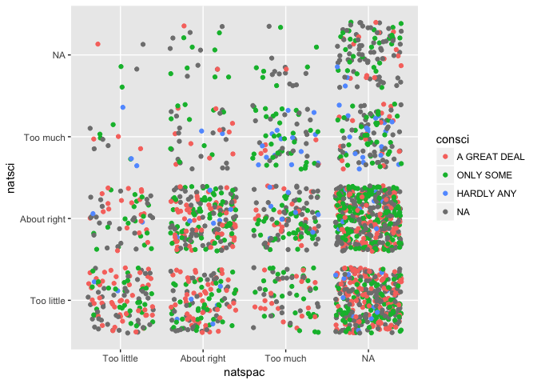

``` r
ggsave("space_science.jpg")
```

    ## Saving 7 x 5 in image

Who are these people skipping questions about spending in science?

``` r
science_spend_missing<- subset(gss, is.na(natsci))
science_spend_NA<-ggplot(aes(income06, polviews, color=race), data=gss)+geom_jitter()+theme(axis.text.x = element_text(angle = 90, hjust = 1))
print(science_spend_NA)
```

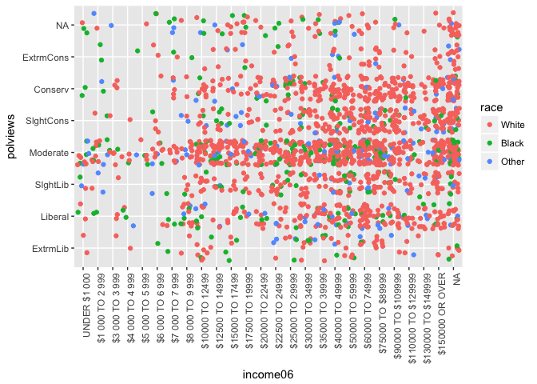

``` r
ggsave("science_spend.jpg")
```

    ## Saving 7 x 5 in image
