Assignment \#7 Write-Up - Sumer Vaid
================

    ## Warning: package 'tidyverse' was built under R version 3.4.2

    ## ── Attaching packages ────────────────────────────────── tidyverse 1.2.1 ──

    ## ✔ ggplot2 2.2.1     ✔ purrr   0.2.4
    ## ✔ tibble  1.3.4     ✔ dplyr   0.7.4
    ## ✔ tidyr   0.7.2     ✔ stringr 1.2.0
    ## ✔ readr   1.1.1     ✔ forcats 0.2.0

    ## Warning: package 'tidyr' was built under R version 3.4.2

    ## Warning: package 'purrr' was built under R version 3.4.2

    ## Warning: package 'dplyr' was built under R version 3.4.2

    ## ── Conflicts ───────────────────────────────────── tidyverse_conflicts() ──
    ## ✖ dplyr::filter() masks stats::filter()
    ## ✖ dplyr::lag()    masks stats::lag()

In this exploratory data analysis, I attempt to formulate several hypothesis and attempt to validate them using exploratory data techniques. In this write-up, I will discuss three streamsof my most interesting findings.

### Income, Hard-Work and Race

I was interested by people's prioritization of hard-work and how this related with their income levels. First, I explored the general patterns of the importance assigned to hard-work:

    ## Saving 7 x 5 in image

I then explored how people's assigned importance of hard-work varied with their income levels. I expected to find that people who prioritized hard-work more were also high earners.

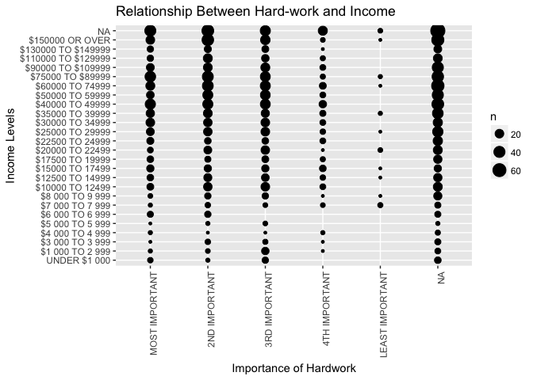

    ## Saving 7 x 5 in image

My hypothesis was somewhat correct: people who rate hard-work as being least important clearly make lesser money than those who rate hard-work as being more than least important. However, instead of seeing a robust characterization of increasing hardwork with increasing income levels, I instead noted a bulk in the upper-middle income levels for most categorizations of hardwork. This means that middle-to-upper middle class families mostly rate hard-work as being atleast somewhat important. However, I was curious to see how this relationship is influenced by race. I assumed that members of low racial status would rate hard-work as being more important to them.

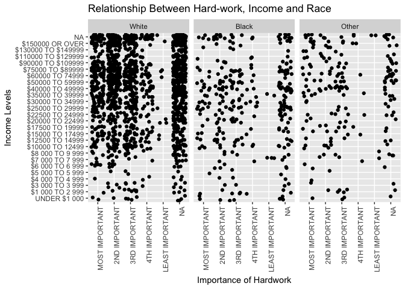

    ## Saving 7 x 5 in image

My hypothesis was wrong: it looks like the relationship between importance assigned to hardwork and income levels is more robust for high-racial status members (Whites) as compared to Blacks. Lastly, I was intrigued by the missingness in the data. I decided to conduct some analysis to understand exactly who opted out of the hard-work question on the survey. I first examined the income levels of non-responders to the hard-work question. My hypothesis was that mostly wealthy individuals, who had acquired their wealth through means other than hardwork (nepotism), would not answer this question.

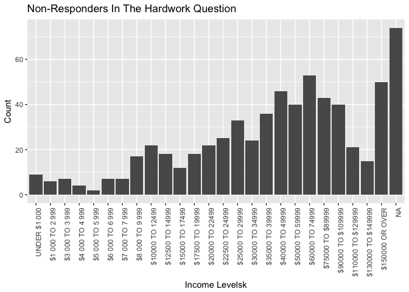

    ## Saving 7 x 5 in image

The distribution here is skewed to the left, suggesting that mostly wealthy individuals opted out of the question on hard-work. Hence, my hypothesis was correct. Nepotism is mostly common in high-racial status groups. Hence, it is likely that those neptostic individuals who opted out of the hard-work question were also white.

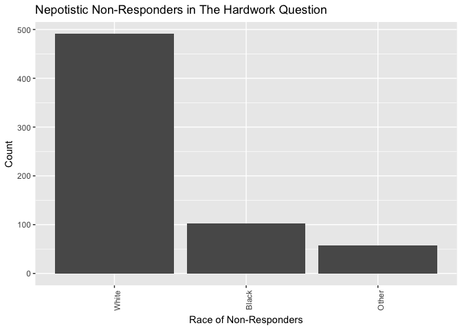

    ## Saving 7 x 5 in image

My hypothesis was correct - the overwhelming majority of non-responders to the hard-work question were white individuals.

### Political Affiliation and Feelings of Proximity to Whites and Blacks

I am interested in examining the relationship between perceptions of blacks and perceptions of whites. I plotted a scatterplot with a linear smoothing line to observe potentially interesting trends. I hypothesized that this relationship should be most linear, with a slight bend towards proximity to whites as the number of white respondents in the survey were greater than black respondents.

    ## Warning: Removed 680 rows containing non-finite values (stat_smooth).

    ## Warning: Removed 680 rows containing missing values (geom_point).

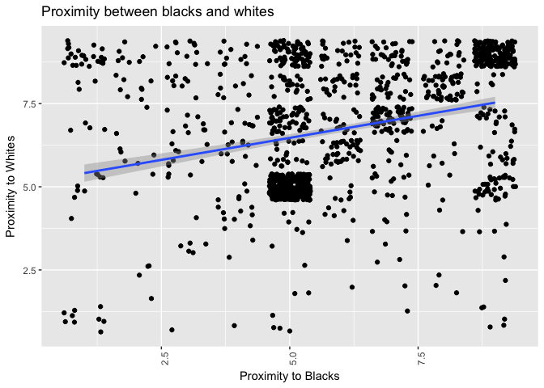

    ## Saving 7 x 5 in image

    ## Warning: Removed 680 rows containing non-finite values (stat_smooth).

    ## Warning: Removed 680 rows containing missing values (geom_point).

The relationship is linear, but it is not a very strong one. As observable, the relationship becomes more linear for individuals who give both blacks and white a higher than 4.5 proximity rating. Therefore, I next examined the relationship between proximity to blacks and whites for those individuals who rated both these proximities as being greater than 5. I hypothesized that in this analysis, the correlation would increase and a more linear relationship would emerge.

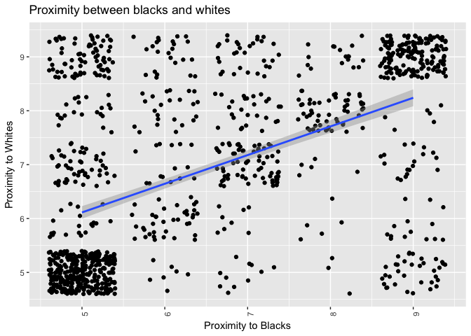

    ## Saving 7 x 5 in image

My hypothesis was correct - analyzing individuals who rate high proximity to both blacks and whites (greater than 5) reveals that for these individuals, proximities to both races is correlated in a near-linear trend.

I was also interested in examining how political views related to feelings of proximity with whites. I plot the mean values of white-proximity across individuals of various political views. I hypothesize that as ideologies get more conservative, the perceived proximity to whites increases.

    ## Warning: Removed 677 rows containing non-finite values (stat_summary).

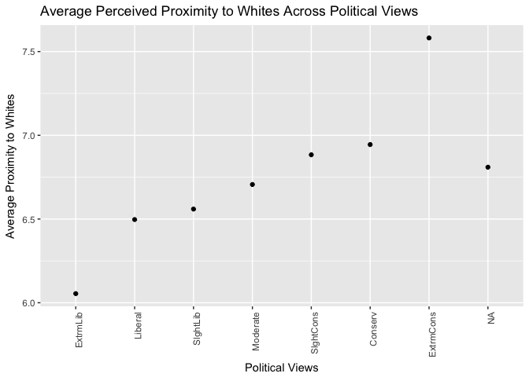

    ## Saving 7 x 5 in image

    ## Warning: Removed 677 rows containing non-finite values (stat_summary).

My hypotehsis was correct: as ideologies span from liberal to conservative, the average reported proximity to whites follows a linear relationship. Next, I examined the data for potential outliers giving the suspiciously high white-proximity value of Extreme Conservatives.

    ## Warning: Removed 677 rows containing non-finite values (stat_boxplot).

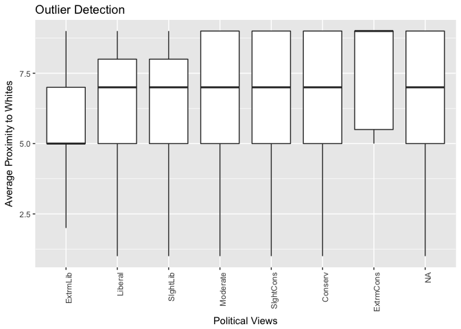

    ## Saving 7 x 5 in image

    ## Warning: Removed 677 rows containing non-finite values (stat_boxplot).

I found that there were no real outliers in the data. There is a lot of downward variability in the data, but overall, we don't see observations very far from the mean.

### Confidence in Science

Lastly, I was interested in examining relations between other variables and the confidence in science variable. First, the general patterns of responses:

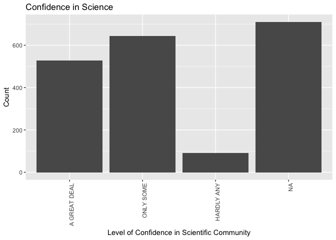

    ## Saving 7 x 5 in image

I was intrigued by the high level of non-responders to the confidence in scientific community question so I examined the demographics of non-responders:

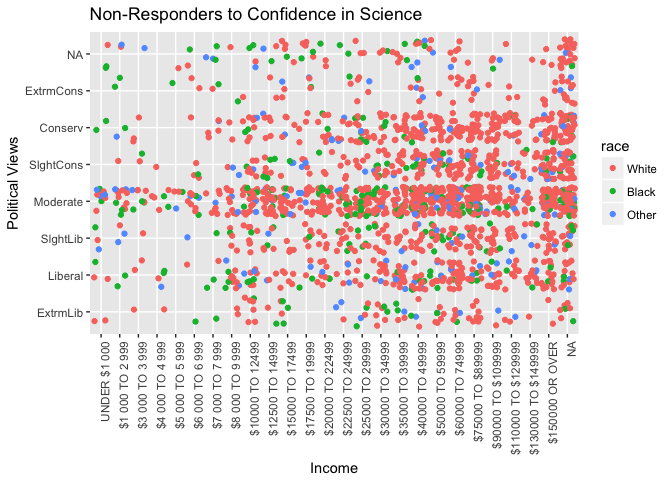

    ## Saving 7 x 5 in image

Pretty robust trends in attriton: White moderates from a wide range of income-levels avoided answering the question but there was little to no attrition in political views distant from those of the moderates.

I finally examined how education levels related to confidence in the scientific community. I hypothesized that people with higher educations levels would typically put greater confidence in the scientific community.

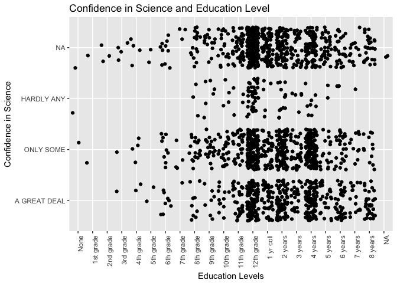

    ## Saving 7 x 5 in image

It looks like the greatest confidence in science is exhibited by individuals who have attended either a community or a full-time college. PhD students and PhD holders do not appear to have a great confidence in the scientific community ironically, perhaps because they are over-integrated with the system and can see the finer faults and vices.
