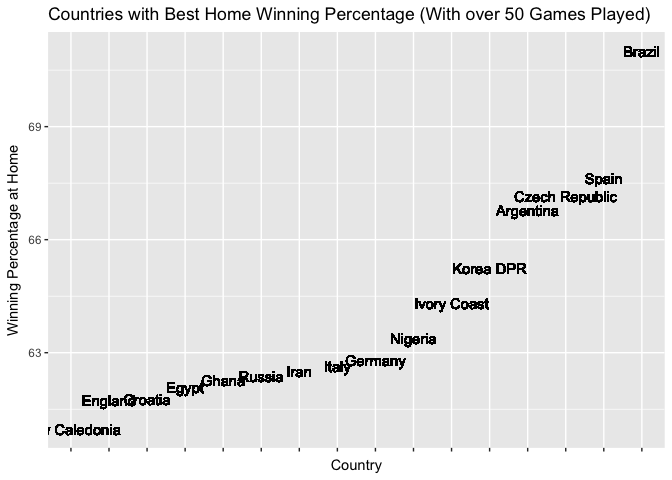
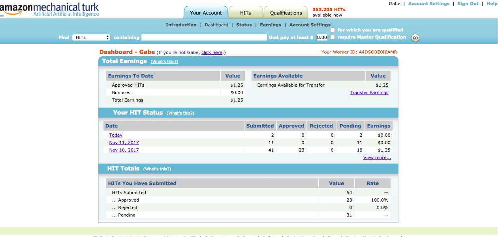
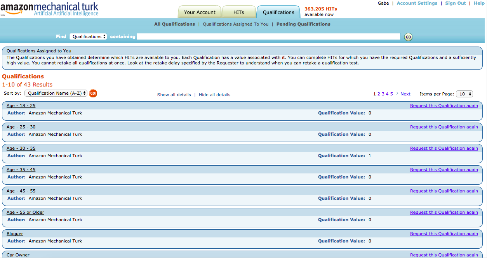

Collaboration
================
Gabriel Velez
11/11/2017

Part 1 - Working with Kaggle
----------------------------

*First Step*

The project of interest to me involves creating an algorithm to predict home prices (sponsored by [Zillow](https://www.kaggle.com/c/zillow-prize-1)). The project looks to improve upon the current “Zenestimate” that Zillow.com provides to prospective home buyers as they explore online different home buying options. The current approach, according to the competition page, uses “7.5 million statistical and machine learning models that analyze hundreds of data points on each property.” Over time, Zillow has been able to lower the median margin of error in their estimate to 5%, and now they running this competition to make their predictive ability of future home prices even more precise. To this end, the goal of the competition is to create a statistical model using available data on a given home that has the lowest residual error. The competition is set up two rounds (a qualifying one and a final one).

The qualifying round be evaluated by using the mean absolute error, or the difference between the predicted log error (which is the log of the model estimate minus the log of the sale price) and the actual log error (using the current Zenestimate model). The final round will be evaluated by applying the algorithm to homes sold in the three months after the competition closes. The measure used to judge the models will be the difference between the predictions and the actual sale prices.

In order to make a submission, I would have develop a predictive model for the sale price of a home. This model would need to consider factors about the home (e.g., number of rooms, floor space, bathrooms), the neighborhood (e.g., crime statistics, median home sale price, number of parks, rural/urbanicity), about the particular home (e.g., how long it has been on the market, recent updates to roof, etc.), and about the trends in home prices in the area. I would begin the problem by looking at what publically available data on modeling home sale prices exists. I would also then research what literature exists on factors impacting home sales. After drawing on this to create various possible models, I would test the effectiveness of each. To do this, I would take available home sale data over an extended time period (say five to ten years) and split it into training and evaluation sets. A ten-fold cross validation approach could be used. First, the data would be split into ten groups. This process then uses one of the ten as the validation set and then tests the model on the other nine, repeating the process with each set serving as the validation set, and then finally taking the average of the mean squared error (MSE) for each one of these steps. I could do this for the various models I create and compare with are the best by having the lowest MSE.

*Second Step*

``` r
soccerResults <- read_csv("soccerResults.csv")
```

    ## Parsed with column specification:
    ## cols(
    ##   date = col_date(format = ""),
    ##   home_team = col_character(),
    ##   away_team = col_character(),
    ##   home_ft = col_integer(),
    ##   away_ft = col_integer(),
    ##   tournament = col_character(),
    ##   city = col_character(),
    ##   country = col_character()
    ## )

``` r
#Plotting Top Team's Winning Percentage
soccerResults %>%
  mutate(`homeWin` = ifelse(home_ft>away_ft, 1, 0)) %>%
  group_by(`home_team`) %>%
  mutate(`totalWins`= sum(`homeWin`), 
         `totalGames` = length(`home_team`), 
         `percWin` = `totalWins`/`totalGames`*100) %>%
  filter(`totalGames`>50, 
         `percWin`>60) %>%
  arrange(`percWin`) %>%
  ggplot(aes(reorder(`home_team`,`percWin`), 
             `percWin`)) +
  geom_text(aes(label=`home_team`)) +
    labs(title = "Countries with Best Home Winning Percentage (With over 50 Games Played)",
       x = "Country", 
       y = "Winning Percentage at Home") +
       theme(axis.text.x=element_blank())
```



Part 2 - Suggesting a Change for a Journal
------------------------------------------

The paper I have chosen to reformulate as a human computation project is ["Review of the effects of citizenship education"](http://www.sciencedirect.com/science/article/pii/S1747938X12000176) by Ellen Geboers, Femke Geijsel, Wilfried Admiraal, and Geert ten Dam. My idea involves reframing the question a bit because human computation methods could be employed to develop a richer starting framework for even approaching the study of citizenship education. This paper begins in the assumption (and there is much research supporting this as well) that school curriculum can affect citizenship outcomes for young people. The approach of the article I chose was to conduct a search and review of available articles on effects of citizenship education on students’ civic attitudes. Based on the analysis of the 28 articles that fit their criteria, the authors assert that a formal curriculum that “includes citizenship projects and courses also appears to be an effective type of citizenship education” (p. 158).

My proposal for a human computation project would be to first develop a better understanding of how citizenship is taught and what sort of curriculums exist. Often, studies on civic education curriculum focus on the impact of one particular approach, or involve a meta-analysis like this one of the available studies of a select set of materials. Therefore, I propose to first create a comprehensive compendium of civic education curriculum (particular lesson plans and textbooks), and then code the focus of their content by categories determined by the current literature (e.g., political activism, constitution, history, civic responsibilities, conflict resolution, etc.). That is, the project involves two steps: the documenting of different civic education resources (by having contributors upload photos, scans, ebooks, etc.) and the coding of this material. While I would be open with contributors about the end purpose for ethical reasons (i.e., be clear about the research goals), I would would use this not only for research purposes, but also as an online platform for teachers, school officials, and policymakers across the world to share resources and ideas about teaching about citizenship. In my experience, many educators are excited by sharing resources and talk about those that they use (either to complain about what they are working with or to talk about how effective it is). I believe that this enthusiasm, as well as the incentive of working toward a broader educational goal, will inspire many diverse people to first upload their curriculum and also be willing to code other curriculum. Additionally, I would integrate a social element (perhaps a platform for posting about resources or activities and a function to invite or link yourself to other teachers) to try to motivate greater participation. This social component could be further promoted by advertising and sharing this at conferences or workshops where educators would be discussing civic education and curriculum.

I envision a couple of substantial obstacles to this human computation project aside from the concern of motivation. First, it is important to have a clear, measurable and relatively straightforward task. While the uploading of civic education resources could easily fit this by allowing for uploading of different formats (even just photos from a phone) with cross checking by other users (to make sure the content is appropriate), the labeling might be more difficult. For example, the same lesson on the American flag may be labeled as history in content by one person and civic knowledge by another. For this reason, it would be important to provide a quick training in the code definitions and to use redundancy (i.e., have multiple users code a text, and then have ways to address when these conflict, such as providing a further set of users with a limited choice between the options coded by previous users. In the example, it would be: "is this material history, civic knowledge, or both?"). Second, the sample of possible contributors would most likely be limited to teachers of citizenship material (or perhaps more broadly, teachers) because of the need to understand particular details. Even the required knowledge to code such a text might limit the possible sample to just those teachers who are from the same country or fluent in the same language as the uploaded material. Finally, perhaps the most problematic obstacle would be copyright laws. Since this material is published and the property of the publishers. It seems to me like the most ethical approach would be to try to convince publishers of the purpose of giving permission to this project, though I am not sure if that would be achieveable.

Part 3 - Amazon MTurk
---------------------

My evidence of participating in an hour of work:

Account Page: 

Qualifications Page: 
