Assignment 7
================
Gabriel Velez
11/21/2017

``` r
#install.packages("poliscidata")
data(gss, package = "poliscidata")
library(tidyverse)
```

    ## Loading tidyverse: ggplot2
    ## Loading tidyverse: tibble
    ## Loading tidyverse: tidyr
    ## Loading tidyverse: readr
    ## Loading tidyverse: purrr
    ## Loading tidyverse: dplyr

    ## Warning: package 'ggplot2' was built under R version 3.3.2

    ## Conflicts with tidy packages ----------------------------------------------

    ## filter(): dplyr, stats
    ## lag():    dplyr, stats

``` r
library(knitr)
#install.packages("GGally")
library(GGally)
```

    ## Warning: package 'GGally' was built under R version 3.3.2

    ## 
    ## Attaching package: 'GGally'

    ## The following object is masked from 'package:dplyr':
    ## 
    ##     nasa

``` r
library(stringr)
```

    ## Warning: package 'stringr' was built under R version 3.3.2

``` r
# convert to tibble
gss <- as_tibble(gss)
```

Lab notebook (6 points)
-----------------------

The question that I want to explore is the ways that different groups of Americans value education and armarment (both individual and collective). To this end, I am first going to explore a few demographic variables that I am considering including and the pertinent variables. I am looking to see what their distribution looks like, and if there are any outliers, asymmetry, multimodality, gaps, peaks, or impossibilities.

``` r
# Looking at various variables distributions - just variables

#Marital Status - marital
gss %>%
  ggplot(aes(marital)) +
    geom_bar()
```

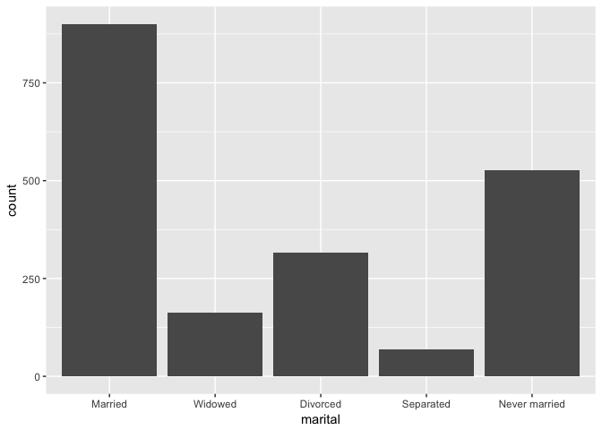

``` r
# Number of siblings - sibs
gss %>%
  ggplot(aes(sibs)) +
    geom_histogram()
```

    ## `stat_bin()` using `bins = 30`. Pick better value with `binwidth`.

    ## Warning: Removed 3 rows containing non-finite values (stat_bin).

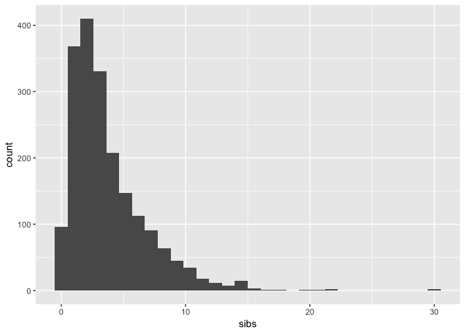

``` r
  # Clearly some outliers, so restricting and trying between 0 and 15 siblings, and using density to see it more smoothly spread
  gss %>%
    filter(sibs <=15) %>%
    ggplot(aes(sibs)) +
      geom_density()
```


``` r
  # Trying it by marital status
  gss %>%
    filter(sibs <=15) %>%
    ggplot(aes(sibs)) +
      geom_density() + 
      facet_wrap(~marital)
```

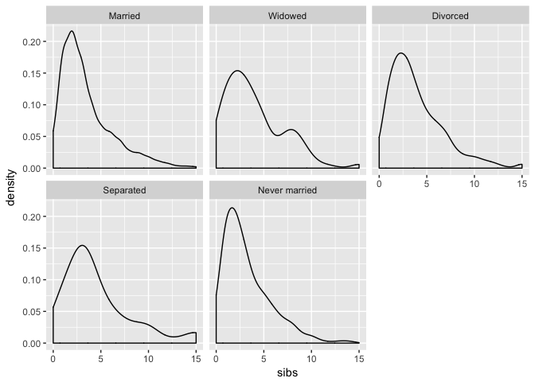

``` r
# Number of children - childs
gss %>%
  ggplot(aes(childs)) +
    geom_bar()
```

    ## Warning: Removed 3 rows containing non-finite values (stat_count).

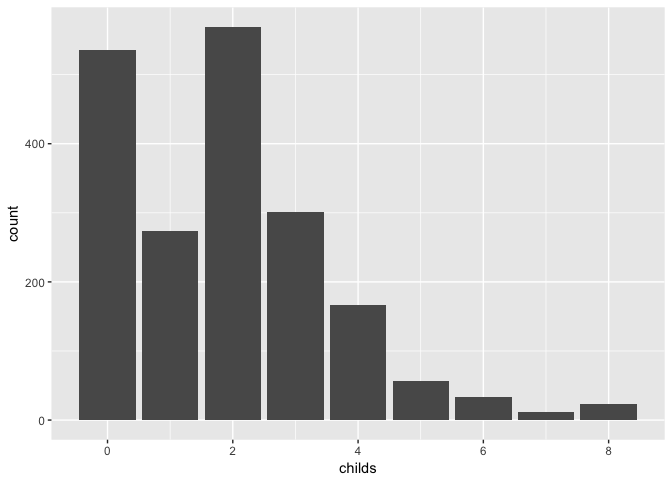

``` r
    # Most are 0 and 2

# Age - age
gss %>%
  ggplot(aes(age)) +
    geom_histogram(bins = 10)
```

    ## Warning: Removed 5 rows containing non-finite values (stat_bin).


``` r
  #Trying fewer bins
  gss %>%
    ggplot(aes(age)) +
      geom_histogram()
```

    ## `stat_bin()` using `bins = 30`. Pick better value with `binwidth`.

    ## Warning: Removed 5 rows containing non-finite values (stat_bin).

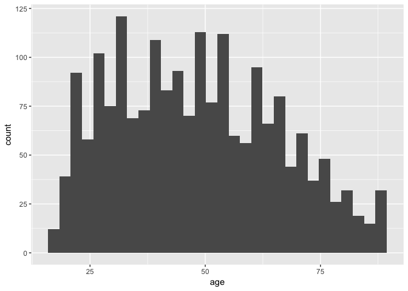

``` r
  #Sort of choppy to look at, so trying density plot
  gss %>%
    ggplot(aes(age)) +
     geom_density()
```

    ## Warning: Removed 5 rows containing non-finite values (stat_density).

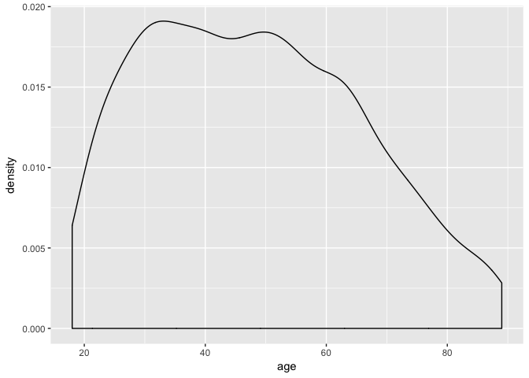

``` r
# Highest degree - degree
gss %>%
  ggplot(aes(degree)) +
    geom_bar()
```


``` r
# Political views - polviews
gss %>%
  ggplot(aes(polviews)) +
    geom_bar()
```


``` r
# Improving Nations Education - nateduc
gss %>%
  ggplot(aes(nateduc)) +
    geom_bar()
```

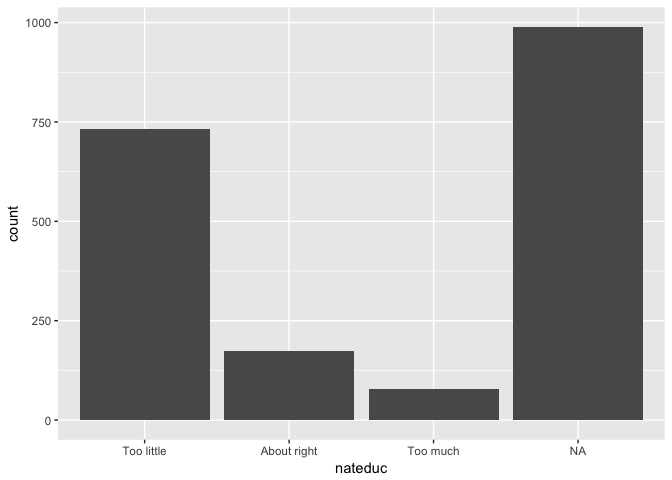

``` r
  #Noticing a high N/A count
  gss %>%
    count(nateduc) %>%
      kable()
```

| nateduc     |    n|
|:------------|----:|
| Too little  |  733|
| About right |  174|
| Too much    |   78|
| NA          |  989|

``` r
# Improving Military, armament, defense - natarms
gss %>%
  ggplot(aes(natarms)) +
    geom_bar()
```

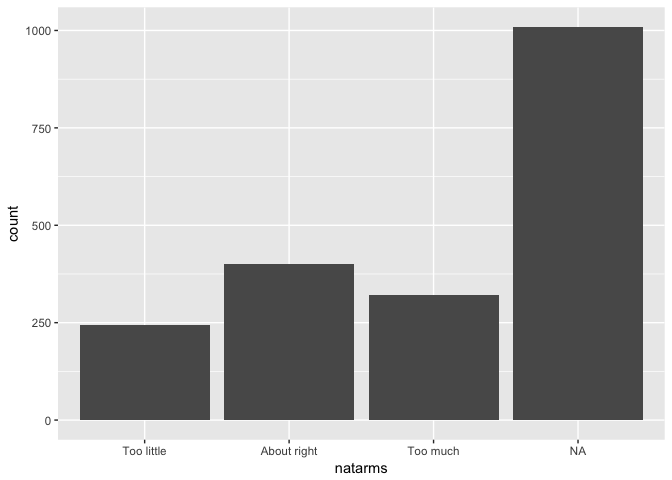

``` r
  # Even higher here, so I may drop this since you lose a lot of power in the analyses
  gss %>%
    count(natarms) %>%
      kable()
```

| natarms     |     n|
|:------------|-----:|
| Too little  |   243|
| About right |   401|
| Too much    |   321|
| NA          |  1009|

``` r
# Government Support for Children - natchld
gss %>%
  ggplot(aes(natchld)) +
    geom_bar()
```

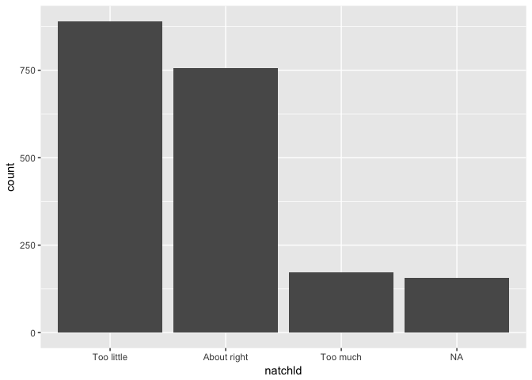

``` r
  # This one is heavily skewed toward "too little," so there is not a lot of variance, so I am going to explore by number of children
  gss %>%
    ggplot(aes(natchld)) +
      geom_bar() +
      facet_wrap(~childs)
```


``` r
  # This looks a little unwieldy, so I am regrouping this into three categories.  I am creating a new data set with the "simplified" variables.
   gssSimp <- gss
  
   gssSimp$childsGroup<-cut(gssSimp$childs, c(0,1,3,8))
    
   gssSimp%>%
      filter(childsGroup!="NA"&natchld!="NA") %>%
      ggplot(aes(natchld)) +
        geom_bar() +
        facet_wrap(~childsGroup)
```

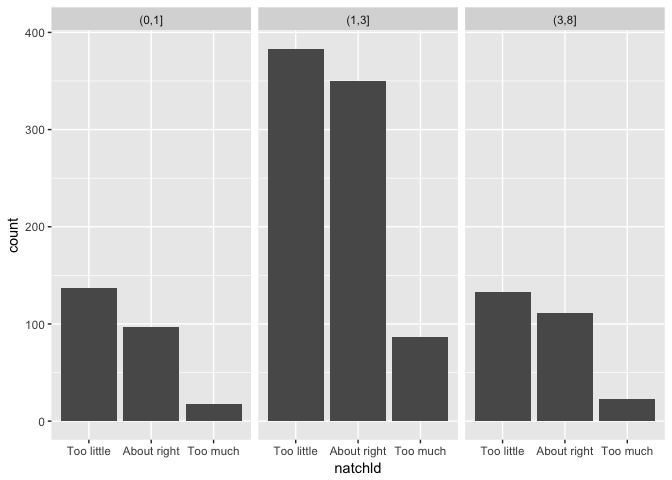

``` r
# Favor or oppose gun permits - gunlaw
gss %>%
  ggplot(aes(gunlaw)) +
    geom_bar()
```


``` r
  # Look at if age groups are different 
  gss %>%
    ggplot(aes(age)) +
      geom_histogram() +
      facet_wrap(~gunlaw)
```

    ## `stat_bin()` using `bins = 30`. Pick better value with `binwidth`.

    ## Warning: Removed 5 rows containing non-finite values (stat_bin).

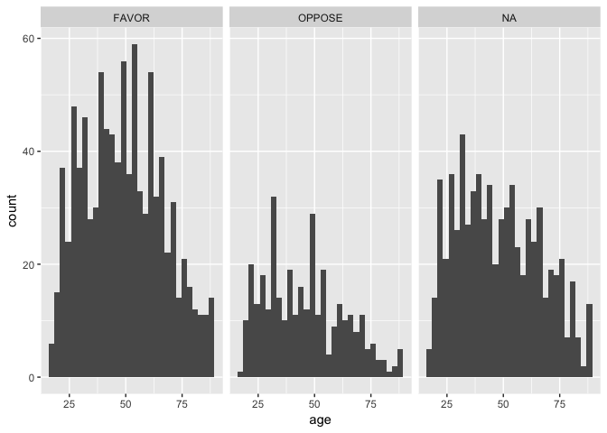

``` r
  # Hard to see, so looking at it with fewer bins
  gss %>%
    ggplot(aes(age)) +
      geom_histogram(bins=10) +
      facet_wrap(~gunlaw)
```

    ## Warning: Removed 5 rows containing non-finite values (stat_bin).

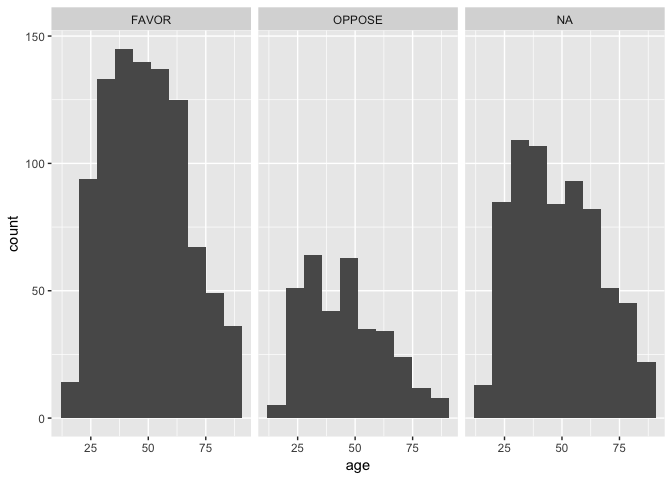

``` r
  # Still hard to see difference in spread because of different numbers, so look at density
  gss %>%
    ggplot(aes(age)) +
      geom_density() +
      facet_wrap(~gunlaw)
```

    ## Warning: Removed 5 rows containing non-finite values (stat_density).


``` r
# Confidence in education - coneduc
gss %>%
  ggplot(aes(coneduc)) +
    geom_bar()
```

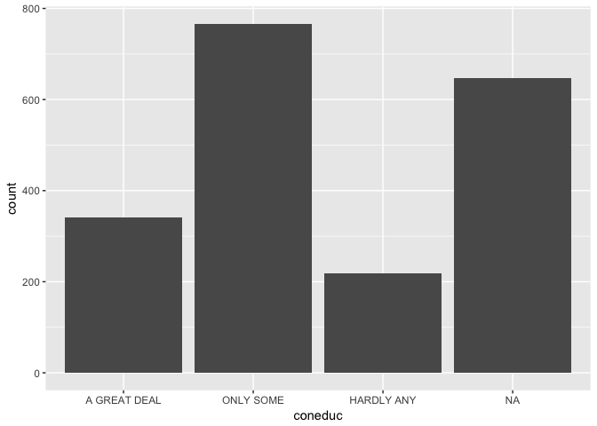

``` r
  # This one has most respondents in the middle (aside from N/A) and might also have issues with variance.  Look at breakdown by number of children categories.
   gssSimp %>%
      filter(childsGroup!="NA"&coneduc!="NA") %>%
      ggplot(aes(coneduc)) +
        geom_bar() +
        facet_wrap(~childsGroup)
```

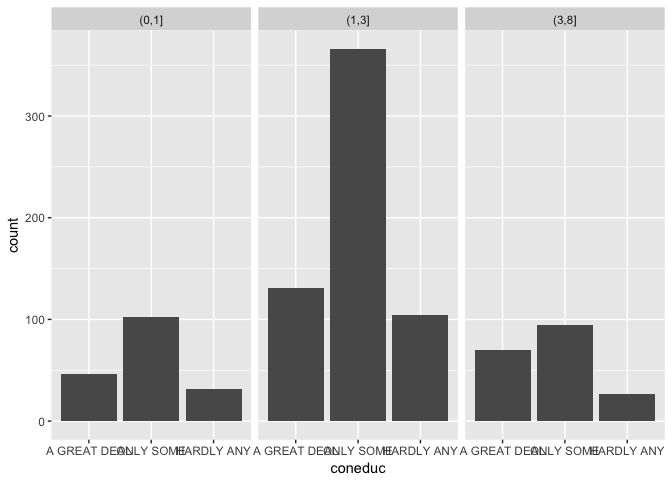

``` r
# Confidence in army - conarmy
gss %>%
  ggplot(aes(conarmy)) +
    geom_bar()
```

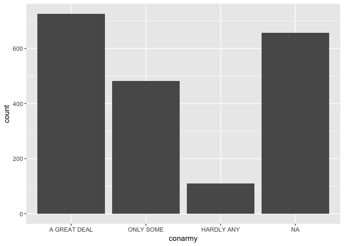

``` r
  # Look at if there is a difference by political view
  gss %>%
    filter(conarmy!="NA"&polviews!="NA") %>%
    ggplot(aes(conarmy)) +
      geom_bar() +
      facet_wrap(~polviews)
```

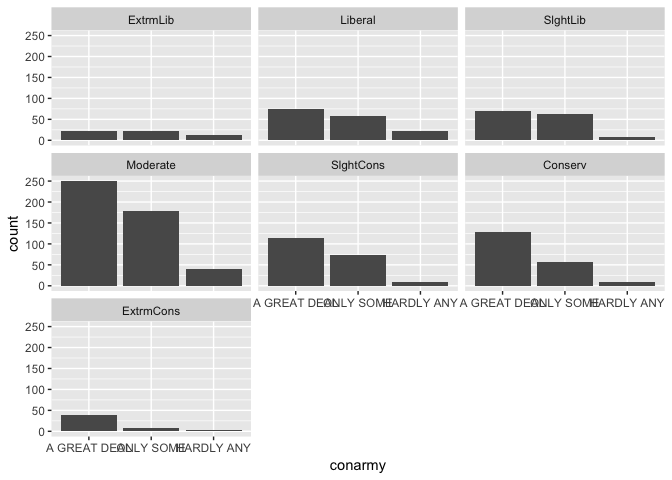

``` r
  # Political views has many gradients that make it harder to see differences, so I am going to regroup it as liberal, moderate, and conservative
  gssSimp$polviews[gssSimp$polviews=="ExtrmLib"] <- "Liberal"
  gssSimp$polviews[gssSimp$polviews=="ExtrmCons"] <- "Conserv"
  gssSimp$polviews[gssSimp$polviews=="SlghtLib"] <- "Moderate"
  gssSimp$polviews[gssSimp$polviews=="SlghtCons"] <- "Moderate"
  
  gssSimp %>%
    filter(conarmy!="NA"&polviews!="NA") %>%
    ggplot(aes(conarmy)) +
      geom_bar() +
      facet_wrap(~polviews)
```


``` r
# Look at relationships age and some of the variables related to army/armarment and education/children

# Age and Opinion on Education
gssSimp %>%
  ggplot(aes(nateduc, age)) +
    geom_boxplot()
```

    ## Warning: Removed 5 rows containing non-finite values (stat_boxplot).

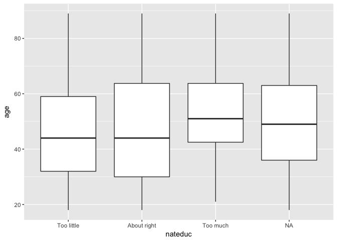

``` r
# Age and Opinion on Government Support for Children
gssSimp %>%
  ggplot(aes(natchld, age)) +
    geom_boxplot()
```

    ## Warning: Removed 5 rows containing non-finite values (stat_boxplot).

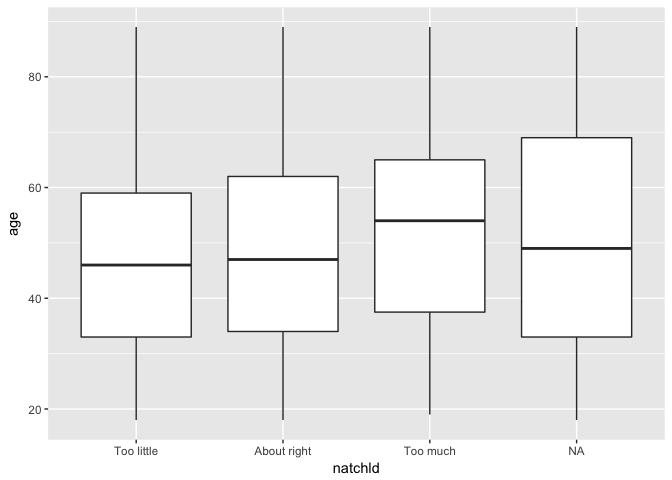

``` r
# Age and Confidence in Army
gssSimp %>%
  ggplot(aes(conarmy, age)) +
    geom_boxplot()
```

    ## Warning: Removed 5 rows containing non-finite values (stat_boxplot).


``` r
# Age and Support for Gun Permits
gssSimp %>%
  ggplot(aes(gunlaw, age)) +
    geom_boxplot()
```

    ## Warning: Removed 5 rows containing non-finite values (stat_boxplot).


``` r
# Age and support for gunlaw, by political views
gssSimp %>%
  filter(gunlaw!="NA") %>%
  ggplot(aes(gunlaw, age)) +
    geom_boxplot() +
    facet_wrap(~ polviews)
```

    ## Warning: Removed 5 rows containing non-finite values (stat_boxplot).


``` r
    # The boxplot for NA here is interesting because it seems to indicate that while there are a number of missing values for political views of young people who oppose gun permit laws.

# Exploring if there is a relationship between number of children and siblings by political views
gssSimp %>%
  ggplot(aes(childs, sibs)) +
    geom_point(size = 1) +
    facet_wrap(~ polviews)
```

    ## Warning: Removed 5 rows containing missing values (geom_point).


``` r
  # This one is a bit confusing, so may try looking at it flipped, and then also look at the smoothing line while removing outliers
  gssSimp %>%
    filter(sibs<16) %>%
    ggplot(aes(sibs, childs)) +
      geom_point(size = 1) +
      geom_smooth() +
      facet_wrap(~ polviews)
```

    ## `geom_smooth()` using method = 'gam'

    ## Warning: Removed 2 rows containing non-finite values (stat_smooth).

    ## Warning: Removed 2 rows containing missing values (geom_point).

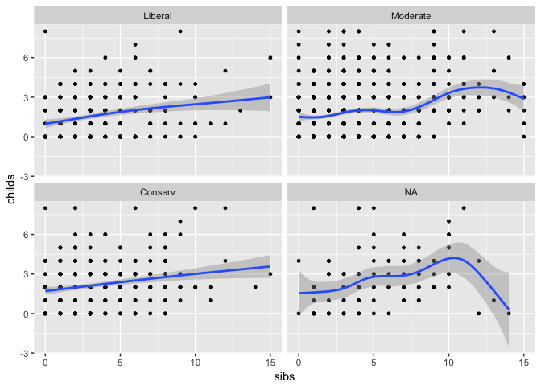

Exploration write-up (4 points)
-------------------------------

Graphs and Code
===============

``` r
# Sibling and Children Distribution Graphs 
siblingsDist <- gssSimp %>%
  ggplot(aes(sibs)) +
    geom_bar() +
    labs(title = "Number of Siblings",
         x = "Number of Siblings",
         y = "Frequency of Response")

childDist <- gssSimp %>%
  ggplot(aes(childs)) +
    geom_bar() +
    labs(title = "Number of Children",
         x = "Number of Children",
        y = "Frequency of Response")

print(childDist)
```

    ## Warning: Removed 3 rows containing non-finite values (stat_count).


``` r
# Opinion about Government Support for Children Graphs
suppChild  <- gssSimp %>%
  filter(natchld!="NA") %>%
  ggplot(aes(natchld)) +
    geom_bar() +
    facet_wrap(~childs) +
    labs(title = "Opinion about Government Support for Children",
        x = "Response",
        y = "Frequency of Response")

print(suppChild)
```

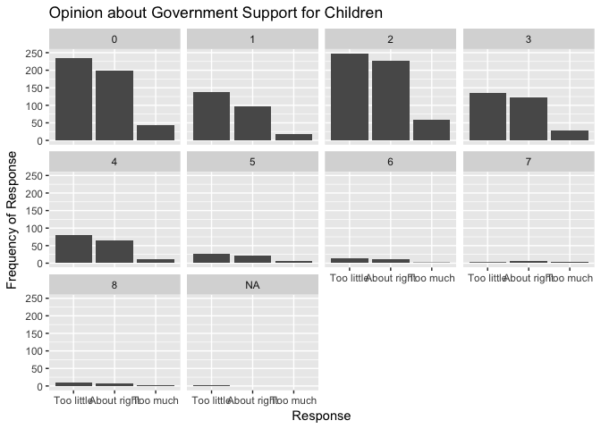

``` r
suppChildSimp <- gssSimp%>%
    filter(childsGroup!="NA"&natchld!="NA") %>%
    ggplot(aes(natchld)) +
      geom_bar() +
      facet_wrap(~childsGroup, 
                 labeller=labeller(childsGroup = c('(0,1]'="No Children", 
                                                   '(1,3]'="1 or 2 Children", 
                                                   '(3,8]'="3 or More Children"))) +
      labs(title = "Opinion about Government Support for Children",
          x = "Response",
          y = "Frequency of Response")

print(suppChildSimp)
```

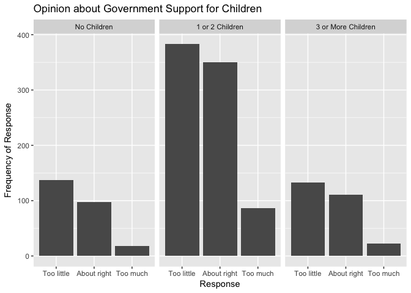

``` r
# Example of Missing Data Issues Graphs
gunLawMiss <- gssSimp %>%
  filter(gunlaw!="NA") %>%
  ggplot(aes(gunlaw, age)) +
    geom_boxplot() +
    facet_wrap(~ polviews, 
               labeller=labeller(polviews = c('Liberal' = "Liberal", 
                                              'Moderate' = "Moderate", 
                                              'Conserv'="Conservative"))) +
      labs(title = "Confidence in Military",
          x = "Stance on Gun Permits",
          y = "Age")
 
print(gunLawMiss) 
```

    ## Warning: Removed 5 rows containing non-finite values (stat_boxplot).


``` r
# Confidence in Education Graph  
gssSimp$coneducWrap = str_wrap(gssSimp$coneduc, width = 6)
   
confEduc <- gssSimp %>%
    filter(childsGroup!="NA"&coneduc!="NA") %>%
    ggplot(aes(coneducWrap)) +
        geom_bar() +
        facet_wrap(~childsGroup, 
                  labeller=labeller(childsGroup = c('(0,1]'="No Children", 
                                                    '(1,3]'="1 or 2 Children", 
                                                    '(3,8]'="3 or More Children"))) +
       labs(title = "Confidence in Education System",
          x = "Response",
          y = "Frequency of Response")
 
print(confEduc)
```


``` r
# Confidence in Army by Political Views and by Children Graphs
gssSimp$conarmyWrap = str_wrap(gssSimp$conarmy, width = 6)

armyPol <- gssSimp %>%
      filter(conarmy!="NA"&polviews!="NA") %>%
      ggplot(aes(conarmyWrap)) +
        geom_bar() +
        facet_wrap(~polviews, 
                  labeller=labeller(polviews = c('Liberal' = "Liberal", 
                                                'Moderate' = "Moderate", 
                                                'Conserv'="Conservative")))+
        labs(title = "Confidence in Military by Political Leaning",
            x = "Response",
            y = "Frequency of Response")
  
print(armyPol)
```


``` r
armyChildren  <- gssSimp %>%
    filter(conarmy!="NA"&polviews!="NA"&childsGroup!="NA") %>%
    ggplot(aes(conarmyWrap)) +
      geom_bar() +
      facet_wrap(~childsGroup, 
                 labeller=labeller(childsGroup = c('(0,1]'="No Children", 
                                                   '(1,3]'="1 or 2 Children", 
                                                   '(3,8]'="3 or More Children"))) +
      labs(title = "Confidence in Military",
          x = "Response",
          y = "Frequency of Response")

print(armyChildren)  
```


``` r
# Support for Gun Laws by Age Graphs
 gunAge <- gssSimp %>%
    filter(gunlaw!="NA") %>%
    ggplot(aes(age, color= gunlaw)) +
      geom_density() +
      labs(title = "Support or Opposition of Gun Permit Laws Across Ages",
        x = "Age",
        y = "Density of Response") +
      guides(color=guide_legend(title="Stance on Gun Laws"))

 print(gunAge)
```

    ## Warning: Removed 5 rows containing non-finite values (stat_density).


``` r
# Support for Gun Laws by Age, Facet Wrapped by Number of Children
gunAgeChild <- gssSimp %>%
  ggplot(aes(age, color= gunlaw)) +
    geom_density() +
    facet_wrap(~childsGroup, 
               labeller=labeller(childsGroup = c('(0,1]'="No Children", 
                                                 '(1,3]'="1 or 2 Children", 
                                                 '(3,8]'="3 or More Children"))) +
    labs(title = "Support or Opposition of Gun Permit Laws Across Ages by Number of Children",
        x = "Age",
        y = "Density of Response") +
    guides(color=guide_legend(title="Stance on Gun Laws"))
 
print(gunAgeChild)
```

    ## Warning: Removed 5 rows containing non-finite values (stat_density).

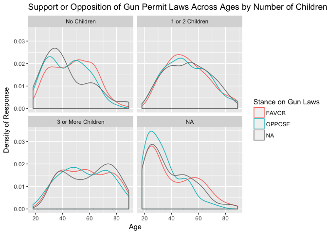

Final Write Up
==============

My exploration into the GSS data set involved focusing mainly on questions around children and military or weapons. I was curious as I began the analysis to explore what relationships or differences there might be between having children or multiple siblings, supporting education or child-focused issues, and support for the military or gun laws. My overall research question focuses on whether Americans with greater exposure to other’s they would want to protect (operationalized through siblings and children) will show greater or less support for armament (both personal and collective, as in through support for the army). Using this dataset, I believe that I could begin to ask the following research questions:

*1)* Are there associations between having more children or siblings and supporting improving the nation’s education or greater government support for children?

*2)* Are there associations between having more children or siblings and supporting improving the nation’s army or opposing gun permits?

Within these research questions, I also want to explore what other factors (like age or political views) may relate to these variables and their relationships.

As I began to explore these questions using the data, I found a couple of noteworthy issues and made a few choices. First of all, in relation to the number of siblings and children that respondents had, it seemed like the first had a few outliers, while the second most likely did not. As seen in the two graphs below, there are a few observations for number of siblings that are 20 or above, which seems like quite a stretch for a family. On the other hand, the most number of children reported was 8, which seems quite plausible.

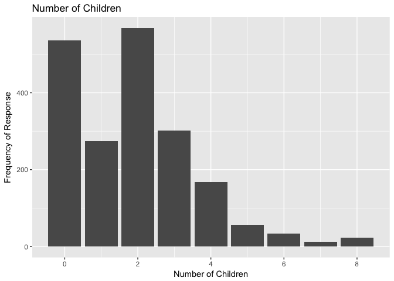

Next, I made a few decisions in regards to rethinking some of the variables because of what I noticed when I began to explore their distributions and relationships. The most frequent responses to number of children was 0 and 2, with a smattering of responses above two. For this reason I grouped the number of children response into three categories - no children, 1 to 2 children, and 3 and above. Similarly, I noticed that it was difficult to assess possible differences by political views with all of the different gradations that the data offers, so I grouped those into three categories (simply liberal, moderate, and conservative). Below, the benefit of this approach to looking at the data can be seen by trying to compare the distributions of response to what people think about the government’s support for children. The simplified approach loses some of the variance of the data, but also shows that there is not much difference in the distributions by the three levels of number of children (except for number of responses


Something else that is interesting to note is that there seem to be in a number of variables an uneven distribution of missing values. This would take a bit more exploration, but one example is in the gun permit question. From the following graph, it is noticeable in the two boxplots for NA as the political view that the 25% for those who oppose is quite low, indicating that there are a number of young respondents who oppose gun permits and are missing political view, and that there are at least a couple of much older ones (pulling the mean higher).

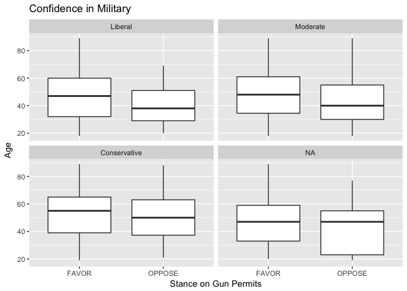

Of the findings, I only began to explore the actual relationship between variables, but there are some interesting observations to note. First, while having no children or 1 or 2 children did not change the distribution in confidence in the education system, those who had more than 3 children displayed less prevalence of saying that they had hardly any confidence.


Also, I explored the distribution of confidence in the army by political views and by number of children. These bar charts demonstrate that moderates seem to be more split between “A Great Deal” and “Only Some”, whereas Liberals are a bit more even spread (though with minimal “Hardly Any” responses) and Conservatives weighted more toward “A Great Deal.” Though it is not quite as striking, there seems to be a similar difference between those with 1 to 2 children versus the other two groups in that proportionally, the number of responses of “Only Some” are a bit higher.

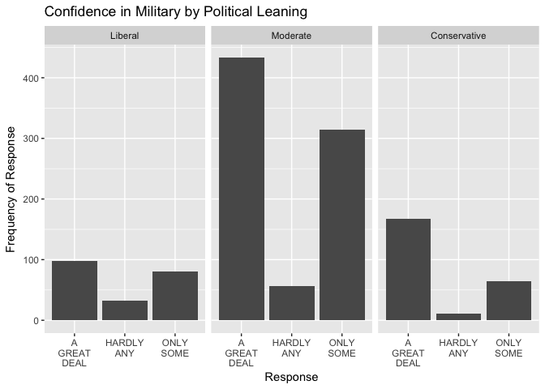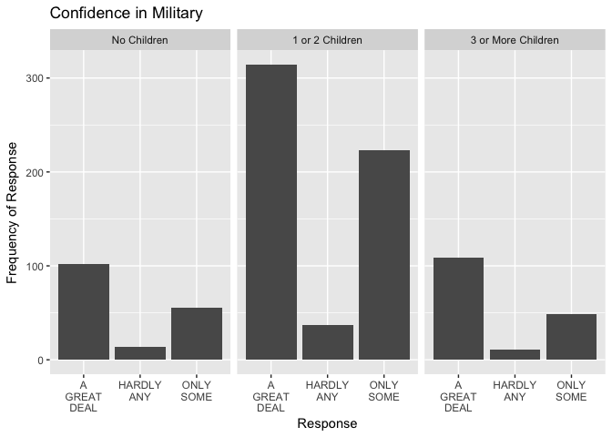

Next, looking at those who oppose gun permits versus those who do not, we can see that the age of those who oppose them is actually a bit lower. When we then break down these results by the three categories of number of children, we can see that of those who have no children, younger respondents tend slightly more to oppose gun permits. There also, however, tends to be a bit more missingness also among younger respondents with no children (that is, whereas the distribution of missingness is about the same as the distribution of those who oppose and those who are in favor in the other children groups, it is higher for younger respondents and lower for middle aged in the no children group).


All in all, I have not yet made any definitive connections between having children and support for education or armament, but there are some interesting associations that would be worth exploring more, such as through a regression model. It seems like age and number of children might be worth considering as an interaction term, while political views would also be important to consider in the model. The age exploratory findings are particularly striking because it seems in general like younger people tended to oppose gun permit laws more (which is counter to a popular narrative of younger people being more "progressive"), but would definitely take more exploration.
