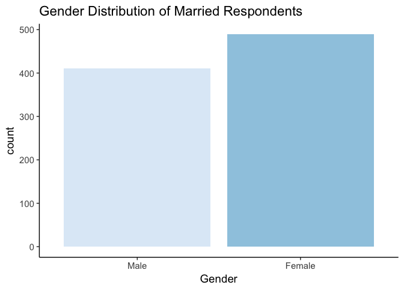
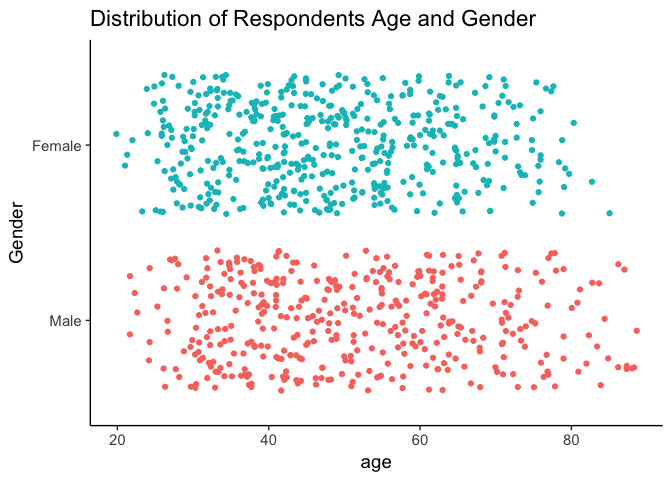
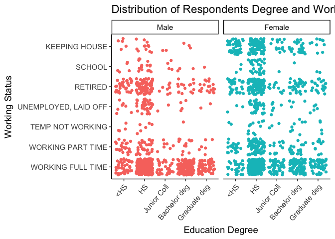

Exploratory Data Analysis - Short Essay
================
Xiuyuan Zhang

### Load library and import data

``` r
library(tidyverse)
library(ggpirate)

theme_set(theme_classic(base_size = 14))
```

### Set dataframes

``` r
# import data from poliscidata package
data(gss, package = "poliscidata")
gss <- as_tibble(gss)

# data with only married respondents
data_married <- gss %>%
    filter(marital == "Married")

# data with married respondents who are working a fulltime position
data_fulltime <- data_married %>%
  filter(wrkstat == "WORKING FULL TIME") 
```

Exploratory Data Analysis
-------------------------

Looking at the description of the dataset provided by the 2012 General Social Survey, the angle I choose to approach this dataset is one guided by the variable **sex** and the general question about gender equality in the United States in 2012. Several questions that I had before starting to analyze the data are: what are the distribution and variations of the variable **working status** for female and male respondents? And, more broadly, is there a strong contrast in regard to background infornation or certain beliefs for female respondents who are currently married when the survey is conducted comparing to ones that are not? Intuitively speaking, gender inequality may be reflected through stark comparison between female respondents and male respodents on various background informations and their beliefs.

### Gender, Marriage Status, and Working Status

``` r
# married respondents grouped by gender
ggplot(data_married, aes(x = sex, fill = sex)) +
    geom_bar() +
    scale_fill_brewer(palette = "Blues") +
    ggtitle("Gender Distribution of Married Respondents") +
    xlab("Gender") +
    theme(legend.position = "none")
```



``` r
# married fulltime-working respondents groubed by gender
ggplot(data_fulltime, aes(x = sex, fill = sex)) +
    geom_bar()+
    scale_fill_brewer(palette = "Blues") +
    ggtitle("Gender Distribution of Fulltime Married Respondents") +
    xlab("Gender") + 
    theme(legend.position = "none")
```


``` r
# married respondents age distribution by gender
ggplot(data_married, aes(x = age, y = sex, color = sex, fill = sex)) + 
  geom_jitter() + 
  ggtitle("Distribution of Respondents Age and Gender") +
  ylab("Gender") +
  theme(legend.position = "none")
```



First, I looked at the distribution of female and male respondents within the married respodents. With a bar plot, one can see clearly that there are more female respondents than male respondents; however, once I added the filter "WORKING FULL TIME" for the variable **working status**, the count for the new bar plot reversed. There are more male respondents who are currently married that are working full time, comparing to female respondents. These two plots shows a heterogeneity revealed by the marital status. Nonetheless, one potential weakness of this comparison is the absence of weights when considering age differences for female and male respondents and their distribution. However, with a scatter plot ploting the distribution of married female and male respondents's ages, the two sexes have similar distribution. Thus, without weighting the data, one can still say that there is a clear contrast that there are more married male respondents that are working full time than married female respodents.

Nevertheless, what lacks from this comparison is a temporal component, which can be added if one uses more than the GSS dataset from 2012, but rather from previous years. The current analysis shed light on possible direction to take forward. Based on the current plot, it suggests that an intresting approach is to make a plot with year as the continuous variable and observe whether there is 1) an increase in the percentage of women working full time as time progresses, 2)the gap between counts of married fulltime female respondents and male respondents getting smaller as the time axis changes positively.

### Gender, Working Status, and Education Degree

``` r
ggplot(data = subset(gss, !is.na(wrkstat)), aes(x = degree, y = wrkstat, color = sex, fill = sex)) +
    facet_wrap(~ sex) +
    geom_jitter() +
    ylab("Working Status") +
    xlab("Education Degree") +
    ggtitle("Distribution of Respondents Degree and Working Statues") +
    theme(axis.text.x = element_text(angle = 50, hjust = 1), legend.position = "none")
```



One other interesting observation originated from a comparison cross respondents' gender (**sex**), education backgrounds (**degrees**), and their **working status**. My initial intuition was that there is a positive correlation where, irregardless of gender, respondents who have a higher education degree would be working (either full-time or part-time) rather than keeping house.Surprisingly, the exploratory plot has provided more accurate insight on this issue and uncovered some heterogeneity governed by the variable **sex**. As one can see from this plot above, in a sample of the entire GSS respondents, only the data from male respondents follows my initial intuition. While there is a fair amount of respondents who are retired as well as who have a high school degree and are currently unemployed/laid-off, there is a clear comparison between the "WORKING FULL TIME" section on the y-axis comparing to the "KEEPING HOUSE" section. The scatter plot is fuller in the working full-time one and near empty in the keeping house section for men. Interestingly, in contrast, this plot tells a different story for female respondents.

For female respondents, while there is a decrease in number of points for the "KEEPING HOUSE" section with the advancement of degrees, the density of the "KEEPING HOUSE" section for female respondents outnumbered the same section for male respondents. Moreover, when compared to itself, the female respondents' "WORKING FULL TIME" section has a smaller gap with its "KEEPING HOUSE" section across different education degrees. On the other hand, the reverse can be said about mael respondents. There is comparatively larger gap between male respondents' "KEEPING HOUSE" and "WORKING FULL TIME" sections, and this difference become greater and greater as the degree advances. This suggests that, 1) there is slightly more even distribution for female respondents within the working status variable comparing to male respondents, 2) there is a heterogenerity within the working status variable when the data is grouped by the variable "degree" and compared across different gender, and 3) it is more common for women to take the role of house keeping than men irregardless of their education background.

Moreover, this scatter plot also shows that there are in general more respondents (both female and male) that hold a high school degree than other categories. Although, from the plot, one can see that there are a lot more respondents that are laid-off who are holding a high school degree, it is also possible that this is influenced by the higher number of the population holding a high school degree. Thus, one should be caustious before concluding that respondents with a high school degree is the most likely to get laid-off or to be unemployed among all degree categories.

### Conclusion

From analyzing the 2012 GSS data using an exploratory method, I strongly believe that this analysis points a curious researcher to further analyze these data longitudinally. The plots mentioned above are an example of the exploratory analysis providing an informative presentation of heterogeneity between different gender across different variables. Moreover, even within specific categorical values within a variable, there is more heterogeneity between female and male respondents. These variations reveal and further confirms to its audience the gaps between two genders and possible customary stereotypes that still exists in year 2012. Yet, as I mentioned earlier, it would be interesting to apply several of the same plot structure to earlier and later datasets from different years, and compare whether there is a general trend of diminishing heterogeneity or not.
