Exploratory Data Analysis - Lab Notebook
================
Xiuyuan Zhang

load library and import data

``` r
library(tidyverse)
library(ggpirate)
library(lme4)
theme_set(theme_classic(base_size = 14))
```

``` r
# import data from poliscidata package
data(gss, package = "poliscidata")
gss <- as_tibble(gss)

# data with only married respondents
data_married <- gss %>%
    filter(marital == "Married")
# data with married respondents who are working a fulltime position
data_fulltime <- data_married %>%
  filter(wrkstat == "WORKING FULL TIME") 

# data with female respondents
data_female <- gss %>%
  filter(sex == "Female")

# data with married female respondents
data_married_female <- data_married %>%
  filter(sex == "Female")

# data with female respondents grouped by "married" or "other"
data_divided <- gss %>%
  filter(sex == "Female") %>%
  mutate(type = if_else(marital == "Married", "married", "other")) %>%
  mutate(type = factor(type, levels = c("married", "other")))

# data with all respondents grouped by "married" or "other"
data_divided_2 <- gss %>%
  mutate(type = if_else(marital == "Married", "married", "other")) %>%
  mutate(type = factor(type, levels = c("married", "other")))

# data with male respondents
data_male <- gss %>%
  filter(sex == "Male")
```

Understanding the basics of this dataset

``` r
# 1 gender distribution for the dataset
ggplot(gss, aes(x = sex)) + geom_bar()
```

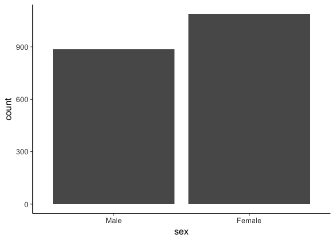

``` r
# 2 race distribution for the dataset 
ggplot(gss, aes(x = race)) + geom_bar()
```


``` r
# 3 married respondents grouped by gender
ggplot(data_married, aes(x = sex)) +
    geom_bar() +
    ggtitle("Married Respondents")
```


``` r
# 4 married fulltime-working respondents groubed by gender
ggplot(data_fulltime, aes(x = sex)) +
    geom_bar()+
    ggtitle("Fulltime Married Respondent")
```


``` r
# In these two graphs one can clearly see that although there are more female respondents who are married, but more male respondents within the married respondents currently have a fulltime position.
```

``` r
# 5 married respondents grouped by working status
ggplot(data = subset(data_married, !is.na(wrkstat)), aes(x = wrkstat, fill = wrkstat)) + 
    geom_bar() +
    scale_fill_brewer(palette = "Blues") +
    ggtitle("Married Respondent Working Status") +
    xlab("working status") +
    theme(axis.text.x = element_text(angle = 50, hjust = 1), legend.position = "none")
```

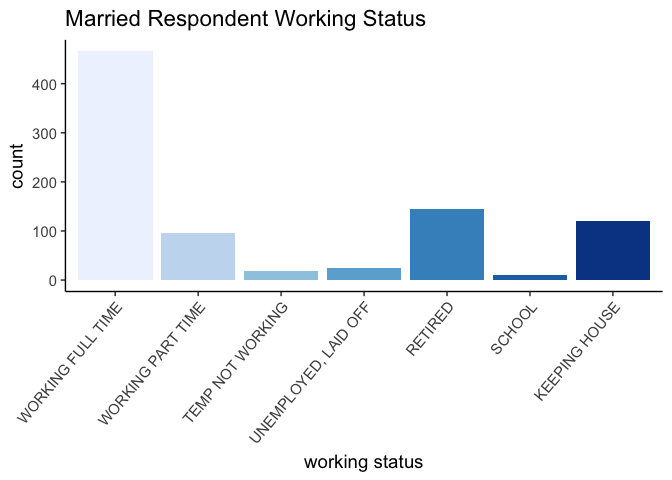

``` r
# 6 married respondents grouped by age and sex
ggplot(data_married, aes(x = age, y = sex, color = sex, fill = sex)) + 
  geom_jitter() + 
  theme(legend.position = "none")
```


``` r
# 7 married respondents grouped by gender and working status (Boolean values)
ggplot(data_married, aes(x = wrkstat == "WORKING FULL TIME", y = sex, color = wrkstat,fill = wrkstat)) + 
    geom_jitter() +
    ggtitle("Married Respondent Working Status by Gender") +
    xlab("working status") +
    theme(axis.text.x = element_text(angle = 50, hjust = 1), legend.position = "none")
```

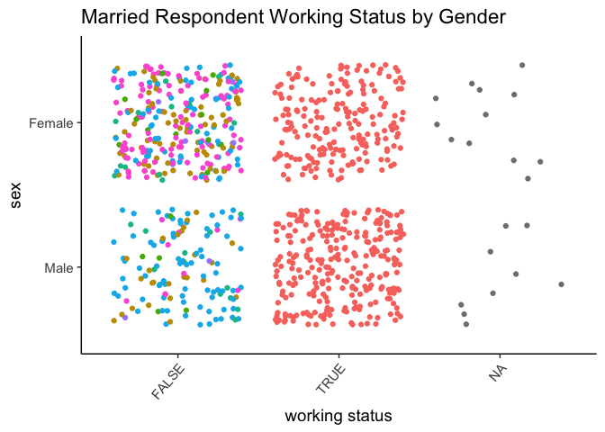

``` r
# 8 married respondents grouped by age and working status, distinguished by gender (boxplot)
ggplot(data = subset(data_married, !is.na(wrkstat)), aes(x = wrkstat, y = age, fill = sex)) + 
    geom_boxplot() +
    theme(axis.text.x = element_text(angle = 50, hjust = 1))
```

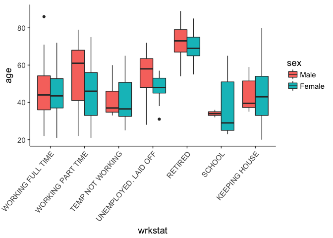

``` r
# 9
ggplot(data = subset(gss, !is.na(wrkstat)), aes(x = degree, y = wrkstat, color = sex, fill = sex)) +
    geom_jitter() +
    theme(axis.text.x = element_text(angle = 50, hjust = 1), legend.position = "none")
```


``` r
# 10
ggplot(data = subset(gss, !is.na(wrkstat)), aes(x = degree, y = wrkstat, color = sex, fill = sex)) +
    facet_wrap(~ sex) +
    geom_jitter() +
    theme(axis.text.x = element_text(angle = 50, hjust = 1), legend.position = "none")
```


``` r
# it is interesting to see that for male respondents, their working status is very related to their education degree, however, for female respondents, there are more variation. With the higher degree female respondents have, that does not inform one whether they would necessarily be working rather than keeping house. 
```

``` r
# 11
ggplot(data_fulltime, aes(x = age)) +
  geom_density(kernel = "gaussian")
```

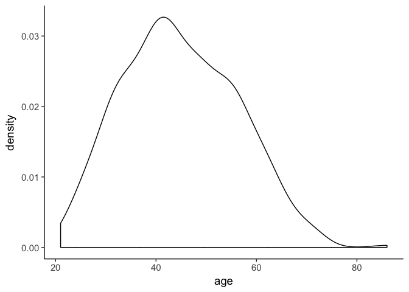

``` r
# 12 
ggplot(data_fulltime, aes(x = degree, y = age, color = sex, fill = sex)) +
    geom_jitter() +
    theme(axis.text.x = element_text(angle = 50, hjust = 1), legend.position = "none")
```


``` r
# 13
ggplot(data_fulltime, aes(x = degree, color = sex, fill = sex)) +
    facet_wrap(~ sex) +
    geom_density(kernel = "gaussian") +
    theme(axis.text.x = element_text(angle = 50, hjust = 1), legend.position = "none")
```


``` r
# 14
ggplot(gss, aes(x = degree, color = sex, fill = sex)) +
    facet_wrap(~ sex) +
    geom_density(kernel = "gaussian") +
    theme(axis.text.x = element_text(angle = 50, hjust = 1), legend.position = "none") +
    ggtitle("Distribution of all Respondents' Degrees")
```


``` r
# 15
ggplot(data_fulltime, aes(x = degree, y = age, color = sex, fill = sex)) +
    geom_rug(sides = "bl") +
    geom_boxplot() + 
    theme(axis.text.x = element_text(angle = 50, hjust = 1), legend.position = "none")
```

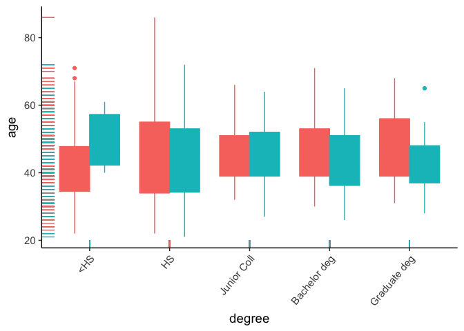

``` r
# 16
ggplot(data_fulltime, aes(x = degree, y = age, color = sex, fill = sex)) +
    geom_polygon(aes(group = age)) + 
    theme(axis.text.x = element_text(angle = 50, hjust = 1), legend.position = "none")
```

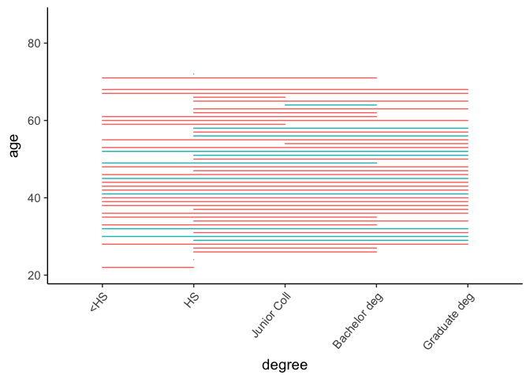

``` r
# 17 married respondents grouped by age and working status, distinguished by gender (boxplot)
ggplot(data_fulltime, aes(x = degree, y = age, fill = sex)) + 
    facet_wrap(~ sex) +
    geom_dotplot(binaxis = "y", stackdir = "center", binwidth = 0.8) +
    theme(axis.text.x = element_text(angle = 50, hjust = 1))
```

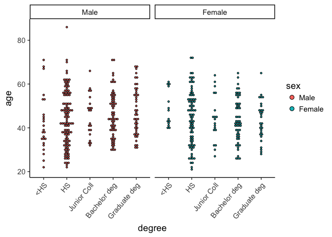

``` r
# 18 married fulltime respondents grouped by age and degree, distinguished by gender (violin plot)
ggplot(data_fulltime, aes(x = degree, y = age, color = sex, fill = sex)) + 
    facet_wrap(~ sex) +
    geom_violin(fill="white", position = position_dodge(width=1)) +
    theme(axis.text.x = element_text(angle = 50, hjust = 1))
```

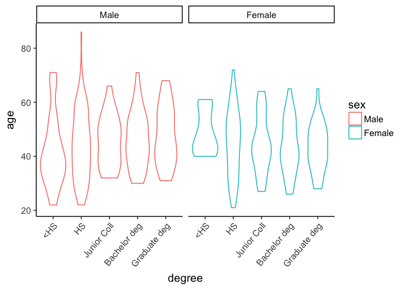 19 (have to change count after this one, this is correct)

``` r
ggplot(gss, aes(x = degree, y = age, color = sex, fill = sex)) + 
    facet_wrap(~ sex) +
    geom_violin(fill="white", position = position_dodge(width=1)) +
    theme(axis.text.x = element_text(angle = 50, hjust = 1))
```

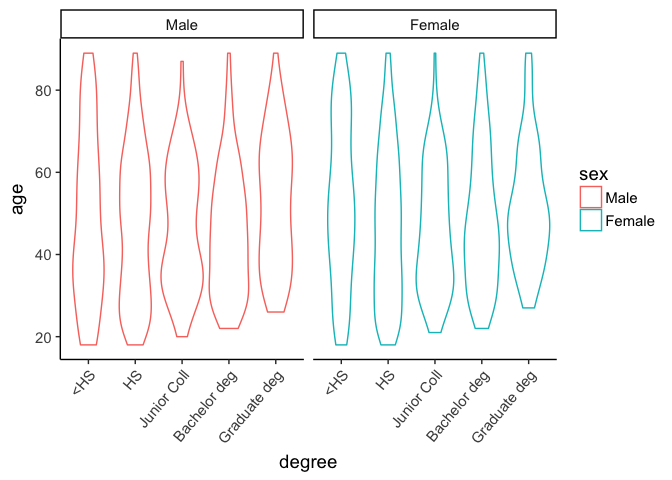 20

``` r
ggplot(gss, aes(x = race, y = age, color = sex, fill = sex)) + 
    facet_wrap(~ sex) +
    geom_violin(fill="white", position = position_dodge(width=1)) +
    theme(axis.text.x = element_text(angle = 50, hjust = 1))
```

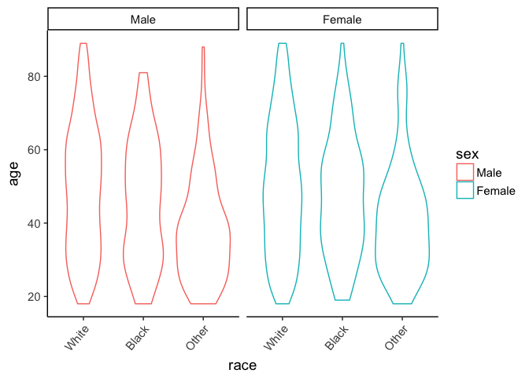 21

``` r
ggplot(gss, aes(x = degree, y = age, color = sex, fill = sex)) + 
    geom_pirate() +
    theme(axis.text.x = element_text(angle = 50, hjust = 1))
```

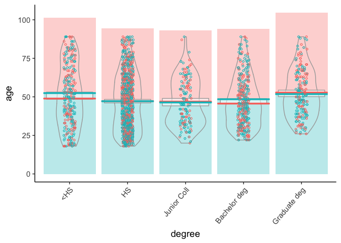 22

``` r
ggplot(data_fulltime, aes(x = degree, y = age, color = sex, fill = sex)) + 
    facet_wrap(~ sex) +
    geom_pirate() +
    theme(axis.text.x = element_text(angle = 50, hjust = 1))
```

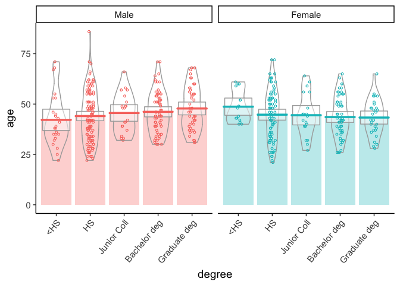 23

``` r
ggplot(data_fulltime, aes(x = age, fill = sex)) + 
    geom_histogram(bins = 5) +
    theme(axis.text.x = element_text(angle = 50, hjust = 1))
```

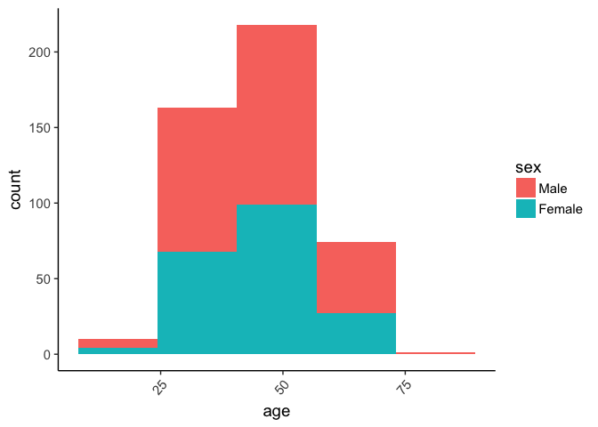 24

``` r
ggplot(data_fulltime, aes(x = age, fill = sex)) + 
    facet_wrap(~sex) +
    geom_histogram(bins = 5) +
    theme(axis.text.x = element_text(angle = 50, hjust = 1))
```

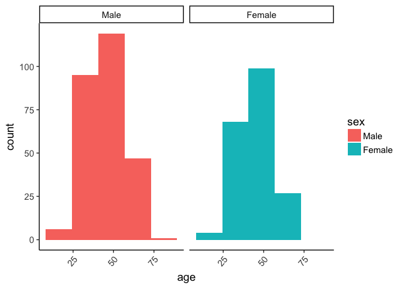 25

``` r
ggplot(data = subset(gss, !is.na(vote08_coded)), aes(x = vote08_coded, color = sex, fill = sex)) + 
    geom_bar()
```

 26

``` r
ggplot(data = subset(gss, !is.na(vote08_coded)), aes(x = vote08_coded, y = sex, color = sex, fill = sex)) + 
    geom_jitter() +
    xlab("voted in 2008 election")
```

 27

``` r
ggplot(data = subset(gss, !is.na(partyid)), aes(x = partyid, y = sex, color = sex, fill = sex)) + 
    geom_jitter()
```

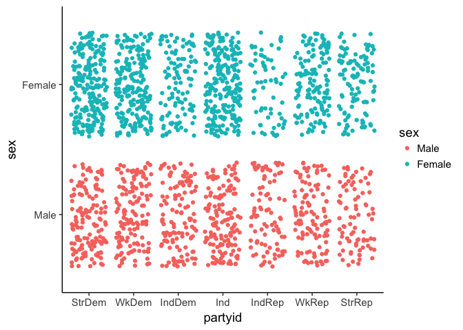 28

``` r
ggplot(data = subset(gss, !is.na(partyid)), aes(x = partyid, color = sex, fill = sex)) + 
    geom_bar()
```

 29

``` r
ggplot(data = subset(gss, !is.na(partyid)), aes(x = partyid, color = sex, fill = sex)) + 
    facet_wrap(~ sex) +
    geom_bar() +
    theme(axis.text.x = element_text(angle = 50, hjust = 1))
```

 30

``` r
ggplot(data = subset(data_female, !is.na(partyid)), aes(x = age, y = partyid)) + 
  geom_jitter()
```

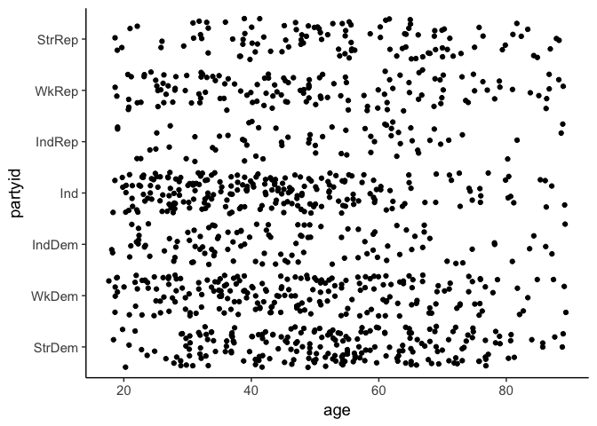 31

``` r
ggplot(data = subset(data_male, !is.na(partyid)), aes(x = age, y = partyid)) + 
  geom_jitter()
```

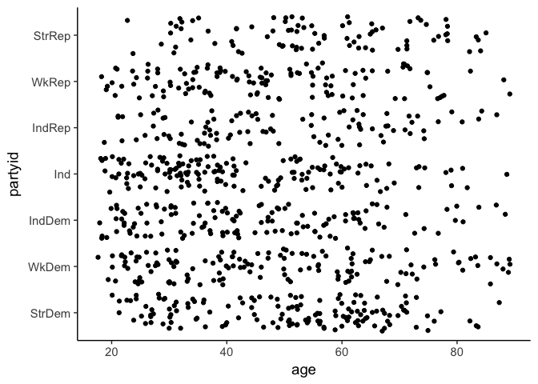 32

``` r
ggplot(data = subset(data_married, !is.na(partyid)), aes(x = age, y = partyid, color = sex, fill = sex)) + 
  facet_wrap(~sex) +
  geom_jitter()
```

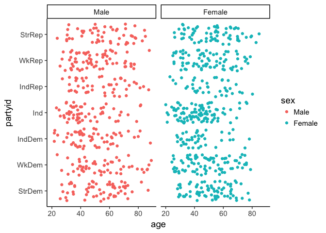 33

``` r
ggplot(data = subset(data_married_female, !is.na(partyid)), aes(x = partyid, fill = partyid)) + 
  geom_bar() + 
  scale_fill_brewer(palette = "Blues") +
  xlab("party identification") + 
  theme(legend.position = "none")
```

 34

``` r
ggplot(data_divided, aes(x = type)) +
  geom_bar()
```

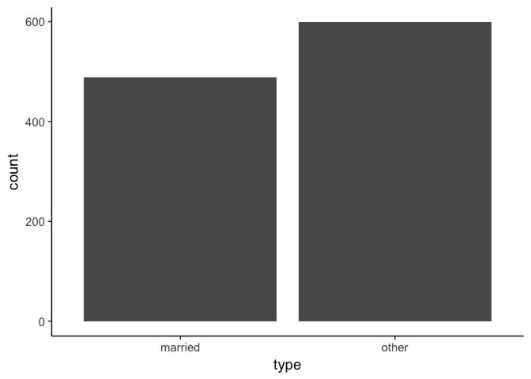 35

``` r
ggplot(data = subset(data_divided, !is.na(wrkstat)), aes(x = wrkstat, color = type, fill = type)) +
  facet_wrap(~ type) + 
  geom_bar() + 
  theme(axis.text.x = element_text(angle = 50, hjust = 1)) + 
  xlab("working status") + 
  ggtitle("Married Female Respondents Working Status")
```

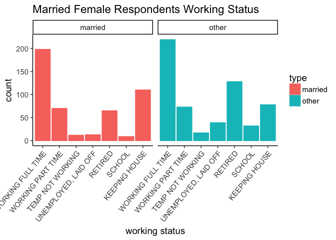 36

``` r
ggplot(data = subset(data_divided, !is.na(wrkstat)), aes(x = wrkstat, y = degree,color = type, fill = type)) +
  facet_wrap(~ type) + 
  geom_jitter() + 
  theme(axis.text.x = element_text(angle = 50, hjust = 1)) + 
  xlab("working status") + 
  ggtitle("Female Respondents Working Status")
```

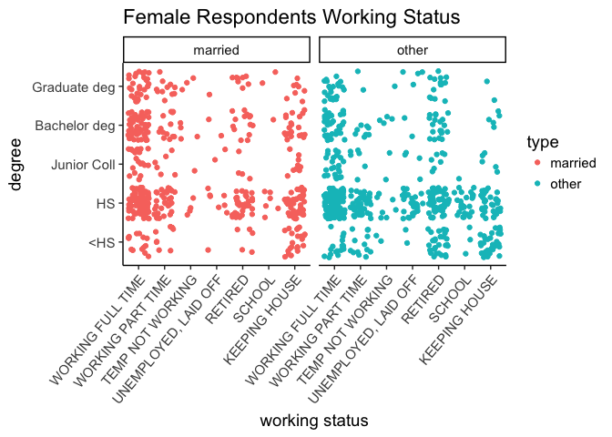 37

``` r
ggplot(data = subset(data_divided_2, !is.na(wrkstat)), aes(x = wrkstat, y = degree, color = type, fill = type)) +
  facet_wrap(~ sex) + 
  geom_jitter(size = 0.7) +
  theme(axis.text.x = element_text(angle = 50, hjust = 1)) + 
  xlab("working status") + 
  ggtitle("Respondents Working Status")
```

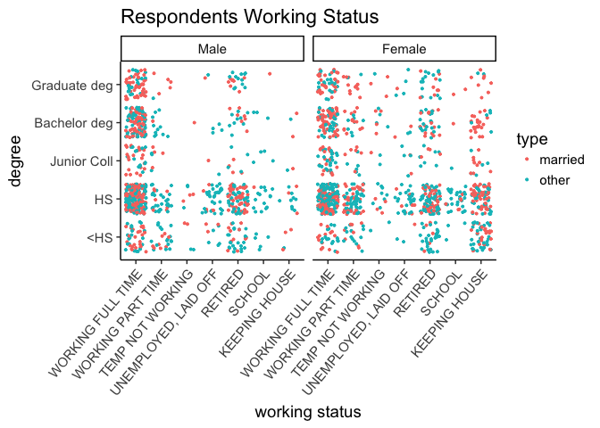

38

``` r
ggplot(data = subset(data_divided_2, !is.na(wrkstat)), aes(x = type, color = degree, fill = degree)) +
  facet_wrap(~ sex) + 
  geom_density() + 
  theme(axis.text.x = element_text(angle = 50, hjust = 1)) + 
  xlab("working status")
```

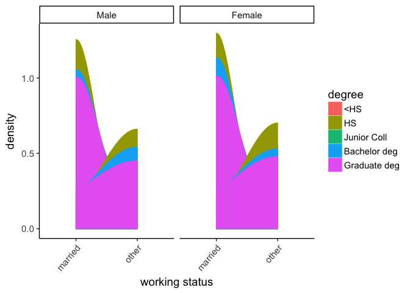 39 Happiness by Mariage status

``` r
ggplot(data = subset(data_divided_2, !is.na(happy)), aes(x = happy, color = type, fill = type)) + 
    facet_wrap(~ type) +
    geom_bar() + 
    xlab("happiness choices") +
    ggtitle("Respondents Happiness Grouped by Marriage Status")
```

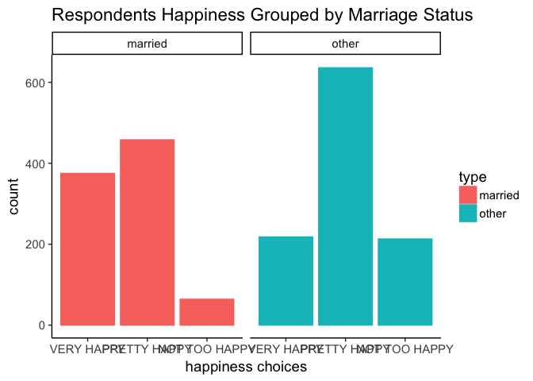

``` r
#40 by gender
ggplot(data = subset(data_divided, !is.na(happy)), aes(x = happy, color = type, fill = type)) +
    facet_wrap(~ type) +
    geom_bar() + 
    xlab("happiness choices") +
    ggtitle("Female Respondents Happiness Grouped by Marriage Status")
```

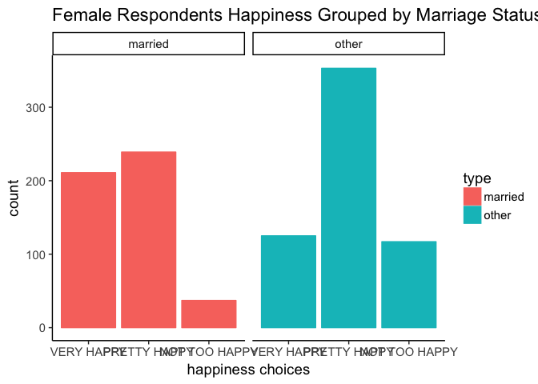

``` r
# 41
ggplot(data = subset(data_female, !is.na(thnkself)), aes(x = thnkself)) +
    geom_bar() +
    theme(axis.text.x = element_text(angle = 50, hjust = 1)) +
    xlab("think for oneself")
```

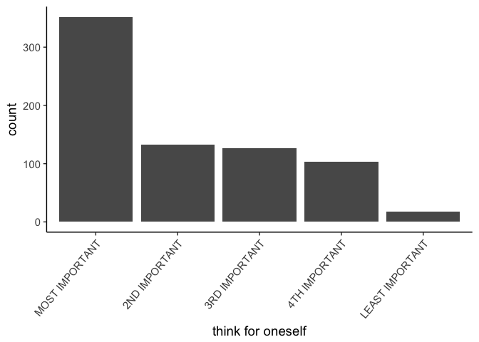

``` r
# 42
ggplot(data = subset(data_male, !is.na(thnkself)), aes(x = thnkself)) +
    geom_bar() +
    theme(axis.text.x = element_text(angle = 50, hjust = 1)) +
    xlab("think for oneself")
```

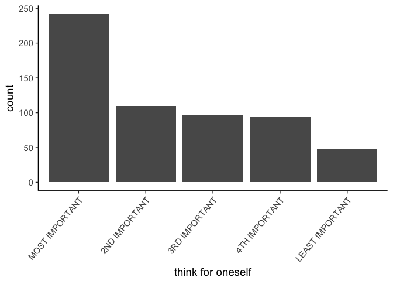

``` r
# 43
ggplot(data = subset(data_female, !is.na(helpoth)), aes(x = helpoth)) +
    geom_bar() +
    theme(axis.text.x = element_text(angle = 50, hjust = 1)) +
    xlab("help others")
```

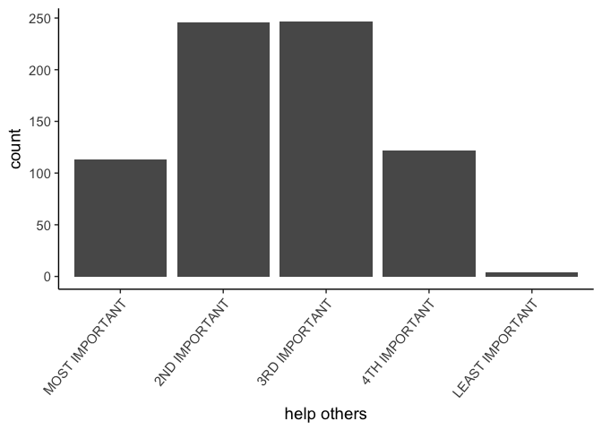

``` r
# 44
ggplot(data = subset(data_male, !is.na(helpoth)), aes(x = helpoth)) +
    geom_bar() +
    theme(axis.text.x = element_text(angle = 50, hjust = 1)) +
    xlab("help others")
```


``` r
# 45
ggplot(data = subset(data_divided, !is.na(thnkself)), aes(x = thnkself, color = type, fill = type)) +
    facet_wrap(~ type) +
    geom_bar() + 
    theme(axis.text.x = element_text(angle = 50, hjust = 1)) +
    xlab("think for oneself")
```

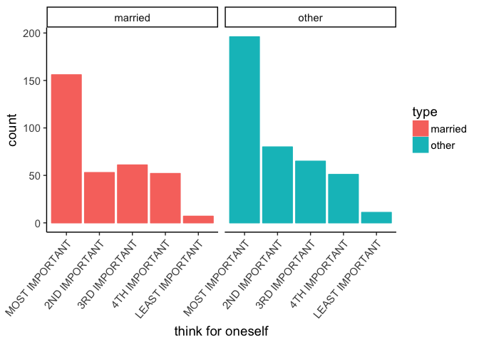
